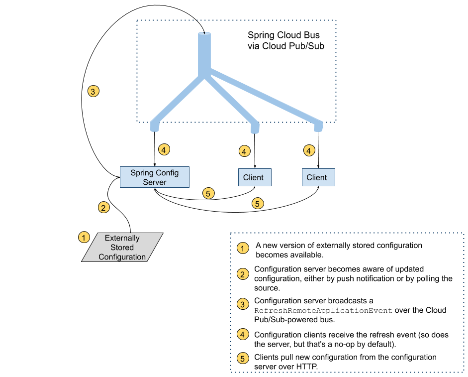

[//]: # (**{project-version}**)
[project-version]: 3.3.0

# Introduction

[project-version]

Here is the [first link][var1]

[var1]: https://example.org

The Spring Cloud GCP project makes the Spring Framework a first-class
citizen of Google Cloud Platform (GCP).

Spring Cloud GCP lets you leverage the power and simplicity of the
Spring Framework to:

  - Publish and subscribe to Google Cloud Pub/Sub topics

  - Configure Spring JDBC with a few properties to use Google Cloud SQL

  - Map objects, relationships, and collections with Spring Data Cloud
    Spanner, Spring Data Cloud Datastore and Spring Data Reactive
    Repositories for Cloud Firestore

  - Write and read from Spring Resources backed up by Google Cloud
    Storage

  - Exchange messages with Spring Integration using Google Cloud Pub/Sub
    on the background

  - Trace the execution of your app with Spring Cloud Sleuth and Google
    Cloud Trace

  - Configure your app with Spring Cloud Config, backed up by the Google
    Runtime Configuration API

  - Consume and produce Google Cloud Storage data via Spring Integration
    GCS Channel Adapters

  - Use Spring Security via Google Cloud IAP

  - Analyze your images for text, objects, and other content with Google
    Cloud Vision

# Getting Started

This section describes how to get up to speed with Spring Cloud GCP
libraries.

## Compatibility with Spring Project Versions

Spring Cloud GCP has dependency and transitive dependencies on Spring
Projects. The table below outlines the versions of Spring Cloud, Spring
Boot and Spring Framework versions that are compatible with certain
Spring Cloud GCP version.

| Spring Cloud GCP            | Spring Cloud                                                                                                          | Spring Boot  | Spring Framework |
| --------------------------- | --------------------------------------------------------------------------------------------------------------------- | ------------ | ---------------- |
| 2.x                         | [2020.0.x](https://github.com/spring-cloud/spring-cloud-release/wiki/Spring-Cloud-2020.0-Release-Notes) (3.0/Illford) | 2.4.x, 2.5.x | 5.3.x            |
| 3.0 (next expected release) | [2021.0.x](https://github.com/spring-cloud/spring-cloud-release/wiki/Spring-Cloud-2021.0-Release-Notes) (3.1/Jubilee) | 2.6.x        | 5.3.x            |

## Setting up Dependencies

All Spring Cloud GCP artifacts are made available through Maven Central.
The following resources are provided to help you setup the libraries for
your project:

  - Maven Bill of Materials for dependency management

  - Starter Dependencies for depending on Spring Cloud GCP modules

You may also consult our [Github
project](https://github.com/GoogleCloudPlatform/spring-cloud-gcp) to
examine the code or build directly from source.

### Bill of Materials

The Spring Cloud GCP Bill of Materials (BOM) contains the versions of
all the dependencies it uses.

If you’re a Maven user, adding the following to your pom.xml file will
allow you omit any Spring Cloud GCP dependency version numbers from your
configuration. Instead, the version of the BOM you’re using determines
the versions of the used dependencies.

``` xml
<dependencyManagement>
   <dependencies>
       <dependency>
           <groupId>com.google.cloud</groupId>
           <artifactId>spring-cloud-gcp-dependencies</artifactId>
           <version>{project-version}</version>
           <type>pom</type>
           <scope>import</scope>
       </dependency>
   </dependencies>
</dependencyManagement>
```

Or, if you’re a Gradle user:

    dependencies {
        implementation platform("com.google.cloud:spring-cloud-gcp-dependencies:{project-version}")
    }

See the [sections](#README.adoc) in the README for selecting an
available version and Maven repository.

In the following sections, it will be assumed you are using the Spring
Cloud GCP BOM and the dependency snippets will not contain versions.

### Starter Dependencies

Spring Cloud GCP offers [starter
dependencies](https://github.com/GoogleCloudPlatform/spring-cloud-gcp/tree/main/spring-cloud-gcp-starters)
through Maven to easily depend on different modules of the library. Each
starter contains all the dependencies and transitive dependencies needed
to begin using their corresponding Spring Cloud GCP module.

For example, if you wish to write a Spring application with Cloud
Pub/Sub, you would include the `spring-cloud-gcp-starter-pubsub`
dependency in your project. You do **not** need to include the
underlying `spring-cloud-gcp-pubsub` dependency, because the `starter`
dependency includes it.

A summary of these artifacts are provided below.

| Spring Cloud GCP Starter | Description                                                                       | Maven Artifact Name                                                                                    |
| ------------------------ | --------------------------------------------------------------------------------- | ------------------------------------------------------------------------------------------------------ |
| Core                     | Automatically configure authentication and Google project settings                | [com.google.cloud:spring-cloud-gcp-starter](#spring-cloud-gcp-core)                                    |
| Cloud Spanner            | Provides integrations with Google Cloud Spanner                                   | [com.google.cloud:spring-cloud-gcp-starter-data-spanner](#spring-data-cloud-spanner)                   |
| Cloud Datastore          | Provides integrations with Google Cloud Datastore                                 | [com.google.cloud:spring-cloud-gcp-starter-data-datastore](#spring-data-cloud-datastore)               |
| Cloud Pub/Sub            | Provides integrations with Google Cloud Pub/Sub                                   | [com.google.cloud:spring-cloud-gcp-starter-pubsub](#cloud-pubsub)                                      |
| Logging                  | Enables Cloud Logging                                                             | [com.google.cloud:spring-cloud-gcp-starter-logging](#cloud-logging)                                    |
| SQL - MySQL              | Cloud SQL integrations with MySQL                                                 | [com.google.cloud:spring-cloud-gcp-starter-sql-mysql](#cloud-sql)                                      |
| SQL - PostgreSQL         | Cloud SQL integrations with PostgreSQL                                            | [com.google.cloud:spring-cloud-gcp-starter-sql-postgresql](#cloud-sql)                                 |
| Storage                  | Provides integrations with Google Cloud Storage and Spring Resource               | [com.google.cloud:spring-cloud-gcp-starter-storage](#cloud-storage)                                    |
| Config                   | Enables usage of Google Runtime Configuration API as a Spring Cloud Config server | [com.google.cloud:spring-cloud-gcp-starter-config](#cloud-runtime-configuration-api)                   |
| Trace                    | Enables instrumentation with Google Cloud Trace                                   | [com.google.cloud:spring-cloud-gcp-starter-trace](#cloud-trace)                                        |
| Vision                   | Provides integrations with Google Cloud Vision                                    | [com.google.cloud:spring-cloud-gcp-starter-vision](#cloud-vision)                                      |
| Security - IAP           | Provides a security layer over applications deployed to Google Cloud              | [com.google.cloud:spring-cloud-gcp-starter-security-iap](#cloud-iap)                                   |
| Security - Firebase      | Provides a security layer over applications deployed to Firebase                  | [com.google.cloud:spring-cloud-gcp-starter-security-firebase](security-firebase.xml#security-firebase) |

### Spring Initializr

[Spring Initializr](https://start.spring.io/) is a tool which generates
the scaffolding code for a new Spring Boot project. It handles the work
of generating the Maven or Gradle build file so you do not have to
manually add the dependencies yourself.

Spring Initializr offers three modules from Spring Cloud GCP that you
can use to generate your project.

  - **GCP Support**: The GCP Support module contains auto-configuration
    support for every Spring Cloud GCP integration. Most of the
    autoconfiguration code is only enabled if the required dependency is
    added to your project.

  - **GCP Messaging**: Google Cloud Pub/Sub integrations work out of the
    box.

  - **GCP Storage**: Google Cloud Storage integrations work out of the
    box.

## Learning Spring Cloud GCP

There are a variety of resources to help you learn how to use Spring
Cloud GCP libraries.

### Sample Applications

The easiest way to learn how to use Spring Cloud GCP is to consult the
[sample applications on
Github](https://github.com/GoogleCloudPlatform/spring-cloud-gcp/tree/main/spring-cloud-gcp-samples).
Spring Cloud GCP provides sample applications which demonstrate how to
use every integration in the library. The table below highlights several
samples of the most commonly used integrations in Spring Cloud GCP.

<table>
<colgroup>
<col style="width: 50%" />
<col style="width: 50%" />
</colgroup>
<thead>
<tr class="header">
<th>GCP Integration</th>
<th>Sample Application</th>
</tr>
</thead>
<tbody>
<tr class="odd">
<td><p>Cloud Pub/Sub</p></td>
<td><p><a href="https://github.com/GoogleCloudPlatform/spring-cloud-gcp/tree/main/spring-cloud-gcp-samples/spring-cloud-gcp-pubsub-sample">spring-cloud-gcp-pubsub-sample</a></p></td>
</tr>
<tr class="even">
<td><p>Cloud Spanner</p></td>
<td><p><a href="https://github.com/GoogleCloudPlatform/spring-cloud-gcp/tree/main/spring-cloud-gcp-samples/spring-cloud-gcp-data-spanner-repository-sample">spring-cloud-gcp-data-spanner-repository-sample</a></p>
<p><a href="https://github.com/GoogleCloudPlatform/spring-cloud-gcp/tree/main/spring-cloud-gcp-samples/spring-cloud-gcp-data-spanner-template-sample">spring-cloud-gcp-data-spanner-template-sample</a></p></td>
</tr>
<tr class="odd">
<td><p>Datastore</p></td>
<td><p><a href="https://github.com/GoogleCloudPlatform/spring-cloud-gcp/tree/main/spring-cloud-gcp-samples/spring-cloud-gcp-data-datastore-sample">spring-cloud-gcp-data-datastore-sample</a></p></td>
</tr>
<tr class="even">
<td><p>Cloud SQL (w/ MySQL)</p></td>
<td><p><a href="https://github.com/GoogleCloudPlatform/spring-cloud-gcp/tree/main/spring-cloud-gcp-samples/spring-cloud-gcp-sql-mysql-sample">spring-cloud-gcp-sql-mysql-sample</a></p></td>
</tr>
<tr class="odd">
<td><p>Cloud Storage</p></td>
<td><p><a href="https://github.com/GoogleCloudPlatform/spring-cloud-gcp/tree/main/spring-cloud-gcp-samples/spring-cloud-gcp-storage-resource-sample">spring-cloud-gcp-storage-resource-sample</a></p></td>
</tr>
<tr class="even">
<td><p>Cloud Logging</p></td>
<td><p><a href="https://github.com/GoogleCloudPlatform/spring-cloud-gcp/tree/main/spring-cloud-gcp-samples/spring-cloud-gcp-logging-sample">spring-cloud-gcp-logging-sample</a></p></td>
</tr>
<tr class="odd">
<td><p>Trace</p></td>
<td><p><a href="https://github.com/GoogleCloudPlatform/spring-cloud-gcp/tree/main/spring-cloud-gcp-samples/spring-cloud-gcp-trace-sample">spring-cloud-gcp-trace-sample</a></p></td>
</tr>
<tr class="even">
<td><p>Cloud Vision</p></td>
<td><p><a href="https://github.com/GoogleCloudPlatform/spring-cloud-gcp/tree/main/spring-cloud-gcp-samples/spring-cloud-gcp-vision-api-sample">spring-cloud-gcp-vision-api-sample</a></p></td>
</tr>
<tr class="odd">
<td><p>Cloud Security - IAP</p></td>
<td><p><a href="https://github.com/GoogleCloudPlatform/spring-cloud-gcp/tree/main/spring-cloud-gcp-samples/spring-cloud-gcp-security-iap-sample">spring-cloud-gcp-security-iap-sample</a></p></td>
</tr>
<tr class="even">
<td><p>Cloud Security - Firebase</p></td>
<td><p><a href="https://github.com/GoogleCloudPlatform/spring-cloud-gcp/tree/main/spring-cloud-gcp-samples/spring-cloud-gcp-security-firebase-sample">spring-cloud-gcp-security-firebase-sample</a></p></td>
</tr>
</tbody>
</table>

Each sample application demonstrates how to use Spring Cloud GCP
libraries in context and how to setup the dependencies for the project.
The applications are fully functional and can be deployed to Google
Cloud Platform as well. If you are interested, you may consult guides
for [deploying an application to
AppEngine](https://codelabs.developers.google.com/codelabs/cloud-app-engine-springboot/index.html)
and [to Google Kubernetes
Engine](https://codelabs.developers.google.com/codelabs/cloud-springboot-kubernetes/index.html).

### Codelabs

For a more hands-on approach, there are several guides and codelabs to
help you get up to speed. These guides provide step-by-step instructions
for building an application using Spring Cloud GCP.

Some examples include:

  - [Deploy a Spring Boot app to App
    Engine](https://codelabs.developers.google.com/codelabs/cloud-app-engine-springboot/index.html)

  - [Build a Kotlin Spring Boot app with Cloud SQL and Cloud
    Pub/Sub](https://codelabs.developers.google.com/codelabs/cloud-spring-cloud-gcp-kotlin/index.html)

  - [Build a Spring Boot application with
    Datastore](https://codelabs.developers.google.com/codelabs/cloud-spring-datastore/index.html)

  - [Messaging with Spring Integration and Cloud
    Pub/Sub](https://codelabs.developers.google.com/codelabs/cloud-spring-cloud-gcp-pubsub-integration/index.html)

The full collection of Spring codelabs can be found on the [Google
Developer Codelabs page](https://codelabs.developers.google.com/spring).

# Spring Cloud GCP Core

Each Spring Cloud GCP module uses `GcpProjectIdProvider` and
`CredentialsProvider` to get the GCP project ID and access credentials.

Spring Cloud GCP provides a Spring Boot starter to auto-configure the
core components.

Maven coordinates, using [Spring Cloud GCP BOM](#bill-of-materials):

``` xml
<dependency>
    <groupId>com.google.cloud</groupId>
    <artifactId>spring-cloud-gcp-starter</artifactId>
</dependency>
```

Gradle coordinates:

    dependencies {
        implementation("com.google.cloud:spring-cloud-gcp-starter")
    }

## Configuration

The following options may be configured with Spring Cloud core.

|                                 |                                                 |          |               |
| ------------------------------- | ----------------------------------------------- | -------- | ------------- |
| Name                            | Description                                     | Required | Default value |
| `spring.cloud.gcp.core.enabled` | Enables or disables GCP core auto configuration | No       | `true`        |

## Project ID

`GcpProjectIdProvider` is a functional interface that returns a GCP
project ID string.

``` java
public interface GcpProjectIdProvider {
    String getProjectId();
}
```

The Spring Cloud GCP starter auto-configures a `GcpProjectIdProvider`.
If a `spring.cloud.gcp.project-id` property is specified, the provided
`GcpProjectIdProvider` returns that property value.

``` java
spring.cloud.gcp.project-id=my-gcp-project-id
```

Otherwise, the project ID is discovered based on an [ordered list of
rules](https://googlecloudplatform.github.io/google-cloud-java/google-cloud-clients/apidocs/com/google/cloud/ServiceOptions.html#getDefaultProjectId--):

1.  The project ID specified by the `GOOGLE_CLOUD_PROJECT` environment
    variable

2.  The Google App Engine project ID

3.  The project ID specified in the JSON credentials file pointed by the
    `GOOGLE_APPLICATION_CREDENTIALS` environment variable

4.  The Google Cloud SDK project ID

5.  The Google Compute Engine project ID, from the Google Compute Engine
    Metadata Server

## Credentials

`CredentialsProvider` is a functional interface that returns the
credentials to authenticate and authorize calls to Google Cloud Client
Libraries.

``` java
public interface CredentialsProvider {
  Credentials getCredentials() throws IOException;
}
```

The Spring Cloud GCP starter auto-configures a `CredentialsProvider`. It
uses the `spring.cloud.gcp.credentials.location` property to locate the
OAuth2 private key of a Google service account. Keep in mind this
property is a Spring Resource, so the credentials file can be obtained
from a number of [different
locations](https://docs.spring.io/spring/docs/current/spring-framework-reference/html/resources.html#resources-implementations)
such as the file system, classpath, URL, etc. The next example specifies
the credentials location property in the file system.

    spring.cloud.gcp.credentials.location=file:/usr/local/key.json

Alternatively, you can set the credentials by directly specifying the
`spring.cloud.gcp.credentials.encoded-key` property. The value should be
the base64-encoded account private key in JSON format.

If that credentials aren’t specified through properties, the starter
tries to discover credentials from a [number of
places](https://github.com/GoogleCloudPlatform/google-cloud-java#authentication):

1.  Credentials file pointed to by the `GOOGLE_APPLICATION_CREDENTIALS`
    environment variable

2.  Credentials provided by the Google Cloud SDK `gcloud auth
    application-default login` command

3.  Google App Engine built-in credentials

4.  Google Cloud Shell built-in credentials

5.  Google Compute Engine built-in credentials

If your app is running on Google App Engine or Google Compute Engine, in
most cases, you should omit the `spring.cloud.gcp.credentials.location`
property and, instead, let the Spring Cloud GCP Starter get the correct
credentials for those environments. On App Engine Standard, the [App
Identity service account
credentials](https://cloud.google.com/appengine/docs/standard/java/appidentity/)
are used, on App Engine Flexible, the [Flexible service account
credential](https://cloud.google.com/appengine/docs/flexible/java/service-account)
are used and on Google Compute Engine, the [Compute Engine Default
Service
Account](https://cloud.google.com/compute/docs/access/create-enable-service-accounts-for-instances#using_the_compute_engine_default_service_account)
is used.

### Scopes

By default, the credentials provided by the Spring Cloud GCP Starter
contain scopes for every service supported by Spring Cloud GCP.

|                      |                                                                                                                                                                              |
| -------------------- | ---------------------------------------------------------------------------------------------------------------------------------------------------------------------------- |
| Service              | Scope                                                                                                                                                                        |
| Spanner              | [www.googleapis.com/auth/spanner.admin](https://www.googleapis.com/auth/spanner.admin), [www.googleapis.com/auth/spanner.data](https://www.googleapis.com/auth/spanner.data) |
| Datastore            | [www.googleapis.com/auth/datastore](https://www.googleapis.com/auth/datastore)                                                                                               |
| Pub/Sub              | [www.googleapis.com/auth/pubsub](https://www.googleapis.com/auth/pubsub)                                                                                                     |
| Storage (Read Only)  | [www.googleapis.com/auth/devstorage.read\_only](https://www.googleapis.com/auth/devstorage.read_only)                                                                        |
| Storage (Read/Write) | [www.googleapis.com/auth/devstorage.read\_write](https://www.googleapis.com/auth/devstorage.read_write)                                                                      |
| Runtime Config       | [www.googleapis.com/auth/cloudruntimeconfig](https://www.googleapis.com/auth/cloudruntimeconfig)                                                                             |
| Trace (Append)       | [www.googleapis.com/auth/trace.append](https://www.googleapis.com/auth/trace.append)                                                                                         |
| Cloud Platform       | [www.googleapis.com/auth/cloud-platform](https://www.googleapis.com/auth/cloud-platform)                                                                                     |
| Vision               | [www.googleapis.com/auth/cloud-vision](https://www.googleapis.com/auth/cloud-vision)                                                                                         |

The Spring Cloud GCP starter allows you to configure a custom scope list
for the provided credentials. To do that, specify a comma-delimited list
of [Google OAuth2
scopes](https://developers.google.com/identity/protocols/googlescopes)
in the `spring.cloud.gcp.credentials.scopes` property.

`spring.cloud.gcp.credentials.scopes` is a comma-delimited list of
[Google OAuth2
scopes](https://developers.google.com/identity/protocols/googlescopes)
for Google Cloud Platform services that the credentials returned by the
provided `CredentialsProvider` support.

    spring.cloud.gcp.credentials.scopes=https://www.googleapis.com/auth/pubsub,https://www.googleapis.com/auth/sqlservice.admin

You can also use `DEFAULT_SCOPES` placeholder as a scope to represent
the starters default scopes, and append the additional scopes you need
to add.

    spring.cloud.gcp.credentials.scopes=DEFAULT_SCOPES,https://www.googleapis.com/auth/cloud-vision

## Environment

`GcpEnvironmentProvider` is a functional interface, auto-configured by
the Spring Cloud GCP starter, that returns a `GcpEnvironment` enum. The
provider can help determine programmatically in which GCP environment
(App Engine Flexible, App Engine Standard, Kubernetes Engine or Compute
Engine) the application is deployed.

``` java
public interface GcpEnvironmentProvider {
    GcpEnvironment getCurrentEnvironment();
}
```

## Customizing bean scope

Spring Cloud GCP starters autoconfigure all necessary beans in the
default singleton scope. If you need a particular bean or set of beans
to be recreated dynamically (for example, to rotate credentials), there
are two options:

1.  Annotate custom beans of the necessary types with `@RefreshScope`.
    This makes the most sense if your application is already redefining
    those beans.

2.  Override the scope for autoconfigured beans by listing them in the
    Spring Cloud property `spring.cloud.refresh.extra-refreshable`.
    
    For example, the beans involved in Cloud Pub/Sub subscription could
    be marked as refreshable as follows:

<!-- end list -->

    spring.cloud.refresh.extra-refreshable=com.google.cloud.spring.pubsub.support.SubscriberFactory,\
      com.google.cloud.spring.pubsub.core.subscriber.PubSubSubscriberTemplate

<div class="note">

`SmartLifecycle` beans, such as Spring Integration adapters, do not
currently support `@RefreshScope`. If your application refreshes any
beans used by such `SmartLifecycle` objects, it may also have to restart
the beans manually when `RefreshScopeRefreshedEvent` is detected, such
as in the Cloud Pub/Sub example below:

``` java
@Autowired
private PubSubInboundChannelAdapter pubSubAdapter;

@EventListener(RefreshScopeRefreshedEvent.class)
public void onRefreshScope(RefreshScopeRefreshedEvent event) {
  this.pubSubAdapter.stop();
  this.pubSubAdapter.start();
}
```

</div>

## Spring Initializr

This starter is available from [Spring
Initializr](https://start.spring.io/) through the `GCP Support` entry.

# Cloud Storage

[Google Cloud Storage](https://cloud.google.com/storage/docs) allows
storing any types of files in single or multiple regions. A Spring Boot
starter is provided to auto-configure the various Storage components.

Maven coordinates, using [Spring Cloud GCP BOM](#bill-of-materials):

``` xml
<dependency>
    <groupId>com.google.cloud</groupId>
    <artifactId>spring-cloud-gcp-starter-storage</artifactId>
</dependency>
```

Gradle coordinates:

    dependencies {
        implementation("com.google.cloud:spring-cloud-gcp-starter-storage")
    }

This starter is also available from [Spring
Initializr](https://start.spring.io/) through the `GCP Storage` entry.

## Using Cloud Storage

The starter automatically configures and registers a `Storage` bean in
the Spring application context. The `Storage` bean
([Javadoc](https://googleapis.dev/java/google-cloud-storage/latest/com/google/cloud/storage/Storage.html))
can be used to list/create/update/delete buckets (a group of objects
with similar permissions and resiliency requirements) and objects.

``` java
@Autowired
private Storage storage;

public void createFile() {
    Bucket bucket = storage.create(BucketInfo.of("my-app-storage-bucket"));

    storage.create(
        BlobInfo.newBuilder("my-app-storage-bucket", "subdirectory/my-file").build(),
            "file contents".getBytes()
    );
}
```

## Cloud Storage Objects As Spring Resources

[Spring
Resources](https://docs.spring.io/spring/docs/current/spring-framework-reference/html/resources.html)
are an abstraction for a number of low-level resources, such as file
system files, classpath files, servlet context-relative files, etc.
Spring Cloud GCP adds a new resource type: a Google Cloud Storage (GCS)
object.

The Spring Resource Abstraction for Google Cloud Storage allows GCS
objects to be accessed by their GCS URL using the `@Value` annotation:

``` java
@Value("gs://[YOUR_GCS_BUCKET]/[GCS_FILE_NAME]")
private Resource gcsResource;
```

…​or the Spring application context

``` java
SpringApplication.run(...).getResource("gs://[YOUR_GCS_BUCKET]/[GCS_FILE_NAME]");
```

This creates a `Resource` object that can be used to read the object,
among [other possible
operations](https://docs.spring.io/spring/docs/current/spring-framework-reference/html/resources.html#resources-resource).

It is also possible to write to a `Resource`, although a
`WriteableResource` is required.

``` java
@Value("gs://[YOUR_GCS_BUCKET]/[GCS_FILE_NAME]")
private Resource gcsResource;
...
try (OutputStream os = ((WritableResource) gcsResource).getOutputStream()) {
  os.write("foo".getBytes());
}
```

To work with the `Resource` as a Google Cloud Storage resource, cast it
to `GoogleStorageResource`.

If the resource path refers to an object on Google Cloud Storage (as
opposed to a bucket), then the `getBlob` method can be called to obtain
a
[`Blob`](https://github.com/GoogleCloudPlatform/google-cloud-java/blob/main/google-cloud-storage/src/main/java/com/google/cloud/storage/Blob.java).
This type represents a GCS file, which has associated
[metadata](https://cloud.google.com/storage/docs/gsutil/addlhelp/WorkingWithObjectMetadata),
such as content-type, that can be set. The `createSignedUrl` method can
also be used to obtain [signed
URLs](https://cloud.google.com/storage/docs/access-control/signed-urls)
for GCS objects. However, creating signed URLs requires that the
resource was created using service account credentials.

<div class="caution">

As of v2.0.2+, the `GoogleStorageResource.getURL()` method returns the
`Bucket` or `Blob` 's `selfLink` value, rather than attempting to
convert the `URI` a `URL` object that nearly-always threw a
`MalformedURLException`. This value is notably different from
`GoogleStorageResource.getURI()`, which returns the more commonly used
`gs://my-bucket/my-object` identifier. Returning a valid URL is
necessary to support some features in the Spring ecosystem, such as
`spring.resources.static-locations`.

</div>

The Spring Boot Starter for Google Cloud Storage auto-configures the
`Storage` bean required by the `spring-cloud-gcp-storage` module, based
on the `CredentialsProvider` provided by the Spring Boot GCP starter.

### Setting the Content Type

You can set the content-type of Google Cloud Storage files from their
corresponding `Resource` objects:

``` java
((GoogleStorageResource)gcsResource).getBlob().toBuilder().setContentType("text/html").build().update();
```

## Configuration

The Spring Boot Starter for Google Cloud Storage provides the following
configuration options:

|                                                    |                                                                                                                                                                                                      |          |                                                                                                         |
| -------------------------------------------------- | ---------------------------------------------------------------------------------------------------------------------------------------------------------------------------------------------------- | -------- | ------------------------------------------------------------------------------------------------------- |
| Name                                               | Description                                                                                                                                                                                          | Required | Default value                                                                                           |
| `spring.cloud.gcp.storage.enabled`                 | Enables the GCP storage APIs.                                                                                                                                                                        | No       | `true`                                                                                                  |
| `spring.cloud.gcp.storage.auto-create-files`       | Creates files and buckets on Google Cloud Storage when writes are made to non-existent files                                                                                                         | No       | `true`                                                                                                  |
| `spring.cloud.gcp.storage.credentials.location`    | OAuth2 credentials for authenticating with the Google Cloud Storage API, if different from the ones in the [Spring Cloud GCP Core Module](#spring-cloud-gcp-core)                                    | No       |                                                                                                         |
| `spring.cloud.gcp.storage.credentials.encoded-key` | Base64-encoded contents of OAuth2 account private key for authenticating with the Google Cloud Storage API, if different from the ones in the [Spring Cloud GCP Core Module](#spring-cloud-gcp-core) | No       |                                                                                                         |
| `spring.cloud.gcp.storage.credentials.scopes`      | [OAuth2 scope](https://developers.google.com/identity/protocols/googlescopes) for Spring Cloud GCP Storage credentials                                                                               | No       | [www.googleapis.com/auth/devstorage.read\_write](https://www.googleapis.com/auth/devstorage.read_write) |

## Sample

A [sample
application](https://github.com/GoogleCloudPlatform/spring-cloud-gcp/tree/main/spring-cloud-gcp-samples/spring-cloud-gcp-storage-resource-sample)
and a
[codelab](https://codelabs.developers.google.com/codelabs/spring-cloud-gcp-gcs/index.html)
are available.

# Cloud SQL

Spring Cloud GCP adds integrations with [Spring
JDBC](https://docs.spring.io/spring/docs/current/spring-framework-reference/html/jdbc.html)
and [Spring
R2DBC](https://docs.spring.io/spring-data/r2dbc/docs/current/reference/html/#r2dbc.core)
so you can run your MySQL or PostgreSQL databases in [Google Cloud
SQL](https://cloud.google.com/sql) using Spring JDBC and other libraries
that depend on it like Spring Data JPA or Spring Data R2DBC.

The Cloud SQL support is provided by Spring Cloud GCP in the form of two
Spring Boot starters, one for MySQL and another one for PostgreSQL. The
role of the starters is to read configuration from properties and assume
default settings so that user experience connecting to MySQL and
PostgreSQL is as simple as possible.

## JDBC Support

Maven and Gradle coordinates, using [Spring Cloud GCP
BOM](#bill-of-materials):

To use MySQL:

``` xml
<dependency>
    <groupId>com.google.cloud</groupId>
    <artifactId>spring-cloud-gcp-starter-sql-mysql</artifactId>
</dependency>
```

    dependencies {
    implementation("com.google.cloud:spring-cloud-gcp-starter-sql-mysql")
    }

To use PostgreSQL:

``` xml
<dependency>
<groupId>com.google.cloud</groupId>
<artifactId>spring-cloud-gcp-starter-sql-postgresql</artifactId>
</dependency>
```

    dependencies {
        implementation("com.google.cloud:spring-cloud-gcp-starter-sql-postgresql")
    }

## Prerequisites

In order to use the Spring Boot Starters for Google Cloud SQL, the
Google Cloud SQL API must be enabled in your GCP project.

To do that, go to the [API library
page](https://console.cloud.google.com/apis/library) of the Google Cloud
Console, search for "Cloud SQL API" and enable the option that is called
"Cloud SQL" .

## Spring Boot Starter for Google Cloud SQL

The Spring Boot Starters for Google Cloud SQL provide an auto-configured
[`DataSource`](https://docs.oracle.com/javase/7/docs/api/javax/sql/DataSource.html)
object. Coupled with Spring JDBC, it provides a
[`JdbcTemplate`](https://docs.spring.io/spring/docs/current/spring-framework-reference/html/jdbc.html#jdbc-JdbcTemplate)
object bean that allows for operations such as querying and modifying a
database.

``` java
public List<Map<String, Object>> listUsers() {
    return jdbcTemplate.queryForList("SELECT * FROM user;");
}
```

You can rely on [Spring Boot data source
auto-configuration](https://docs.spring.io/spring-boot/docs/current/reference/html/boot-features-sql.html#boot-features-connect-to-production-database)
to configure a `DataSource` bean. In other words, properties like the
SQL username, `spring.datasource.username`, and password,
`spring.datasource.password` can be used. There is also some
configuration specific to Google Cloud SQL (see "Cloud SQL Configuration
Properties" section below).

|                                       |                     |          |                                                                        |
| ------------------------------------- | ------------------- | -------- | ---------------------------------------------------------------------- |
| Property name                         | Description         | Required | Default value                                                          |
| `spring.datasource.username`          | Database username   | No       | MySQL: `root`; PostgreSQL: `postgres`                                  |
| `spring.datasource.password`          | Database password   | No       | `null`                                                                 |
| `spring.datasource.driver-class-name` | JDBC driver to use. | No       | MySQL: `com.mysql.cj.jdbc.Driver`; PostgreSQL: `org.postgresql.Driver` |

<div class="note">

If you provide your own `spring.datasource.url`, it will be ignored,
unless you disable Cloud SQL auto configuration with
`spring.cloud.gcp.sql.enabled=false` or
`spring.cloud.gcp.sql.jdbc.enabled=false`.

</div>

### `DataSource` creation flow

Spring Boot starter for Google Cloud SQL registers a
`CloudSqlEnvironmentPostProcessor` that provides a correctly formatted
`spring.datasource.url` property to the environment based on the
properties mentioned above. It also provides defaults for
`spring.datasource.username` and `spring.datasource.driver-class-name`,
which can be overridden. The starter also configures credentials for the
JDBC connection based on the properties below.

The user properties and the properties provided by the
`CloudSqlEnvironmentPostProcessor` are then used by [Spring
Boot](https://docs.spring.io/spring-boot/docs/current/reference/html/boot-features-sql.html)
to create the `DataSource`. You can select the type of connection pool
(e.g., Tomcat, HikariCP, etc.) by [adding their dependency to the
classpath](https://docs.spring.io/spring-boot/docs/current/reference/html/boot-features-sql.html#boot-features-connect-to-production-database).

Using the created `DataSource` in conjunction with Spring JDBC provides
you with a fully configured and operational `JdbcTemplate` object that
you can use to interact with your SQL database. You can connect to your
database with as little as a database and instance names.

# R2DBC Support

Maven and Gradle coordinates, using [Spring Cloud GCP
BOM](#bill-of-materials):

To use MySQL:

``` xml
<dependency>
    <groupId>com.google.cloud</groupId>
    <artifactId>spring-cloud-gcp-starter-sql-mysql-r2dbc</artifactId>
</dependency>
```

    dependencies {
        implementation("com.google.cloud:spring-cloud-gcp-starter-sql-mysql-r2dbc")
    }

To use PostgreSQL:

``` xml
<dependency>
    <groupId>com.google.cloud</groupId>
    <artifactId>spring-cloud-gcp-starter-sql-postgres-r2dbc</artifactId>
</dependency>
```

    dependencies {
        implementation("com.google.cloud:spring-cloud-gcp-starter-sql-postgres-r2dbc")
    }

## Prerequisites

In order to use the Spring Boot Starters for Google Cloud SQL, the
Google Cloud SQL API must be enabled in your GCP project.

To do that, go to the [API library
page](https://console.cloud.google.com/apis/library) of the Google Cloud
Console, search for "Cloud SQL API" and enable the option that is called
"Cloud SQL".

## Spring Boot Starter for Google Cloud SQL

The Cloud SQL R2DBC starter provides a customized
`io.r2dbc.spi.ConnectionFactory` bean for connecting to Cloud SQL with
the help of the [Cloud SQL Socket
Factory](https://github.com/GoogleCloudPlatform/cloud-sql-jdbc-socket-factory).
Similar to the JDBC support, you can connect to your database with as
little as a database and instance names.

A higher level convenience object
[`R2dbcEntityTemplate`](https://docs.spring.io/spring-data/r2dbc/docs/current/reference/html/#r2dbc.core)
is also provided for operations such as querying and modifying a
database.

``` java
@Autowired R2dbcEntityTemplate template;

public Flux<String> listUsers() {
  return template.select(User.class).all().map(user -> user.toString());
}
```

Standard R2DBC properties like the SQL username,
`spring.r2dbc.username`, and password, `spring.r2dbc.password` can be
used. There is also some configuration specific to Google Cloud SQL (see
"Cloud SQL Configuration Properties" section below).

|                         |                   |          |                                       |
| ----------------------- | ----------------- | -------- | ------------------------------------- |
| Property name           | Description       | Required | Default value                         |
| `spring.r2dbc.username` | Database username | No       | MySQL: `root`; PostgreSQL: `postgres` |
| `spring.r2dbc.password` | Database password | No       | `null`                                |

<div class="note">

If you provide your own `spring.r2dbc.url`, it will be ignored, unless
you disable Cloud SQL auto-configuration for R2DBC with
`spring.cloud.gcp.sql.enabled=false` or
`spring.cloud.gcp.sql.r2dbc.enabled=false` .

</div>

### `ConnectionFactory` creation flow

Spring Cloud GCP starter for Google Cloud SQL registers a
`R2dbcCloudSqlEnvironmentPostProcessor` that provides a correctly
formatted `spring.r2dbc.url` property to the environment based on the
properties mentioned above. It also provides a default value for
`spring.r2dbc.username`, which can be overridden. The starter also
configures credentials for the R2DBC connection based on the properties
below.

The user properties and the properties provided by the
`R2dbcCloudSqlEnvironmentPostProcessor` are then used by Spring Boot to
create the `ConnectionFactory`.

The customized `ConnectionFactory` is then ready to connect to Cloud
SQL. The rest of Spring Data R2DBC objects built on it (
`R2dbcEntityTemplate`, `DatabaseClient`) are automatically configured
and operational, ready to interact with your SQL database.

# Cloud SQL IAM database authentication

Currently, Cloud SQL only supports [IAM database authentication for
PostgreSQL](https://cloud.google.com/sql/docs/postgres/authentication:).
It allows you to connect to the database using an IAM account, rather
than a predefined database username and password. You will need to do
the following to enable it:

1.  In your database instance settings, turn on the
    `cloudsql.iam_authentication` flag.

2.  Add the IAM user or service account to the list of database users.

3.  In the application settings, set
    `spring.cloud.gcp.sql.enableIamAuth` to `true`. (Note that this will
    also set the database protocol `sslmode` to `disabled`, as it’s
    required for IAM authentication to work. However, it doesn’t
    compromise the security of the communication because the connection
    is always encrypted.)

# Cloud SQL Configuration Properties

|                                                 |                                                                                                                                                                                                                                                                                                                                           |          |                                                             |
| ----------------------------------------------- | ----------------------------------------------------------------------------------------------------------------------------------------------------------------------------------------------------------------------------------------------------------------------------------------------------------------------------------------- | -------- | ----------------------------------------------------------- |
| Property name                                   | Description                                                                                                                                                                                                                                                                                                                               | Required | Default value                                               |
| `spring.cloud.gcp.sql.enabled`                  | Enables or disables Cloud SQL auto configuration                                                                                                                                                                                                                                                                                          | No       | `true`                                                      |
| `spring.cloud.gcp.sql.jdbc.enabled`             | Enables or disables Cloud SQL auto-configuration for JDBC                                                                                                                                                                                                                                                                                 | No       | `true`                                                      |
| `spring.cloud.gcp.sql.r2dbc.enabled`            | Enables or disables Cloud SQL auto-configuration for R2DBC                                                                                                                                                                                                                                                                                | No       | `true`                                                      |
| `spring.cloud.gcp.sql.database-name`            | Name of the database to connect to.                                                                                                                                                                                                                                                                                                       | Yes      |                                                             |
| `spring.cloud.gcp.sql.instance-connection-name` | A string containing a Google Cloud SQL instance’s project ID, region and name, each separated by a colon.                                                                                                                                                                                                                                 | Yes      | For example, `my-project-id:my-region:my-instance-name`.    |
| `spring.cloud.gcp.sql.ip-types`                 | Allows you to specify a comma delimited list of preferred IP types for connecting to a Cloud SQL instance. Left unconfigured Cloud SQL Socket Factory will default it to `PUBLIC,PRIVATE`. See [Cloud SQL Socket Factory - Specifying IP Types](https://github.com/GoogleCloudPlatform/cloud-sql-jdbc-socket-factory#specifying-ip-types) | No       | `PUBLIC,PRIVATE`                                            |
| `spring.cloud.gcp.sql.credentials.location`     | File system path to the Google OAuth2 credentials private key file. Used to authenticate and authorize new connections to a Google Cloud SQL instance.                                                                                                                                                                                    | No       | Default credentials provided by the Spring GCP Boot starter |
| `spring.cloud.gcp.sql.credentials.encoded-key`  | Base64-encoded contents of OAuth2 account private key in JSON format. Used to authenticate and authorize new connections to a Google Cloud SQL instance.                                                                                                                                                                                  | No       | Default credentials provided by the Spring GCP Boot starter |
| `spring.cloud.gcp.sql.enableIamAuth`            | Specifies whether to enable IAM database authentication (PostgreSQL only).                                                                                                                                                                                                                                                                | No       | `False`                                                     |

# Troubleshooting tips

## Connection issues

If you’re not able to connect to a database and see an endless loop of
`Connecting to Cloud SQL instance […​] on IP […​]`, it’s likely that
exceptions are being thrown and logged at a level lower than your
logger’s level. This may be the case with HikariCP, if your logger is
set to INFO or higher level.

To see what’s going on in the background, you should add a `logback.xml`
file to your application resources folder, that looks like this:

``` xml
<?xml version="1.0" encoding="UTF-8"?>
<configuration>
  <include resource="org/springframework/boot/logging/logback/base.xml"/>
  <logger name="com.zaxxer.hikari.pool" level="DEBUG"/>
</configuration>
```

## Errors like `c.g.cloud.sql.core.SslSocketFactory : Re-throwing cached exception due to attempt to refresh instance information too soon after error`

If you see a lot of errors like this in a loop and can’t connect to your
database, this is usually a symptom that something isn’t right with the
permissions of your credentials or the Google Cloud SQL API is not
enabled. Verify that the Google Cloud SQL API is enabled in the Cloud
Console and that your service account has the [necessary IAM
roles](https://cloud.google.com/sql/docs/mysql/project-access-control#roles).

To find out what’s causing the issue, you can enable DEBUG logging level
as mentioned [above](#connection-issues).

## PostgreSQL: `java.net.SocketException: already connected` issue

We found this exception to be common if your Maven project’s parent is
`spring-boot` version `1.5.x`, or in any other circumstance that would
cause the version of the `org.postgresql:postgresql` dependency to be an
older one (e.g., `9.4.1212.jre7`).

To fix this, re-declare the dependency in its correct version. For
example, in Maven:

``` xml
<dependency>
  <groupId>org.postgresql</groupId>
  <artifactId>postgresql</artifactId>
  <version>42.1.1</version>
</dependency>
```

# Samples

Available sample applications and codelabs:

  - [Spring Cloud GCP
    MySQL](https://github.com/GoogleCloudPlatform/spring-cloud-gcp/tree/main/spring-cloud-gcp-samples/spring-cloud-gcp-sql-mysql-sample)

  - [Spring Cloud GCP
    PostgreSQL](https://github.com/GoogleCloudPlatform/spring-cloud-gcp/tree/main/spring-cloud-gcp-samples/spring-cloud-gcp-sql-postgres-sample)

  - [Spring Data JPA with Spring Cloud GCP
    SQL](https://github.com/GoogleCloudPlatform/spring-cloud-gcp/tree/main/spring-cloud-gcp-samples/spring-cloud-gcp-data-jpa-sample)

  - Codelab: [Spring Pet Clinic using Cloud
    SQL](https://codelabs.developers.google.com/codelabs/cloud-spring-petclinic-cloudsql/index.html)

  - [R2DBC: Spring Cloud GCP
    MySQL](https://github.com/GoogleCloudPlatform/spring-cloud-gcp/tree/main/spring-cloud-gcp-samples/spring-cloud-gcp-sql-mysql-r2dbc-sample)

  - [R2DBC: Spring Cloud GCP
    PostgreSQL](https://github.com/GoogleCloudPlatform/spring-cloud-gcp/tree/main/spring-cloud-gcp-samples/spring-cloud-gcp-sql-postgres-r2dbc-sample)

# Cloud Pub/Sub

Spring Cloud GCP provides an abstraction layer to publish to and
subscribe from Google Cloud Pub/Sub topics and to create, list or delete
Google Cloud Pub/Sub topics and subscriptions.

A Spring Boot starter is provided to auto-configure the various required
Pub/Sub components.

Maven coordinates, using [Spring Cloud GCP BOM](#bill-of-materials):

``` xml
<dependency>
    <groupId>com.google.cloud</groupId>
    <artifactId>spring-cloud-gcp-starter-pubsub</artifactId>
</dependency>
```

Gradle coordinates:

    dependencies {
        implementation("com.google.cloud:spring-cloud-gcp-starter-pubsub")
    }

This starter is also available from [Spring
Initializr](https://start.spring.io) through the `GCP Messaging` entry.

## Configuration

The Spring Boot starter for Google Cloud Pub/Sub provides the following
configuration options.

### Spring Cloud GCP Pub/Sub API Configuration

This section describes options for enabling the integration, specifying
the GCP project and credentials, and setting whether the APIs should
connect to an emulator for local testing.

|                                                   |                                                                                                                                                                                                       |          |                                                                          |
| ------------------------------------------------- | ----------------------------------------------------------------------------------------------------------------------------------------------------------------------------------------------------- | -------- | ------------------------------------------------------------------------ |
| Name                                              | Description                                                                                                                                                                                           | Required | Default value                                                            |
| `spring.cloud.gcp.pubsub.enabled`                 | Enables or disables Pub/Sub auto-configuration                                                                                                                                                        | No       | `true`                                                                   |
| `spring.cloud.gcp.pubsub.project-id`              | GCP project ID where the Google Cloud Pub/Sub API is hosted, if different from the one in the [Spring Cloud GCP Core Module](#spring-cloud-gcp-core)                                                  | No       |                                                                          |
| `spring.cloud.gcp.pubsub.credentials.location`    | OAuth2 credentials for authenticating with the Google Cloud Pub/Sub API, if different from the ones in the [Spring Cloud GCP Core Module](#spring-cloud-gcp-core)                                     | No       |                                                                          |
| `spring.cloud.gcp.pubsub.emulator-host`           | The host and port of the local running emulator. If provided, this will setup the client to connect against a running [Google Cloud Pub/Sub Emulator](https://cloud.google.com/pubsub/docs/emulator). | No       |                                                                          |
| `spring.cloud.gcp.pubsub.credentials.encoded-key` | Base64-encoded contents of OAuth2 account private key for authenticating with the Google Cloud Pub/Sub API, if different from the ones in the [Spring Cloud GCP Core Module](#spring-cloud-gcp-core)  | No       |                                                                          |
| `spring.cloud.gcp.pubsub.credentials.scopes`      | [OAuth2 scope](https://developers.google.com/identity/protocols/googlescopes) for Spring Cloud GCP Pub/Sub credentials                                                                                | No       | [www.googleapis.com/auth/pubsub](https://www.googleapis.com/auth/pubsub) |

### Publisher/Subscriber Configuration

This section describes configuration options to customize the behavior
of the application’s Pub/Sub publishers and subscribers. Subscriber
settings can be either global or subscription-specific.

<div class="note">

A custom configuration (injected through a setter in
`DefaultSubscriberFactory` or a custom bean) will take precedence over
auto-configuration. Hence, if one wishes to use per-subscription
configuration for a Pub/Sub setting, there must not be a custom bean for
that setting. When using auto-configuration, if both global and
per-subscription configurations are provided, then the per-subscription
configuration will be used. However, if a per-subscription configuration
is not set then the global or default configuration will be used.

</div>

|                                                                                                      |                                                                                                                                                                                                                                                              |          |                           |
| ---------------------------------------------------------------------------------------------------- | ------------------------------------------------------------------------------------------------------------------------------------------------------------------------------------------------------------------------------------------------------------ | -------- | ------------------------- |
| Name                                                                                                 | Description                                                                                                                                                                                                                                                  | Required | Default value             |
| `spring.cloud.gcp.pubsub.subscriber.parallel-pull-count`                                             | The number of pull workers                                                                                                                                                                                                                                   | No       | 1                         |
| `spring.cloud.gcp.pubsub.subscriber.max-ack-extension-period`                                        | The maximum period a message ack deadline will be extended, in seconds                                                                                                                                                                                       | No       | 0                         |
| `spring.cloud.gcp.pubsub.subscriber.pull-endpoint`                                                   | The endpoint for synchronous pulling messages                                                                                                                                                                                                                | No       | pubsub.googleapis.com:443 |
| `spring.cloud.gcp.pubsub.[subscriber,publisher].executor-threads`                                    | Number of threads used by `Subscriber` instances created by `SubscriberFactory`                                                                                                                                                                              | No       | 4                         |
| `spring.cloud.gcp.pubsub.[subscriber,publisher.batching].flow-control.max-outstanding-element-count` | Maximum number of outstanding elements to keep in memory before enforcing flow control.                                                                                                                                                                      | No       | unlimited                 |
| `spring.cloud.gcp.pubsub.[subscriber,publisher.batching].flow-control.max-outstanding-request-bytes` | Maximum number of outstanding bytes to keep in memory before enforcing flow control.                                                                                                                                                                         | No       | unlimited                 |
| `spring.cloud.gcp.pubsub.[subscriber,publisher.batching].flow-control.limit-exceeded-behavior`       | The behavior when the specified limits are exceeded.                                                                                                                                                                                                         | No       | Block                     |
| `spring.cloud.gcp.pubsub.publisher.batching.element-count-threshold`                                 | The element count threshold to use for batching.                                                                                                                                                                                                             | No       | 1 (batching off)          |
| `spring.cloud.gcp.pubsub.publisher.batching.request-byte-threshold`                                  | The request byte threshold to use for batching.                                                                                                                                                                                                              | No       | 1 byte (batching off)     |
| `spring.cloud.gcp.pubsub.publisher.batching.delay-threshold-seconds`                                 | The delay threshold to use for batching. After this amount of time has elapsed (counting from the first element added), the elements will be wrapped up in a batch and sent.                                                                                 | No       | 1 ms (batching off)       |
| `spring.cloud.gcp.pubsub.publisher.batching.enabled`                                                 | Enables batching.                                                                                                                                                                                                                                            | No       | false                     |
| `spring.cloud.gcp.pubsub.publisher.enable-message-ordering`                                          | Enables message ordering.                                                                                                                                                                                                                                    | No       | false                     |
| `spring.cloud.gcp.pubsub.publisher.endpoint`                                                         | The publisher endpoint. Example: `"us-east1-pubsub.googleapis.com:443"`. This is useful in conjunction with enabling message ordering because sending messages to the same region ensures they are received in order even when multiple publishers are used. | No       | pubsub.googleapis.com:443 |

#### Subscription-specific Configurations

|                                                                                                       |                                                                                                                                                                                                                                                         |          |                           |
| ----------------------------------------------------------------------------------------------------- | ------------------------------------------------------------------------------------------------------------------------------------------------------------------------------------------------------------------------------------------------------- | -------- | ------------------------- |
| Name                                                                                                  | Description                                                                                                                                                                                                                                             | Required | Default value             |
| `spring.cloud.gcp.pubsub.subscription.[subscription-name].parallel-pull-count`                        | The number of pull workers.                                                                                                                                                                                                                             | No       | 1                         |
| `spring.cloud.gcp.pubsub.subscription.[subscription-name].max-ack-extension-period`                   | The maximum period a message ack deadline will be extended, in seconds.                                                                                                                                                                                 | No       | 0                         |
| `spring.cloud.gcp.pubsub.subscription.[subscription-name].pull-endpoint`                              | The endpoint for synchronous pulling messages.                                                                                                                                                                                                          | No       | pubsub.googleapis.com:443 |
| `spring.cloud.gcp.pubsub.subscription.[subscription-name].executor-threads`                           | Number of threads used by `Subscriber` instances created by `SubscriberFactory`. Note that configuring per-subscription `executor-threads` will result in the creation of thread pools for both global/default **and** per-subscription configurations. | No       | 4                         |
| `spring.cloud.gcp.pubsub.subscription.[subscription-name].flow-control.max-outstanding-element-count` | Maximum number of outstanding elements to keep in memory before enforcing flow control.                                                                                                                                                                 | No       | unlimited                 |
| `spring.cloud.gcp.pubsub.subscription.[subscription-name].flow-control.max-outstanding-request-bytes` | Maximum number of outstanding bytes to keep in memory before enforcing flow control.                                                                                                                                                                    | No       | unlimited                 |
| `spring.cloud.gcp.pubsub.subscription.[subscription-name].flow-control.limit-exceeded-behavior`       | The behavior when the specified limits are exceeded.                                                                                                                                                                                                    | No       | Block                     |

### GRPC Connection Settings

The Pub/Sub API uses the
[GRPC](https://cloud.google.com/pubsub/docs/reference/service_apis_overview#grpc_api)
protocol to send API requests to the Pub/Sub service. This section
describes configuration options for customizing the GRPC behavior.

<div class="note">

The properties that refer to `retry` control the RPC retries for
transient failures during the gRPC call to Cloud Pub/Sub server. They do
**not** control message redelivery; only message acknowledgement
deadline can be used to extend or shorten the amount of time until
Pub/Sub attempts redelivery.

</div>

|                                                                                    |                                                                                                                                                                                                                                               |          |                             |
| ---------------------------------------------------------------------------------- | --------------------------------------------------------------------------------------------------------------------------------------------------------------------------------------------------------------------------------------------- | -------- | --------------------------- |
| Name                                                                               | Description                                                                                                                                                                                                                                   | Required | Default value               |
| `spring.cloud.gcp.pubsub.keepAliveIntervalMinutes`                                 | Determines frequency of keepalive gRPC ping                                                                                                                                                                                                   | No       | `5 minutes`                 |
| `spring.cloud.gcp.pubsub.subscriber.retryableCodes`                                | RPC status codes that should be retried when pulling messages.                                                                                                                                                                                | No       | UNKNOWN,ABORTED,UNAVAILABLE |
| `spring.cloud.gcp.pubsub.[subscriber,publisher].retry.total-timeout-seconds`       | TotalTimeout has ultimate control over how long the logic should keep trying the remote call until it gives up completely. The higher the total timeout, the more retries can be attempted.                                                   | No       | 0                           |
| `spring.cloud.gcp.pubsub.[subscriber,publisher].retry.initial-retry-delay-second`  | InitialRetryDelay controls the delay before the first retry. Subsequent retries will use this value adjusted according to the RetryDelayMultiplier.                                                                                           | No       | 0                           |
| `spring.cloud.gcp.pubsub.[subscriber,publisher].retry.retry-delay-multiplier`      | RetryDelayMultiplier controls the change in retry delay. The retry delay of the previous call is multiplied by the RetryDelayMultiplier to calculate the retry delay for the next call.                                                       | No       | 1                           |
| `spring.cloud.gcp.pubsub.[subscriber,publisher].retry.max-retry-delay-seconds`     | MaxRetryDelay puts a limit on the value of the retry delay, so that the RetryDelayMultiplier can’t increase the retry delay higher than this amount.                                                                                          | No       | 0                           |
| `spring.cloud.gcp.pubsub.[subscriber,publisher].retry.max-attempts`                | MaxAttempts defines the maximum number of attempts to perform. If this value is greater than 0, and the number of attempts reaches this limit, the logic will give up retrying even if the total retry time is still lower than TotalTimeout. | No       | 0                           |
| `spring.cloud.gcp.pubsub.[subscriber,publisher].retry.jittered`                    | Jitter determines if the delay time should be randomized.                                                                                                                                                                                     | No       | true                        |
| `spring.cloud.gcp.pubsub.[subscriber,publisher].retry.initial-rpc-timeout-seconds` | InitialRpcTimeout controls the timeout for the initial RPC. Subsequent calls will use this value adjusted according to the RpcTimeoutMultiplier.                                                                                              | No       | 0                           |
| `spring.cloud.gcp.pubsub.[subscriber,publisher].retry.rpc-timeout-multiplier`      | RpcTimeoutMultiplier controls the change in RPC timeout. The timeout of the previous call is multiplied by the RpcTimeoutMultiplier to calculate the timeout for the next call.                                                               | No       | 1                           |
| `spring.cloud.gcp.pubsub.[subscriber,publisher].retry.max-rpc-timeout-seconds`     | MaxRpcTimeout puts a limit on the value of the RPC timeout, so that the RpcTimeoutMultiplier can’t increase the RPC timeout higher than this amount.                                                                                          | No       | 0                           |

Subscription-specific Configuration

|                                                                                              |                                                                                                                                                                                                                                               |          |                             |
| -------------------------------------------------------------------------------------------- | --------------------------------------------------------------------------------------------------------------------------------------------------------------------------------------------------------------------------------------------- | -------- | --------------------------- |
| Name                                                                                         | Description                                                                                                                                                                                                                                   | Required | Default value               |
| `spring.cloud.gcp.pubsub.subscription.[subscription-name].retryableCodes`                    | RPC status codes that should be retried when pulling messages.                                                                                                                                                                                | No       | UNKNOWN,ABORTED,UNAVAILABLE |
| `spring.cloud.gcp.pubsub.subscription.[subscription-name].retry.total-timeout-seconds`       | TotalTimeout has ultimate control over how long the logic should keep trying the remote call until it gives up completely. The higher the total timeout, the more retries can be attempted.                                                   | No       | 0                           |
| `spring.cloud.gcp.pubsub.subscription.[subscription-name].retry.initial-retry-delay-second`  | InitialRetryDelay controls the delay before the first retry. Subsequent retries will use this value adjusted according to the RetryDelayMultiplier.                                                                                           | No       | 0                           |
| `spring.cloud.gcp.pubsub.subscription.[subscription-name].retry.retry-delay-multiplier`      | RetryDelayMultiplier controls the change in retry delay. The retry delay of the previous call is multiplied by the RetryDelayMultiplier to calculate the retry delay for the next call.                                                       | No       | 1                           |
| `spring.cloud.gcp.pubsub.subscription.[subscription-name].retry.max-retry-delay-seconds`     | MaxRetryDelay puts a limit on the value of the retry delay, so that the RetryDelayMultiplier can’t increase the retry delay higher than this amount.                                                                                          | No       | 0                           |
| `spring.cloud.gcp.pubsub.subscription.[subscription-name].retry.max-attempts`                | MaxAttempts defines the maximum number of attempts to perform. If this value is greater than 0, and the number of attempts reaches this limit, the logic will give up retrying even if the total retry time is still lower than TotalTimeout. | No       | 0                           |
| `spring.cloud.gcp.pubsub.subscription.[subscription-name].retry.jittered`                    | Jitter determines if the delay time should be randomized.                                                                                                                                                                                     | No       | true                        |
| `spring.cloud.gcp.pubsub.subscription.[subscription-name].retry.initial-rpc-timeout-seconds` | InitialRpcTimeout controls the timeout for the initial RPC. Subsequent calls will use this value adjusted according to the RpcTimeoutMultiplier.                                                                                              | No       | 0                           |
| `spring.cloud.gcp.pubsub.subscription.[subscription-name].retry.rpc-timeout-multiplier`      | RpcTimeoutMultiplier controls the change in RPC timeout. The timeout of the previous call is multiplied by the RpcTimeoutMultiplier to calculate the timeout for the next call.                                                               | No       | 1                           |
| `spring.cloud.gcp.pubsub.subscription.[subscription-name].retry.max-rpc-timeout-seconds`     | MaxRpcTimeout puts a limit on the value of the RPC timeout, so that the RpcTimeoutMultiplier can’t increase the RPC timeout higher than this amount.                                                                                          | No       | 0                           |

### Programmatic Configuration

To apply publishing customizations not covered by the properties above,
you may provide custom beans of type `PublisherCustomizer` to
post-process the `Publisher.Builder` object right before it is built
into a `Publisher`. The `PublisherCustomizer` beans may be annotated
with Spring Framework’s `@Order` annotation to ensure they are applied
in a particular sequence.

## Spring Boot Actuator Support

### Cloud Pub/Sub Health Indicator

If you are using Spring Boot Actuator, you can take advantage of the
Cloud Pub/Sub health indicator called `pubsub`. The health indicator
will verify whether Cloud Pub/Sub is up and accessible by your
application. To enable it, all you need to do is add the [Spring Boot
Actuator](https://docs.spring.io/spring-boot/docs/current/reference/htmlsingle/#production-ready)
to your project.

The `pubsub` indicator will then roll up to the overall application
status visible at
[localhost:8080/actuator/health](http://localhost:8080/actuator/health)
(use the `management.endpoint.health.show-details` property to view
per-indicator details).

``` xml
<dependency>
    <groupId>org.springframework.boot</groupId>
    <artifactId>spring-boot-starter-actuator</artifactId>
</dependency>
```

<div class="note">

If your application already has actuator and Cloud Pub/Sub starters,
this health indicator is enabled by default. To disable the Cloud
Pub/Sub indicator, set `management.health.pubsub.enabled` to `false`.

</div>

The health indicator validates the connection to Pub/Sub by pulling
messages from a Pub/Sub subscription.

If no subscription has been specified via
`spring.cloud.gcp.pubsub.health.subscription`, it will pull messages
from a random subscription that is expected not to exist. It will signal
"up" if it is able to connect to GCP Pub/Sub APIs, i.e. the pull results
in a response of `NOT_FOUND` or `PERMISSION_DENIED`.

If a custom subscription has been specified, this health indicator will
signal "up" if messages are successfully pulled and (optionally)
acknowledged, or when a successful pull is performed but no messages are
returned from Pub/Sub. Note that messages pulled from the subscription
will not be acknowledged, unless you set the
`spring.cloud.gcp.pubsub.health.acknowledge-messages` option to `true`.
So, take care not to configure a subscription that has a business
impact, or instead leave the custom subscription out completely.

|                                                       |                                                                                   |          |                                                     |
| ----------------------------------------------------- | --------------------------------------------------------------------------------- | -------- | --------------------------------------------------- |
| Name                                                  | Description                                                                       | Required | Default value                                       |
| `management.health.pubsub.enabled`                    | Whether to enable the Pub/Sub health indicator                                    | No       | `true` with Spring Boot Actuator, `false` otherwise |
| `spring.cloud.gcp.pubsub.health.subscription`         | Subscription to health check against by pulling a message                         | No       | Random non-existent                                 |
| `spring.cloud.gcp.pubsub.health.timeout-millis`       | Milliseconds to wait for response from Pub/Sub before timing out                  | No       | `2000`                                              |
| `spring.cloud.gcp.pubsub.health.acknowledge-messages` | Whether to acknowledge messages pulled from the optionally specified subscription | No       | `false`                                             |

### Cloud Pub/Sub Subscription Health Indicator

If you are using Spring Boot Actuator, you can take advantage of the
Cloud Pub/Sub subscription health indicator called `pubsub-subscriber`.
The subscription health indicator will verify whether Pub/Sub
subscriptions are actively processing messages from the subscription’s
backlog. To enable it, you need to add the [Spring Boot
Actuator](https://docs.spring.io/spring-boot/docs/current/reference/htmlsingle/#production-ready)
to your project and the [GCP
Monitoring](https://cloud.google.com/monitoring/docs/reference/libraries).
Also you need to set the following properties
`spring.cloud.gcp.pubsub.health.lagThreshold`,
`spring.cloud.gcp.pubsub.health.backlogThreshold`.

The `pubsub-subscriber` indicator will then roll up to the overall
application status visible at
[localhost:8080/actuator/health](http://localhost:8080/actuator/health)
(use the `management.endpoint.health.show-details` property to view
per-indicator details).

``` xml
<dependency>
    <groupId>org.springframework.boot</groupId>
    <artifactId>spring-boot-starter-actuator</artifactId>
</dependency>
<dependency>
    <groupId>com.google.cloud</groupId>
    <artifactId>google-cloud-monitoring</artifactId>
</dependency>
```

The health indicator validates a subscriber’s health by checking the
subscription’s message backlog and the last processed message. A
subscription’s backlog is retrieved using Google Cloud’s Monitoring
Metrics. The metric used is the `num_undelivered_messages` for a
subscription.

If a message has been recently processed in a reasonable time threshold,
then the subscriber is healthy. If the backlog of messages for a
subscription is big but the subscriber consumes messages then subscriber
is still healthy. If there hasn’t been any processing of recent messages
but the backlog increases, then the subscriber is unhealthy.

<div class="note">

The health indicator will not behave entirely as expected if Dead Letter
Queueing is enabled on the subscription being checked,
num\_undelivered\_messages will drop down by itself after DLQ threshold
is reached.

</div>

|                                                   |                                                                  |          |                                                     |
| ------------------------------------------------- | ---------------------------------------------------------------- | -------- | --------------------------------------------------- |
| Name                                              | Description                                                      | Required | Default value                                       |
| `management.health.pubsub-subscriber.enabled`     | Whether to enable the Pub/Sub Subscription health indicator      | No       | `true` with Spring Boot Actuator, `false` otherwise |
| `spring.cloud.gcp.pubsub.health.lagThreshold`     | Threshold in seconds over message processing lag                 | Yes      | Provided                                            |
| `spring.cloud.gcp.pubsub.health.backlogThreshold` | The threshold number of messages for a subscription backlog      | Yes      | Provided                                            |
| `spring.cloud.gcp.pubsub.health.lookUpInterval`   | The optional interval in seconds for subscription backlog lookup | No       | `1`                                                 |
| `spring.cloud.gcp.pubsub.health.executorThreads`  | Number of threads used for Health Check Executors                | No       | `4`                                                 |

## Pub/Sub Operations & Template

`PubSubOperations` is an abstraction that allows Spring users to use
Google Cloud Pub/Sub without depending on any Google Cloud Pub/Sub API
semantics. It provides the common set of operations needed to interact
with Google Cloud Pub/Sub. `PubSubTemplate` is the default
implementation of `PubSubOperations` and it uses the [Google Cloud Java
Client for
Pub/Sub](https://github.com/GoogleCloudPlatform/google-cloud-java/tree/main/google-cloud-pubsub)
to interact with Google Cloud Pub/Sub.

### Publishing to a topic

`PubSubTemplate` provides asynchronous methods to publish messages to a
Google Cloud Pub/Sub topic. The `publish()` method takes in a topic name
to post the message to, a payload of a generic type and, optionally, a
map with the message headers. The topic name could either be a canonical
topic name within the current project, or the fully-qualified name
referring to a topic in a different project using the
`projects/<project_name>/topics/<topic_name>` format.

Here is an example of how to publish a message to a Google Cloud Pub/Sub
topic:

``` java
Unresolved directive in pubsub.adoc - include::{project-root}/spring-cloud-gcp-autoconfigure/src/test/java/com/google/cloud/spring/autoconfigure/pubsub/it/PubSubTemplateDocumentationIntegrationTests.java[tag=publish]
```

By default, the `SimplePubSubMessageConverter` is used to convert
payloads of type `byte[]`, `ByteString`, `ByteBuffer`, and `String` to
Pub/Sub messages.

#### Ordering messages

If you are relying on message converters and would like to provide an
ordering key, use the `GcpPubSubHeaders.ORDERING_KEY` header. You will
also need to make sure to enable message ordering on the publisher via
the `spring.cloud.gcp.pubsub.publisher.enable-message-ordering`
property. Additionally, if you are using multiple publishers, you will
want to set the `spring.cloud.gcp.pubsub.publisher.endpoint` to a
regional endpoint such as `"us-east1-pubsub.googleapis.com:443"` so that
messages are sent to the same region and received in order.

``` java
Unresolved directive in pubsub.adoc - include::{project-root}/spring-cloud-gcp-autoconfigure/src/test/java/com/google/cloud/spring/autoconfigure/pubsub/it/PubSubTemplateDocumentationIntegrationTests.java[tag=publish_ordering]
```

### Subscribing to a subscription

Google Cloud Pub/Sub allows many subscriptions to be associated to the
same topic. `PubSubTemplate` allows you to listen to subscriptions via
the `subscribe()` method. When listening to a subscription, messages
will be pulled from Google Cloud Pub/Sub asynchronously and passed to a
user provided message handler. The subscription name could either be a
canonical subscription name within the current project, or the
fully-qualified name referring to a subscription in a different project
using the `projects/<project_name>/subscriptions/<subscription_name>`
format.

#### Example

Subscribe to a subscription with a message handler:

``` java
Unresolved directive in pubsub.adoc - include::{project-root}/spring-cloud-gcp-autoconfigure/src/test/java/com/google/cloud/spring/autoconfigure/pubsub/it/PubSubTemplateDocumentationIntegrationTests.java[tag=subscribe]
```

#### Subscribe methods

`PubSubTemplate` provides the following subscribe methods:

|                                                                                                                                                   |                                                                                                              |
| ------------------------------------------------------------------------------------------------------------------------------------------------- | ------------------------------------------------------------------------------------------------------------ |
| **subscribe(String subscription, Consumer\<BasicAcknowledgeablePubsubMessage\> messageConsumer)**                                                 | asynchronously pulls messages and passes them to `messageConsumer`                                           |
| **subscribeAndConvert(String subscription, Consumer\<ConvertedBasicAcknowledgeablePubsubMessage\<T\>\> messageConsumer, Class\<T\> payloadType)** | same as `pull`, but converts message payload to `payloadType` using the converter configured in the template |

<div class="note">

As of version 1.2, subscribing by itself is not enough to keep an
application running. For a command-line application, you may want to
provide your own `ThreadPoolTaskScheduler` bean named
`pubsubSubscriberThreadPool`, which by default creates non-daemon
threads that will keep an application from stopping. This default
behavior has been overridden in Spring Cloud GCP for consistency with
Cloud Pub/Sub client library, and to avoid holding up command-line
applications that would like to shut down once their work is done.

</div>

### Pulling messages from a subscription

Google Cloud Pub/Sub supports synchronous pulling of messages from a
subscription. This is different from subscribing to a subscription, in
the sense that subscribing is an asynchronous task.

#### Example

Pull up to 10 messages:

``` java
Unresolved directive in pubsub.adoc - include::{project-root}/spring-cloud-gcp-autoconfigure/src/test/java/com/google/cloud/spring/autoconfigure/pubsub/it/PubSubTemplateDocumentationIntegrationTests.java[tag=pull]
```

#### Pull methods

`PubsubTemplate` provides the following pull methods:

<table>
<colgroup>
<col style="width: 20%" />
<col style="width: 80%" />
</colgroup>
<tbody>
<tr class="odd">
<td><p><strong>pull(String subscription, Integer maxMessages, Boolean returnImmediately)</strong></p></td>
<td><p>Pulls a number of messages from a subscription, allowing for the retry settings to be configured. Any messages received by <code>pull()</code> are not automatically acknowledged. See <a href="#acknowledging-messages">Acknowledging messages</a>.</p>
<p>The <code>maxMessages</code> parameter is the maximum limit of how many messages to pull from a subscription in a single call; this value <strong>must</strong> be greater than 0. You may omit this parameter by passing in <code>null</code>; this means there will be no limit on the number of messages pulled (<code>maxMessages</code> will be <code>Integer.MAX_INTEGER</code>).</p>
<p>If <code>returnImmediately</code> is <code>true</code>, the system will respond immediately even if it there are no messages available to return in the <code>Pull</code> response. Otherwise, the system may wait (for a bounded amount of time) until at least one message is available, rather than returning no messages.</p></td>
</tr>
<tr class="even">
<td><p><strong>pullAndAck</strong></p></td>
<td><p>Works the same as the <code>pull</code> method and, additionally, acknowledges all received messages.</p></td>
</tr>
<tr class="odd">
<td><p><strong>pullNext</strong></p></td>
<td><p>Allows for a single message to be pulled and automatically acknowledged from a subscription.</p></td>
</tr>
<tr class="even">
<td><p><strong>pullAndConvert</strong></p></td>
<td><p>Works the same as the <code>pull</code> method and, additionally, converts the Pub/Sub binary payload to an object of the desired type, using the converter configured in the template.</p></td>
</tr>
</tbody>
</table>

<div class="warning">

We do not recommend setting `returnImmediately` to `true`, as it may
result in delayed message delivery. "Immediately" really means 1 second,
and if Pub/Sub cannot retrieve any messages from the backend in that
time, it will return 0 messages, despite having messages queue up on the
topic. Therefore, we recommend setting `returnImmediately` to `false`,
or using `subscribe` methods from the previous section.

</div>

#### Acknowledging messages

There are two ways to acknowledge messages.

1.  To acknowledge multiple messages at once, you can use the
    `PubSubTemplate.ack()` method. You can also use the
    `PubSubTemplate.nack()` for negatively acknowledging messages. Using
    these methods for acknowledging messages in batches is more
    efficient than acknowledging messages individually, but they
    **require** the collection of messages to be from the same project.

2.  To acknowledge messages individually you can use the `ack()` or
    `nack()` method on each of them (to acknowledge or negatively
    acknowledge, correspondingly).

<div class="note">

All `ack()`, `nack()`, and `modifyAckDeadline()` methods on messages, as
well as `PubSubSubscriberTemplate`, are implemented asynchronously,
returning a `ListenableFuture<Void>` to enable asynchronous processing.

</div>

#### Dead Letter Topics

Your application may occasionally receive a message it cannot process.
If you [create your `Subscription`](#creating-a-subscription) passing
the `Subscription.Builder` argument, you can specify a
`DeadLetterPolicy` that will forward all `nack()`-ed and non-`ack()`-ed
messages after a configurable amount of redelivery attempts. See
[here](https://cloud.google.com/pubsub/docs/dead-letter-topics) for more
information.

``` java
public Subscription newSubscription() {
    // Must use the fully-qualified topic name.
    String fullDeadLetterTopic = PubSubTopicUtils
                        .toTopicName(DEAD_LETTER_TOPIC, gcpProjectIdProvider.getProjectId())
                        .toString();
    return pubSubAdmin.createSubscription(Subscription.newBuilder()
            .setName(SUBSCRIPTION_NAME)
            .setTopic(TOPIC_NAME)
            .setDeadLetterPolicy(DeadLetterPolicy.newBuilder()
                    .setDeadLetterTopic(fullDeadLetterTopic)
                    .setMaxDeliveryAttempts(6)
                    .build()));
}
```

Dead letter topics are no different than any other topic, though some
[additional
permissions](https://cloud.google.com/pubsub/docs/dead-letter-topics#granting_forwarding_permissions)
are necessary to ensure the Cloud Pub/Sub service can successfully `ack`
the original message and re-`publish` it on the dead letter topic.

### JSON support

For serialization and deserialization of POJOs using Jackson JSON,
configure a `PubSubMessageConverter` bean, and the Spring Boot starter
for GCP Pub/Sub will automatically wire it into the `PubSubTemplate`.

``` java
Unresolved directive in pubsub.adoc - include::{project-root}/spring-cloud-gcp-autoconfigure/src/test/java/com/google/cloud/spring/autoconfigure/pubsub/it/PubSubTemplateDocumentationIntegrationTests.java[tag=json_bean]
```

<div class="note">

Alternatively, you can set it directly by calling the
`setMessageConverter()` method on the `PubSubTemplate`. Other
implementations of the `PubSubMessageConverter` can also be configured
in the same manner.

</div>

Assuming you have the following class defined:

``` java
Unresolved directive in pubsub.adoc - include::{project-root}/spring-cloud-gcp-autoconfigure/src/test/java/com/google/cloud/spring/autoconfigure/pubsub/it/PubSubTemplateDocumentationIntegrationTests.java[tag=json_convertible_class]
```

You can serialize objects to JSON on publish automatically:

``` java
Unresolved directive in pubsub.adoc - include::{project-root}/spring-cloud-gcp-autoconfigure/src/test/java/com/google/cloud/spring/autoconfigure/pubsub/it/PubSubTemplateDocumentationIntegrationTests.java[tag=json_publish]
```

And that’s how you convert messages to objects on pull:

``` java
Unresolved directive in pubsub.adoc - include::{project-root}/spring-cloud-gcp-autoconfigure/src/test/java/com/google/cloud/spring/autoconfigure/pubsub/it/PubSubTemplateDocumentationIntegrationTests.java[tag=json_pull]
```

Please refer to our [Pub/Sub JSON Payload Sample
App](https://github.com/GoogleCloudPlatform/spring-cloud-gcp/tree/main/spring-cloud-gcp-samples/spring-cloud-gcp-integration-pubsub-json-sample)
as a reference for using this functionality.

## Reactive Stream Subscriber

It is also possible to acquire a reactive stream backed by a
subscription. To do so, a Project Reactor dependency
(`io.projectreactor:reactor-core`) must be added to the project. The
combination of the Pub/Sub starter and the Project Reactor dependencies
will then make a `PubSubReactiveFactory` bean available, which can then
be used to get a `Publisher`.

``` java
@Autowired
PubSubReactiveFactory reactiveFactory;

// ...

Flux<AcknowledgeablePubsubMessage> flux
                = reactiveFactory.poll("exampleSubscription", 1000);
```

The `Flux` then represents an infinite stream of GCP Pub/Sub messages
coming in through the specified subscription. For unlimited demand, the
Pub/Sub subscription will be polled regularly, at intervals determined
by `pollingPeriodMs` parameter passed in when creating the `Flux`. For
bounded demand, the `pollingPeriodMs` parameter is unused. Instead, as
many messages as possible (up to the requested number) are delivered
immediately, with the remaining messages delivered as they become
available.

Any exceptions thrown by the underlying message retrieval logic will be
passed as an error to the stream. The error handling operators
(`Flux#retry()`, `Flux#onErrorResume()` etc.) can be used to recover.

The full range of Project Reactor operations can be applied to the
stream. For example, if you only want to fetch 5 messages, you can use
`limitRequest` operation to turn the infinite stream into a finite one:

``` java
Flux<AcknowledgeablePubsubMessage> fiveMessageFlux = flux.limitRequest(5);
```

Messages flowing through the `Flux` should be manually acknowledged.

``` java
flux.doOnNext(AcknowledgeablePubsubMessage::ack);
```

## Pub/Sub management

`PubSubAdmin` is the abstraction provided by Spring Cloud GCP to manage
Google Cloud Pub/Sub resources. It allows for the creation, deletion and
listing of topics and subscriptions.

<div class="note">

Generally when referring to topics and subscriptions, you can either use
the short canonical name within the current project, or the
fully-qualified name referring to a topic or subscription in a different
project using the
`projects/<project_name>/(topics|subscriptions)/<name>` format.

</div>

The Spring Boot starter for GCP Pub/Sub auto-configures a `PubSubAdmin`
object using the `GcpProjectIdProvider` and the `CredentialsProvider`
auto-configured by the Spring Boot GCP Core starter.

### Creating a topic

`PubSubAdmin` implements a method to create topics:

``` java
public Topic createTopic(String topicName)
```

Here is an example of how to create a Google Cloud Pub/Sub topic:

``` java
public void newTopic() {
    pubSubAdmin.createTopic("topicName");
}
```

### Deleting a topic

`PubSubAdmin` implements a method to delete topics:

``` java
public void deleteTopic(String topicName)
```

Here is an example of how to delete a Google Cloud Pub/Sub topic:

``` java
public void deleteTopic() {
    pubSubAdmin.deleteTopic("topicName");
}
```

### Listing topics

`PubSubAdmin` implements a method to list topics:

``` java
public List<Topic> listTopics
```

Here is an example of how to list every Google Cloud Pub/Sub topic name
in a project:

``` java
Unresolved directive in pubsub.adoc - include::{project-root}/spring-cloud-gcp-autoconfigure/src/test/java/com/google/cloud/spring/autoconfigure/pubsub/it/PubSubTemplateDocumentationIntegrationTests.java[tag=list_topics]
```

### Creating a subscription

`PubSubAdmin` implements several methods to create subscriptions to
existing topics:

``` java
public Subscription createSubscription(String subscriptionName, String topicName)

public Subscription createSubscription(String subscriptionName, String topicName, Integer ackDeadline)

public Subscription createSubscription(String subscriptionName, String topicName, Integer ackDeadline, String pushEndpoint)

public Subscription createSubscription(Subscriber.Builder builder)
```

The default value for `ackDeadline` is 10 seconds. If `pushEndpoint`
isn’t specified, the subscription uses message pulling, instead. You
can also pass a `Subscription.Builder` for full control over any options
or features available in the client library.

Here is an example of how to create a Google Cloud Pub/Sub subscription:

``` java
public Subscription newSubscription() {
    return pubSubAdmin.createSubscription("subscriptionName", "topicName", 15);
}
```

### Deleting a subscription

`PubSubAdmin` implements a method to delete subscriptions:

``` java
public void deleteSubscription(String subscriptionName)
```

Here is an example of how to delete a Google Cloud Pub/Sub subscription:

``` java
public void deleteSubscription() {
    pubSubAdmin.deleteSubscription("subscriptionName");
}
```

### Listing subscriptions

`PubSubAdmin` implements a method to list subscriptions:

``` java
public List<Subscription> listSubscriptions()
```

Here is an example of how to list every subscription name in a project:

``` java
Unresolved directive in pubsub.adoc - include::{project-root}/spring-cloud-gcp-autoconfigure/src/test/java/com/google/cloud/spring/autoconfigure/pubsub/it/PubSubTemplateDocumentationIntegrationTests.java[tag=list_subscriptions]
```

## Sample

Sample applications for [using the
template](https://github.com/GoogleCloudPlatform/spring-cloud-gcp/tree/main/spring-cloud-gcp-samples/spring-cloud-gcp-pubsub-sample)
and [using a subscription-backed reactive
stream](https://github.com/GoogleCloudPlatform/spring-cloud-gcp/tree/main/spring-cloud-gcp-samples/spring-cloud-gcp-pubsub-reactive-sample)
are available.

# Spring Integration

Spring Cloud GCP provides Spring Integration adapters that allow your
applications to use Enterprise Integration Patterns backed up by Google
Cloud Platform services.

## Channel Adapters for Cloud Pub/Sub

The channel adapters for Google Cloud Pub/Sub connect your Spring
[`MessageChannels`](https://docs.spring.io/spring-integration/reference/html/channel.html)
to Google Cloud Pub/Sub topics and subscriptions. This enables messaging
between different processes, applications or micro-services backed up by
Google Cloud Pub/Sub.

The Spring Integration Channel Adapters for Google Cloud Pub/Sub are
included in the `spring-cloud-gcp-pubsub` module and can be
autoconfigured by using the `spring-cloud-gcp-starter-pubsub` module in
combination with a Spring Integration dependency.

Maven coordinates, using [Spring Cloud GCP BOM](#bill-of-materials):

``` xml
<dependency>
    <groupId>com.google.cloud</groupId>
    <artifactId>spring-cloud-gcp-starter-pubsub</artifactId>
</dependency>
<dependency>
    <groupId>org.springframework.integration</groupId>
    <artifactId>spring-integration-core</artifactId>
</dependency>
```

Gradle coordinates:

    dependencies {
        implementation("com.google.cloud:spring-cloud-gcp-starter-pubsub")
        implementation("org.springframework.integration:spring-integration-core")
    }

### Inbound channel adapter (using Pub/Sub Streaming Pull)

`PubSubInboundChannelAdapter` is the inbound channel adapter for GCP
Pub/Sub that listens to a GCP Pub/Sub subscription for new messages. It
converts new messages to an internal Spring
[`Message`](https://docs.spring.io/spring-integration/reference/html/messaging-construction-chapter.html#message)
and then sends it to the bound output channel.

Google Pub/Sub treats message payloads as byte arrays. So, by default,
the inbound channel adapter will construct the Spring `Message` with
`byte[]` as the payload. However, you can change the desired payload
type by setting the `payloadType` property of the
`PubSubInboundChannelAdapter`. The `PubSubInboundChannelAdapter`
delegates the conversion to the desired payload type to the
`PubSubMessageConverter` configured in the `PubSubTemplate`.

To use the inbound channel adapter, a `PubSubInboundChannelAdapter` must
be provided and configured on the user application side.

``` java
@Bean
public MessageChannel pubsubInputChannel() {
    return new PublishSubscribeChannel();
}

@Bean
public PubSubInboundChannelAdapter messageChannelAdapter(
    @Qualifier("pubsubInputChannel") MessageChannel inputChannel,
    PubSubTemplate pubsubTemplate) {
    PubSubInboundChannelAdapter adapter =
        new PubSubInboundChannelAdapter(pubsubTemplate, "subscriptionName");
    adapter.setOutputChannel(inputChannel);
    adapter.setAckMode(AckMode.MANUAL);

    return adapter;
}
```

In the example, we first specify the `MessageChannel` where the adapter
is going to write incoming messages to. The `MessageChannel`
implementation isn’t important here. Depending on your use case, you
might want to use a `MessageChannel` other than
`PublishSubscribeChannel`.

Then, we declare a `PubSubInboundChannelAdapter` bean. It requires the
channel we just created and a `SubscriberFactory`, which creates
`Subscriber` objects from the Google Cloud Java Client for Pub/Sub. The
Spring Boot starter for GCP Pub/Sub provides a configured
`PubSubSubscriberOperations` object.

#### Acknowledging messages and handling failures

When working with Cloud Pub/Sub, it is important to understand the
concept of `ackDeadline` — the amount of time Cloud Pub/Sub will wait
until attempting redelivery of an outstanding message. Each subscription
has a default `ackDeadline` applied to all messages sent to it.
Additionally, the Cloud Pub/Sub client library can extend each streamed
message’s `ackDeadline` until the message processing completes, fails or
until the maximum extension period elapses.

<div class="note">

In the Pub/Sub client library, default maximum extension period is an
hour. However, Spring Cloud GCP disables this auto-extension behavior.
Use the `spring.cloud.gcp.pubsub.subscriber.max-ack-extension-period`
property to re-enable it.

</div>

Acknowledging (acking) a message removes it from Pub/Sub’s known
outstanding messages. Nacking a message resets its acknowledgement
deadline to 0, forcing immediate redelivery. This could be useful in a
load balanced architecture, where one of the subscribers is having
issues but others are available to process messages.

The `PubSubInboundChannelAdapter` supports three acknowledgement modes:
the default `AckMode.AUTO` (automatic acking on processing success and
nacking on exception), as well as two modes for additional manual
control: AckMode.AUTO\_ACK (automatic acking on success but no action on
exception) and AckMode.MANUAL (no automatic actions at all; both acking
and nacking have to be done manually).

|                                                                        | AUTO                       | AUTO\_ACK          | MANUAL          |
| ---------------------------------------------------------------------- | -------------------------- | ------------------ | --------------- |
| Message processing completes successfully                              | ack, no redelivery         | ack, no redelivery | \<no action\>\* |
| Message processing fails, but error handler completes successfully\*\* | ack, no redelivery         | ack, no redelivery | \<no action\>\* |
| Message processing fails; no error handler present                     | nack, immediate redelivery | \<no action\>\*    | \<no action\>\* |
| Message processing fails, and error handler throws an exception        | nack, immediate redelivery | \<no action\>\*    | \<no action\>\* |

Acknowledgement mode behavior

\* \<no action\> means that the message will be neither acked nor
nacked. Cloud Pub/Sub will attempt redelivery according to subscription
`ackDeadline` setting and the `max-ack-extension-period` client library
setting.

\*\* For the adapter, "success" means the Spring Integration flow
processed without raising an exception, so successful message processing
and the successful completion of an error handler both result in the
same behavior (message will be acknowledged). To trigger default error
behavior (nacking in `AUTO` mode; neither acking nor nacking in
`AUTO_ACK` mode), propagate the error back to the adapter by throwing an
exception from the [Error Handling flow](#error-handling).

##### Manual acking/nacking

The adapter attaches a `BasicAcknowledgeablePubsubMessage` object to the
`Message` headers. Users can extract the
`BasicAcknowledgeablePubsubMessage` using the
`GcpPubSubHeaders.ORIGINAL_MESSAGE` key and use it to ack (or nack) a
message.

``` java
@Bean
@ServiceActivator(inputChannel = "pubsubInputChannel")
public MessageHandler messageReceiver() {
    return message -> {
        LOGGER.info("Message arrived! Payload: " + new String((byte[]) message.getPayload()));
        BasicAcknowledgeablePubsubMessage originalMessage =
              message.getHeaders().get(GcpPubSubHeaders.ORIGINAL_MESSAGE, BasicAcknowledgeablePubsubMessage.class);
        originalMessage.ack();
    };
}
```

##### Error Handling

If you want to have more control over message processing in case of an
error, you need to associate the `PubSubInboundChannelAdapter` with a
Spring Integration error channel and specify the behavior to be invoked
with `@ServiceActivator`.

<div class="note">

In order to activate the default behavior (nacking in `AUTO` mode;
neither acking nor nacking in `AUTO_ACK` mode), your error handler has
to throw an exception. Otherwise, the adapter will assume that
processing completed successfully and will ack the message.

</div>

``` java
@Bean
public MessageChannel pubsubInputChannel() {
    return new PublishSubscribeChannel();
}

@Bean
public PubSubInboundChannelAdapter messageChannelAdapter(
    @Qualifier("pubsubInputChannel") MessageChannel inputChannel,
    PubSubTemplate pubsubTemplate) {
    PubSubInboundChannelAdapter adapter =
        new PubSubInboundChannelAdapter(pubsubTemplate, "subscriptionName");
    adapter.setOutputChannel(inputChannel);
    adapter.setAckMode(AckMode.AUTO_ACK);
    adapter.setErrorChannelName("pubsubErrors");

    return adapter;
}

@ServiceActivator(inputChannel =  "pubsubErrors")
public void pubsubErrorHandler(Message<MessagingException> message) {
    LOGGER.warn("This message will be automatically acked because error handler completes successfully");
}
```

If you would prefer to manually ack or nack the message, you can do it
by retrieving the header of the exception payload:

``` java
@ServiceActivator(inputChannel =  "pubsubErrors")
public void pubsubErrorHandler(Message<MessagingException> exceptionMessage) {

    BasicAcknowledgeablePubsubMessage originalMessage =
      (BasicAcknowledgeablePubsubMessage)exceptionMessage.getPayload().getFailedMessage()
        .getHeaders().get(GcpPubSubHeaders.ORIGINAL_MESSAGE);

    originalMessage.nack();
}
```

### Pollable Message Source (using Pub/Sub Synchronous Pull)

While `PubSubInboundChannelAdapter`, through the underlying Asynchronous
Pull Pub/Sub mechanism, provides the best performance for high-volume
applications that receive a steady flow of messages, it can create load
balancing anomalies due to message caching. This behavior is most
obvious when publishing a large batch of small messages that take a long
time to process individually. It manifests as one subscriber taking up
most messages, even if multiple subscribers are available to take on the
work. For a more detailed explanation of this scenario, see [GCP Pub/Sub
documentation](https://cloud.google.com/pubsub/docs/pull#streamingpull_dealing_with_large_backlogs_of_small_messages).

In such a scenario, a `PubSubMessageSource` can help spread the load
between different subscribers more evenly.

As with the Inbound Channel Adapter, the message source has a
configurable acknowledgement mode, payload type, and header mapping.

The default behavior is to return from the synchronous pull operation
immediately if no messages are present. This can be overridden by using
`setBlockOnPull()` method to wait for at least one message to arrive.

By default, `PubSubMessageSource` pulls from the subscription one
message at a time. To pull a batch of messages on each request, use the
`setMaxFetchSize()` method to set the batch size.

``` java
@Bean
@InboundChannelAdapter(channel = "pubsubInputChannel", poller = @Poller(fixedDelay = "100"))
public MessageSource<Object> pubsubAdapter(PubSubTemplate pubSubTemplate) {
    PubSubMessageSource messageSource = new PubSubMessageSource(pubSubTemplate,  "exampleSubscription");
    messageSource.setAckMode(AckMode.MANUAL);
    messageSource.setPayloadType(String.class);
    messageSource.setBlockOnPull(true);
    messageSource.setMaxFetchSize(100);
    return messageSource;
}
```

The `@InboundChannelAdapter` annotation above ensures that the
configured `MessageSource` is polled for messages, which are then
available for manipulation with any Spring Integration mechanism on the
`pubsubInputChannel` message channel. For example, messages can be
retrieved in a method annotated with `@ServiceActivator`, as seen below.

For additional flexibility, `PubSubMessageSource` attaches an
`AcknowledgeablePubSubMessage` object to the
`GcpPubSubHeaders.ORIGINAL_MESSAGE` message header. The object can be
used for manually (n)acking the message.

``` java
@ServiceActivator(inputChannel = "pubsubInputChannel")
public void messageReceiver(String payload,
        @Header(GcpPubSubHeaders.ORIGINAL_MESSAGE) AcknowledgeablePubsubMessage message)
            throws InterruptedException {
    LOGGER.info("Message arrived by Synchronous Pull! Payload: " + payload);
    message.ack();
}
```

<div class="note">

`AcknowledgeablePubSubMessage` objects acquired by synchronous pull are
aware of their own acknowledgement IDs. Streaming pull does not expose
this information due to limitations of the underlying API, and returns
`BasicAcknowledgeablePubsubMessage` objects that allow acking/nacking
individual messages, but not extracting acknowledgement IDs for future
processing.

</div>

### Outbound channel adapter

`PubSubMessageHandler` is the outbound channel adapter for GCP Pub/Sub
that listens for new messages on a Spring `MessageChannel`. It uses
`PubSubTemplate` to post them to a GCP Pub/Sub topic.

To construct a Pub/Sub representation of the message, the outbound
channel adapter needs to convert the Spring `Message` payload to a byte
array representation expected by Pub/Sub. It delegates this conversion
to the `PubSubTemplate`. To customize the conversion, you can specify a
`PubSubMessageConverter` in the `PubSubTemplate` that should convert the
`Object` payload and headers of the Spring `Message` to a
`PubsubMessage`.

To use the outbound channel adapter, a `PubSubMessageHandler` bean must
be provided and configured on the user application side.

``` java
@Bean
@ServiceActivator(inputChannel = "pubsubOutputChannel")
public MessageHandler messageSender(PubSubTemplate pubsubTemplate) {
    return new PubSubMessageHandler(pubsubTemplate, "topicName");
}
```

The provided `PubSubTemplate` contains all the necessary configuration
to publish messages to a GCP Pub/Sub topic.

`PubSubMessageHandler` publishes messages asynchronously by default. A
publish timeout can be configured for synchronous publishing. If none is
provided, the adapter waits indefinitely for a response.

It is possible to set user-defined callbacks for the `publish()` call in
`PubSubMessageHandler` through the `setSuccessCallback()` and
`setFailureCallback()` methods (either one or both may be set). These
give access to the Pub/Sub publish message ID in case of success, or the
root cause exception in case of error. Both callbacks include the
original message as the second argument. The old `setPublishCallback()`
method that only gave access to message ID or root cause exception is
deprecated and will be removed in a future release.

``` java
Unresolved directive in spring-integration-pubsub.adoc - include::{project-root}/spring-cloud-gcp-autoconfigure/src/test/java/com/google/cloud/spring/autoconfigure/pubsub/it/PubSubTemplateDocumentationIntegrationTests.java[tag=adapter_callback]
```

To override the default topic you can use the `GcpPubSubHeaders.TOPIC`
header.

``` java
@Autowired
private MessageChannel pubsubOutputChannel;

public void handleMessage(Message<?> msg) throws MessagingException {
    final Message<?> message = MessageBuilder
        .withPayload(msg.getPayload())
        .setHeader(GcpPubSubHeaders.TOPIC, "customTopic").build();
    pubsubOutputChannel.send(message);
}
```

It is also possible to set an SpEL expression for the topic with the
`setTopicExpression()` or `setTopicExpressionString()` methods.

``` java
Unresolved directive in spring-integration-pubsub.adoc - include::{project-root}/spring-cloud-gcp-autoconfigure/src/test/java/com/google/cloud/spring/autoconfigure/pubsub/it/PubSubTemplateDocumentationIntegrationTests.java[tag=message_router]
```

### Header mapping

These channel adapters contain header mappers that allow you to map, or
filter out, headers from Spring to Google Cloud Pub/Sub messages, and
vice-versa. By default, the inbound channel adapter maps every header on
the Google Cloud Pub/Sub messages to the Spring messages produced by the
adapter. The outbound channel adapter maps every header from Spring
messages into Google Cloud Pub/Sub ones, except the ones added by Spring
and some special headers, like headers with key `"id"`, `"timestamp"`,
`"gcp_pubsub_acknowledgement"`, and `"gcp_pubsub_ordering_key"`. In the
process, the outbound mapper also converts the value of the headers into
string.

Note that you can provide the `GcpPubSubHeaders.ORDERING_KEY`
(`"gcp_pubsub_ordering_key"`) header, which will be automatically mapped
to `PubsubMessage.orderingKey` property, and excluded from the headers
in the published message. Remember to set
`spring.cloud.gcp.pubsub.publisher.enable-message-ordering` to `true`,
if you are publishing messages with this header.

Each adapter declares a `setHeaderMapper()` method to let you further
customize which headers you want to map from Spring to Google Cloud
Pub/Sub, and vice-versa.

For example, to filter out headers `"foo"`, `"bar"` and all headers
starting with the prefix "prefix\_", you can use `setHeaderMapper()`
along with the `PubSubHeaderMapper` implementation provided by this
module.

``` java
PubSubMessageHandler adapter = ...
...
PubSubHeaderMapper headerMapper = new PubSubHeaderMapper();
headerMapper.setOutboundHeaderPatterns("!foo", "!bar", "!prefix_*", "*");
adapter.setHeaderMapper(headerMapper);
```

<div class="note">

The order in which the patterns are declared in
`PubSubHeaderMapper.setOutboundHeaderPatterns()` and
`PubSubHeaderMapper.setInboundHeaderPatterns()` matters. The first
patterns have precedence over the following ones.

</div>

In the previous example, the `"*"` pattern means every header is mapped.
However, because it comes last in the list, [the previous patterns take
precedence](https://docs.spring.io/spring-integration/api/org/springframework/integration/support/utils/PatternMatchUtils.html).

### Samples

Available examples:

  - [Sending/Receiving Messages with Channel
    Adapters](https://github.com/GoogleCloudPlatform/spring-cloud-gcp/tree/main/spring-cloud-gcp-samples/spring-cloud-gcp-integration-pubsub-sample)

  - [Pub/Sub Channel Adapters with JSON
    payloads](https://github.com/GoogleCloudPlatform/spring-cloud-gcp/tree/main/spring-cloud-gcp-samples/spring-cloud-gcp-integration-pubsub-json-sample)

  - [Spring Integration and Pub/Sub
    Codelab](https://codelabs.developers.google.com/codelabs/cloud-spring-cloud-gcp-pubsub-integration/index.html)

## Channel Adapters for Google Cloud Storage

The channel adapters for Google Cloud Storage allow you to read and
write files to Google Cloud Storage through `MessageChannels`.

Spring Cloud GCP provides two inbound adapters,
`GcsInboundFileSynchronizingMessageSource` and
`GcsStreamingMessageSource`, and one outbound adapter,
`GcsMessageHandler`.

The Spring Integration Channel Adapters for Google Cloud Storage are
included in the `spring-cloud-gcp-storage` module.

To use the Storage portion of Spring Integration for Spring Cloud GCP,
you must also provide the `spring-integration-file` dependency, since it
isn’t pulled transitively.

Maven coordinates, using [Spring Cloud GCP BOM](#bill-of-materials):

``` xml
<dependency>
    <groupId>com.google.cloud</groupId>
    <artifactId>spring-cloud-gcp-storage</artifactId>
</dependency>
<dependency>
    <groupId>org.springframework.integration</groupId>
    <artifactId>spring-integration-file</artifactId>
</dependency>
```

Gradle coordinates:

    dependencies {
        implementation("com.google.cloud:spring-cloud-gcp-starter-storage")
        implementation("org.springframework.integration:spring-integration-file")
    }

### Inbound channel adapter

The Google Cloud Storage inbound channel adapter polls a Google Cloud
Storage bucket for new files and sends each of them in a `Message`
payload to the `MessageChannel` specified in the
`@InboundChannelAdapter` annotation. The files are temporarily stored in
a folder in the local file system.

Here is an example of how to configure a Google Cloud Storage inbound
channel adapter.

``` java
@Bean
@InboundChannelAdapter(channel = "new-file-channel", poller = @Poller(fixedDelay = "5000"))
public MessageSource<File> synchronizerAdapter(Storage gcs) {
  GcsInboundFileSynchronizer synchronizer = new GcsInboundFileSynchronizer(gcs);
  synchronizer.setRemoteDirectory("your-gcs-bucket");

  GcsInboundFileSynchronizingMessageSource synchAdapter =
          new GcsInboundFileSynchronizingMessageSource(synchronizer);
  synchAdapter.setLocalDirectory(new File("local-directory"));

  return synchAdapter;
}
```

### Inbound streaming channel adapter

The inbound streaming channel adapter is similar to the normal inbound
channel adapter, except it does not require files to be stored in the
file system.

Here is an example of how to configure a Google Cloud Storage inbound
streaming channel adapter.

``` java
@Bean
@InboundChannelAdapter(channel = "streaming-channel", poller = @Poller(fixedDelay = "5000"))
public MessageSource<InputStream> streamingAdapter(Storage gcs) {
  GcsStreamingMessageSource adapter =
          new GcsStreamingMessageSource(new GcsRemoteFileTemplate(new GcsSessionFactory(gcs)));
  adapter.setRemoteDirectory("your-gcs-bucket");
  return adapter;
}
```

If you would like to process the files in your bucket in a specific
order, you may pass in a `Comparator<BlobInfo>` to the constructor
`GcsStreamingMessageSource` to sort the files being processed.

### Outbound channel adapter

The outbound channel adapter allows files to be written to Google Cloud
Storage. When it receives a `Message` containing a payload of type
`File`, it writes that file to the Google Cloud Storage bucket specified
in the adapter.

Here is an example of how to configure a Google Cloud Storage outbound
channel adapter.

``` java
@Bean
@ServiceActivator(inputChannel = "writeFiles")
public MessageHandler outboundChannelAdapter(Storage gcs) {
  GcsMessageHandler outboundChannelAdapter = new GcsMessageHandler(new GcsSessionFactory(gcs));
  outboundChannelAdapter.setRemoteDirectoryExpression(new ValueExpression<>("your-gcs-bucket"));

  return outboundChannelAdapter;
}
```

### Sample

See the [Spring Integration with Google Cloud Storage Sample
Code](https://github.com/GoogleCloudPlatform/spring-cloud-gcp/tree/main/spring-cloud-gcp-samples/spring-cloud-gcp-integration-storage-sample).

# Spring Cloud Stream

Spring Cloud GCP provides a [Spring Cloud
Stream](https://cloud.spring.io/spring-cloud-stream/) binder to Google
Cloud Pub/Sub.

The provided binder relies on the [Spring Integration Channel Adapters
for Google Cloud
Pub/Sub](https://github.com/GoogleCloudPlatform/spring-cloud-gcp/tree/main/spring-cloud-gcp-pubsub/src/main/java/com/google/cloud/spring/pubsub/integration).

Maven coordinates, using [Spring Cloud GCP BOM](#bill-of-materials):

``` xml
<dependency>
    <groupId>com.google.cloud</groupId>
    <artifactId>spring-cloud-gcp-pubsub-stream-binder</artifactId>
</dependency>
```

Gradle coordinates:

    dependencies {
        implementation("com.google.cloud:spring-cloud-gcp-pubsub-stream-binder")
    }

## Overview

This binder binds producers to Google Cloud Pub/Sub topics and consumers
to subscriptions.

<div class="note">

Partitioning is currently not supported by this binder.

</div>

## Configuration

You can configure the Spring Cloud Stream Binder for Google Cloud
Pub/Sub to automatically generate the underlying resources, like the
Google Cloud Pub/Sub topics and subscriptions for producers and
consumers. For that, you can use the
`spring.cloud.stream.gcp.pubsub.bindings.<channelName>.<consumer|producer>.auto-create-resources`
property, which is turned ON by default.

Starting with version 1.1, these and other binder properties can be
configured globally for all the bindings, e.g.
`spring.cloud.stream.gcp.pubsub.default.consumer.auto-create-resources`.

If you are using Pub/Sub auto-configuration from the Spring Cloud GCP
Pub/Sub Starter, you should refer to the
[configuration](#pubsub-configuration) section for other Pub/Sub
parameters.

<div class="note">

To use this binder with a [running
emulator](https://cloud.google.com/pubsub/docs/emulator), configure its
host and port via `spring.cloud.gcp.pubsub.emulator-host`.

</div>

### Producer Synchronous Sending Configuration

By default, this binder will send messages to Cloud Pub/Sub
asynchronously. If synchronous sending is preferred (for example, to
allow propagating errors back to the sender), set
`spring.cloud.stream.gcp.pubsub.default.producer.sync` property to
`true`.

### Producer Destination Configuration

If automatic resource creation is turned ON and the topic corresponding
to the destination name does not exist, it will be created.

For example, for the following configuration, a topic called `myEvents`
would be created.

**application.properties.**

    spring.cloud.stream.bindings.events.destination=myEvents
    spring.cloud.stream.gcp.pubsub.bindings.events.producer.auto-create-resources=true

### Consumer Destination Configuration

A `PubSubInboundChannelAdapter` will be configured for your consumer
endpoint. You may adjust the ack mode of the consumer endpoint using the
`ack-mode` property. The ack mode controls how messages will be
acknowledged when they are successfully received. The three possible
options are: `AUTO` (default), `AUTO_ACK`, and `MANUAL`. These options
are described in detail in the [Pub/Sub channel adapter
documentation](#inbound-channel-adapter-using-pubsub-streaming-pull).

**application.properties.**

    # How to set the ACK mode of the consumer endpoint.
    spring.cloud.stream.gcp.pubsub.bindings.{CONSUMER_NAME}.consumer.ack-mode=AUTO_ACK

With automatic resource creation turned ON for a consumer, the library
creates a topic and/or a subscription if they do not exist. The topic
name becomes the same as the destination name, and the subscription name
follows these rules (in order of precedence):

  - A user-defined, pre-existing subscription (use
    `spring.cloud.stream.gcp.pubsub.bindings.{CONSUMER_NAME}.consumer.subscriptionName`)

  - A consumer group using the topic name (use
    `spring.cloud.stream.bindings.events.group` to create a subscription
    named `<topicName>.<group>`)

  - If neither of the above are specified, the library creates an
    anonymous subscription with the name
    `anonymous.<destinationName>.<randomUUID>`. Then when the binder
    shuts down, the library automatically cleans up all Pub/Sub
    subscriptions created for anonymous consumer groups.

For example, with this configuration:

**application.properties.**

    spring.cloud.stream.bindings.events.destination=myEvents
    spring.cloud.stream.gcp.pubsub.bindings.events.consumer.auto-create-resources=false

Only an anonymous subscription named
`anonymous.myEvents.a6d83782-c5a3-4861-ac38-e6e2af15a7be` is created and
later cleaned up.

In another example, with the following configuration:

**application.properties.**

    spring.cloud.stream.bindings.events.destination=myEvents
    spring.cloud.stream.gcp.pubsub.bindings.events.consumer.auto-create-resources=true
    
    # specify consumer group, and avoid anonymous consumer group generation
    spring.cloud.stream.bindings.events.group=consumerGroup1

These resources will be created:

  - A topic named `myEvents`

  - A subscription named `myEvents.consumerGroup1`

### Endpoint Customization

You may customize channel routing by defining a
`ConsumerEndpointCustomizer` in your autoconfiguration. This is useful
if you want to customize the default configurations provided by the
Pub/Sub Spring Cloud Stream Binder.

The example below demonstrates how to use a `ConsumerEndpointCustomizer`
to override the default error channel configured by the binder.

``` java
@Bean
public ConsumerEndpointCustomizer<PubSubInboundChannelAdapter> messageChannelAdapter() {
    return (endpoint, destinationName, group) -> {
        NamedComponent namedComponent = (NamedComponent) endpoint.getOutputChannel();
        String channelName = namedComponent.getBeanName();
        endpoint.setErrorChannelName(channelName + ".errors");
    };
}
```

## Binding with Functions

Since version 3.0, Spring Cloud Stream supports a functional programming
model natively. This means that the only requirement for turning your
application into a sink is presence of a `java.util.function.Consumer`
bean in the application context.

    @Bean
    public Consumer<UserMessage> logUserMessage() {
      return userMessage -> {
        // process message
      }
    };

A source application is one where a `Supplier` bean is present. It can
return an object, in which case Spring Cloud Stream will invoke the
supplier repeatedly. Alternatively, the function can return a reactive
stream, which will be used as is.

    @Bean
    Supplier<Flux<UserMessage>> generateUserMessages() {
      return () -> /* flux creation logic */;
    }

A processor application works similarly to a source application, except
it is triggered by presence of a `Function` bean.

## Binding with Annotations

<div class="note">

As of version 3.0, annotation binding is considered legacy.

</div>

To set up a sink application in this style, you would associate a class
with a binding interface, such as the built-in `Sink` interface.

    @EnableBinding(Sink.class)
    public class SinkExample {
    
        @StreamListener(Sink.INPUT)
        public void handleMessage(UserMessage userMessage) {
            // process message
        }
    }

To set up a source application, you would similarly associate a class
with a built-in `Source` interface, and inject an instance of it
provided by Spring Cloud Stream.

    @EnableBinding(Source.class)
    public class SourceExample {
    
        @Autowired
        private Source source;
    
        public void sendMessage() {
            this.source.output().send(new GenericMessage<>(/* your object here */));
        }
    }

## Streaming vs. Polled Input

Many Spring Cloud Stream applications will use the built-in `Sink`
binding, which triggers the *streaming* input binder creation. Messages
can then be consumed with an input handler marked by
`@StreamListener(Sink.INPUT)` annotation, at whatever rate Pub/Sub sends
them.

For more control over the rate of message arrival, a polled input binder
can be set up by defining a custom binding interface with an
`@Input`-annotated method returning `PollableMessageSource`.

``` java
public interface PollableSink {

    @Input("input")
    PollableMessageSource input();
}
```

The `PollableMessageSource` can then be injected and queried, as needed.

``` java
@EnableBinding(PollableSink.class)
public class SinkExample {

    @Autowired
    PollableMessageSource destIn;

    @Bean
    public ApplicationRunner singlePollRunner() {
        return args -> {
            // This will poll only once.
            // Add a loop or a scheduler to get more messages.
            destIn.poll(message -> System.out.println("Message retrieved: " + message));
        };
    }
}
```

By default, the polling will only get 1 message at a time. Use the
`spring.cloud.stream.gcp.pubsub.default.consumer.maxFetchSize` property
to fetch additional messages per network roundtrip.

## Sample

Sample applications are available:

  - For [streaming input,
    annotation-based](https://github.com/GoogleCloudPlatform/spring-cloud-gcp/tree/main/spring-cloud-gcp-samples/spring-cloud-gcp-pubsub-stream-sample).

  - For [streaming input, functional
    style](https://github.com/GoogleCloudPlatform/spring-cloud-gcp/tree/main/spring-cloud-gcp-samples/spring-cloud-gcp-pubsub-stream-functional-sample).

  - For [polled
    input](https://github.com/GoogleCloudPlatform/spring-cloud-gcp/tree/main/spring-cloud-gcp-samples/spring-cloud-gcp-pubsub-stream-polling-sample).

# Spring Cloud Bus

Using [Cloud Pub/Sub](https://cloud.google.com/pubsub/) as the [Spring
Cloud Bus](https://spring.io/projects/spring-cloud-bus) implementation
is as simple as importing the `spring-cloud-gcp-starter-bus-pubsub`
starter.

This starter brings in the [Spring Cloud Stream binder for Cloud
Pub/Sub](#spring-cloud-stream), which is used to both publish and
subscribe to the bus. If the bus topic (named `springCloudBus` by
default) does not exist, the binder automatically creates it. The binder
also creates anonymous subscriptions for each project using the
`spring-cloud-gcp-starter-bus-pubsub` starter.

Maven coordinates, using [Spring Cloud GCP BOM](#bill-of-materials):

``` xml
<dependency>
  <groupId>com.google.cloud</groupId>
  <artifactId>spring-cloud-gcp-starter-bus-pubsub</artifactId>
</dependency>
```

Gradle coordinates:

``` groovy
dependencies {
    implementation("com.google.cloud:spring-cloud-gcp-starter-bus-pubsub")
}
```

## Configuration Management with Spring Cloud Config and Spring Cloud Bus

Spring Cloud Bus can be used to push configuration changes from a Spring
Cloud Config server to the clients listening on the same bus.

To use GCP Pub/Sub as the bus implementation, both the configuration
server and the configuration client need the
`spring-cloud-gcp-starter-bus-pubsub` dependency.

All other configuration is standard to [Spring Cloud
Config](https://spring.io/projects/spring-cloud-config).



Spring Cloud Config Server typically runs on port `8888`, and can read
configuration from a [variety of source control
systems](https://cloud.spring.io/spring-cloud-config/spring-cloud-config.html#_environment_repository)
such as GitHub, and even from the local filesystem. When the server is
notified that new configuration is available, it fetches the updated
configuration and sends a notification (`RefreshRemoteApplicationEvent`)
out via Spring Cloud Bus.

When configuration is stored locally, config server polls the parent
directory for changes. With configuration stored in source control
repository, such as GitHub, the config server needs to be notified that
a new version of configuration is available. In a deployed server, this
would be done automatically through a GitHub webhook, but in a local
testing scenario, the `/monitor` HTTP endpoint needs to be invoked
manually.

    curl -X POST http://localhost:8888/monitor -H "X-Github-Event: push" -H "Content-Type: application/json" -d '{"commits": [{"modified": ["application.properties"]}]}'

By adding the `spring-cloud-gcp-starter-bus-pubsub` dependency, you
instruct Spring Cloud Bus to use Cloud Pub/Sub to broadcast
configuration changes. Spring Cloud Bus will then create a topic named
`springCloudBus`, as well as a subscription for each configuration
client.

The configuration server happens to also be a configuration client,
subscribing to the configuration changes that it sends out. Thus, in a
scenario with one configuration server and one configuration client, two
anonymous subscriptions to the `springCloudBus` topic are created.
However, a config server disables configuration refresh by default (see
[ConfigServerBootstrapApplicationListener](https://static.javadoc.io/org.springframework.cloud/spring-cloud-config-server/2.1.0.RELEASE/index.html)
for more details).

A [demo
application](https://github.com/GoogleCloudPlatform/spring-cloud-gcp/tree/main/spring-cloud-gcp-samples/spring-cloud-gcp-pubsub-bus-config-sample)
showing configuration management and distribution over a Cloud
Pub/Sub-powered bus is available. The sample contains two examples of
configuration management with Spring Cloud Bus: one monitoring a local
file system, and the other retrieving configuration from a GitHub
repository.

# Cloud Trace

Google Cloud Platform provides a managed distributed tracing service
called [Cloud Trace](https://cloud.google.com/trace/), and [Spring Cloud
Sleuth](https://cloud.spring.io/spring-cloud-sleuth/) can be used with
it to easily instrument Spring Boot applications for observability.

Typically, Spring Cloud Sleuth captures trace information and forwards
traces to services like Zipkin for storage and analysis. However, on
GCP, instead of running and maintaining your own Zipkin instance and
storage, you can use Cloud Trace to store traces, view trace details,
generate latency distributions graphs, and generate performance
regression reports.

This Spring Cloud GCP starter can forward Spring Cloud Sleuth traces to
Cloud Trace without an intermediary Zipkin server.

Maven coordinates, using [Spring Cloud GCP BOM](#bill-of-materials):

``` xml
<dependency>
    <groupId>com.google.cloud</groupId>
    <artifactId>spring-cloud-gcp-starter-trace</artifactId>
</dependency>
```

Gradle coordinates:

    dependencies {
        implementation("com.google.cloud:spring-cloud-gcp-starter-trace")
    }

You must enable Cloud Trace API from the Google Cloud Console in order
to capture traces. Navigate to the [Cloud Trace
API](https://console.cloud.google.com/apis/api/cloudtrace.googleapis.com/overview)
for your project and make sure it’s enabled.

<div class="note">

If you are already using a Zipkin server capturing trace information
from multiple platform/frameworks, you can also use a [Stackdriver
Zipkin proxy](https://cloud.google.com/trace/docs/zipkin) to forward
those traces to Cloud Trace without modifying existing applications.

</div>

## Tracing

Spring Cloud Sleuth uses the [Brave
tracer](https://github.com/openzipkin/brave) to generate traces. This
integration enables Brave to use the
[`StackdriverTracePropagation`](https://github.com/openzipkin/zipkin-gcp/tree/main/propagation-stackdriver)
propagation.

A propagation is responsible for extracting trace context from an entity
(e.g., an HTTP servlet request) and injecting trace context into an
entity. A canonical example of the propagation usage is a web server
that receives an HTTP request, which triggers other HTTP requests from
the server before returning an HTTP response to the original caller. In
the case of `StackdriverTracePropagation`, first it looks for trace
context in the `x-cloud-trace-context` key (e.g., an HTTP request
header). The value of the `x-cloud-trace-context` key can be formatted
in three different ways:

  - `x-cloud-trace-context: TRACE_ID`

  - `x-cloud-trace-context: TRACE_ID/SPAN_ID`

  - `x-cloud-trace-context: TRACE_ID/SPAN_ID;o=TRACE_TRUE`

`TRACE_ID` is a 32-character hexadecimal value that encodes a 128-bit
number.

`SPAN_ID` is an unsigned long. Since Cloud Trace doesn’t support span
joins, a new span ID is always generated, regardless of the one
specified in `x-cloud-trace-context`.

`TRACE_TRUE` can either be `0` if the entity should be untraced, or `1`
if it should be traced. This field forces the decision of whether or not
to trace the request; if omitted then the decision is deferred to the
sampler.

If a `x-cloud-trace-context` key isn’t found,
`StackdriverTracePropagation` falls back to tracing with the [X-B3
headers](https://github.com/openzipkin/b3-propagation).

## Spring Boot Starter for Cloud Trace

Spring Boot Starter for Cloud Trace uses Spring Cloud Sleuth and
auto-configures a
[StackdriverSender](https://github.com/openzipkin/zipkin-gcp/blob/main/sender-stackdriver/src/main/java/zipkin2/reporter/stackdriver/StackdriverSender.java)
that sends the Sleuth’s trace information to Cloud Trace.

All configurations are optional:

|                                                     |                                                                                                                                  |          |               |
| --------------------------------------------------- | -------------------------------------------------------------------------------------------------------------------------------- | -------- | ------------- |
| Name                                                | Description                                                                                                                      | Required | Default value |
| `spring.cloud.gcp.trace.enabled`                    | Auto-configure Spring Cloud Sleuth to send traces to Cloud Trace.                                                                | No       | `true`        |
| `spring.cloud.gcp.trace.project-id`                 | Overrides the project ID from the [Spring Cloud GCP Module](#spring-cloud-gcp-core)                                              | No       |               |
| `spring.cloud.gcp.trace.credentials.location`       | Overrides the credentials location from the [Spring Cloud GCP Module](#spring-cloud-gcp-core)                                    | No       |               |
| `spring.cloud.gcp.trace.credentials.encoded-key`    | Overrides the credentials encoded key from the [Spring Cloud GCP Module](#spring-cloud-gcp-core)                                 | No       |               |
| `spring.cloud.gcp.trace.credentials.scopes`         | Overrides the credentials scopes from the [Spring Cloud GCP Module](#spring-cloud-gcp-core)                                      | No       |               |
| `spring.cloud.gcp.trace.num-executor-threads`       | Number of threads used by the Trace executor                                                                                     | No       | 4             |
| `spring.cloud.gcp.trace.authority`                  | HTTP/2 authority the channel claims to be connecting to.                                                                         | No       |               |
| `spring.cloud.gcp.trace.compression`                | Name of the compression to use in Trace calls                                                                                    | No       |               |
| `spring.cloud.gcp.trace.deadline-ms`                | Call deadline in milliseconds                                                                                                    | No       |               |
| `spring.cloud.gcp.trace.max-inbound-size`           | Maximum size for inbound messages                                                                                                | No       |               |
| `spring.cloud.gcp.trace.max-outbound-size`          | Maximum size for outbound messages                                                                                               | No       |               |
| `spring.cloud.gcp.trace.wait-for-ready`             | [Waits for the channel to be ready](https://github.com/grpc/grpc/blob/main/doc/wait-for-ready.md) in case of a transient failure | No       | `false`       |
| `spring.cloud.gcp.trace.messageTimeout`             | Timeout in seconds before pending spans will be sent in batches to GCP Cloud Trace. (previously `spring.zipkin.messageTimeout`)  | No       | 1             |
| `spring.cloud.gcp.trace.server-response-timeout-ms` | Server response timeout in millis.                                                                                               | No       | `5000`        |
| `spring.cloud.gcp.trace.pubsub.enabled`             | (Experimental) Auto-configure Pub/Sub instrumentation for Trace.                                                                 | No       | `false`       |

You can use core Spring Cloud Sleuth properties to control Sleuth’s
sampling rate, etc. Read [Sleuth
documentation](https://cloud.spring.io/spring-cloud-sleuth/) for more
information on Sleuth configurations.

For example, when you are testing to see the traces are going through,
you can set the sampling rate to 100%.

    spring.sleuth.sampler.probability=1                     # Send 100% of the request traces to Cloud Trace.
    spring.sleuth.web.skipPattern=(^cleanup.*|.+favicon.*)  # Ignore some URL paths.
    spring.sleuth.scheduled.enabled=false                   # disable executor 'async' traces

<div class="warning">

By default, Spring Cloud Sleuth auto-configuration instruments executor
beans, which may cause recurring traces with the name `async` to appear
in Cloud Trace if your application or one of its dependencies introduces
scheduler beans into Spring application context. To avoid this noise,
please disable automatic instrumentation of executors via
`spring.sleuth.scheduled.enabled=false` in your application
configuration.

</div>

Spring Cloud GCP Trace does override some Sleuth configurations:

  - Always uses 128-bit Trace IDs. This is required by Cloud Trace.

  - Does not use Span joins. Span joins will share the span ID between
    the client and server Spans. Cloud Trace requires that every Span ID
    within a Trace to be unique, so Span joins are not supported.

  - Uses `StackdriverHttpRequestParser` by default to populate
    Stackdriver related fields.

## Overriding the auto-configuration

Spring Cloud Sleuth supports sending traces to multiple tracing systems
as of version 2.1.0. In order to get this to work, every tracing system
needs to have a `Reporter<Span>` and `Sender`. If you want to override
the provided beans you need to give them a specific name. To do this you
can use respectively
`StackdriverTraceAutoConfiguration.REPORTER_BEAN_NAME` and
`StackdriverTraceAutoConfiguration.SENDER_BEAN_NAME`.

## Customizing spans

You can add additional tags and annotations to spans by using the
`brave.SpanCustomizer`, which is available in the application context.

Here’s an example that uses `WebMvcConfigurer` to configure an MVC
interceptor that adds two extra tags to all web controller spans.

``` java
@SpringBootApplication
public class Application implements WebMvcConfigurer {

    public static void main(String[] args) {
        SpringApplication.run(Application.class, args);
    }

    @Autowired
    private SpanCustomizer spanCustomizer;

    @Override
    public void addInterceptors(InterceptorRegistry registry) {
        registry.addInterceptor(new HandlerInterceptor() {
            @Override
            public boolean preHandle(HttpServletRequest request, HttpServletResponse response, Object handler) throws Exception {
                spanCustomizer.tag("session-id", request.getSession().getId());
                spanCustomizer.tag("environment", "QA");

                return true;
            }
        });
    }
}
```

You can then search and filter traces based on these additional tags in
the Cloud Trace service.

## Integration with Logging

Integration with Cloud Logging is available through the [Cloud Logging
Support](logging.adoc). If the Trace integration is used together with
the Logging one, the request logs will be associated to the
corresponding traces. The trace logs can be viewed by going to the
[Google Cloud Console Trace
List](https://console.cloud.google.com/traces/traces), selecting a trace
and pressing the `Logs → View` link in the `Details` section.

## Pub/Sub Trace Instrumentation (Experimental)

You can enable trace instrumentation and propagation for Pub/Sub
messages by using the `spring.cloud.gcp.trace.pubsub.enabled=true`
property. It’s set to `false` by default, but when set to `true`, trace
spans will be created and propagated to Cloud Trace whenever the
application sends or receives messages through `PubSubTemplate` or any
other integration that builds on top of `PubSubTemplate`, such as the
Spring Integration channel adapters, and the Spring Cloud Stream Binder.

    # Enable Pub/Sub tracing using this property
    spring.cloud.gcp.trace.pubsub.enabled=true
    
    # You should disable Spring Integration instrumentation by Sleuth as it's unnecessary when Pub/Sub tracing is enabled
    spring.sleuth.integration.enabled=false

## Sample

A [sample
application](https://github.com/GoogleCloudPlatform/spring-cloud-gcp/tree/main/spring-cloud-gcp-samples/spring-cloud-gcp-trace-sample)
and a
[codelab](https://codelabs.developers.google.com/codelabs/cloud-spring-cloud-gcp-trace/index.html)
are available.

# Cloud Logging

Maven coordinates, using [Spring Cloud GCP BOM](#bill-of-materials):

``` xml
<dependency>
    <groupId>com.google.cloud</groupId>
    <artifactId>spring-cloud-gcp-starter-logging</artifactId>
</dependency>
```

Gradle coordinates:

    dependencies {
        implementation("com.google.cloud:spring-cloud-gcp-starter-logging")
    }

[Cloud Logging](https://cloud.google.com/logging/) is the managed
logging service provided by Google Cloud Platform.

This module provides support for associating a web request trace ID with
the corresponding log entries. It does so by retrieving the
`X-B3-TraceId` value from the [Mapped Diagnostic Context
(MDC)](https://logback.qos.ch/manual/mdc.html), which is set by Spring
Cloud Sleuth. If Spring Cloud Sleuth isn’t used, the configured
`TraceIdExtractor` extracts the desired header value and sets it as the
log entry’s trace ID. This allows grouping of log messages by request,
for example, in the [Google Cloud Console Logs
viewer](https://console.cloud.google.com/logs/viewer).

<div class="note">

Due to the way logging is set up, the GCP project ID and credentials
defined in `application.properties` are ignored. Instead, you should set
the `GOOGLE_CLOUD_PROJECT` and `GOOGLE_APPLICATION_CREDENTIALS`
environment variables to the project ID and credentials private key
location, respectively. You can do this easily if you’re using the
[Google Cloud SDK](https://cloud.google.com/sdk), using the `gcloud
config set project [YOUR_PROJECT_ID]` and `gcloud auth
application-default login` commands, respectively.

</div>

## Web MVC Interceptor

For use in Web MVC-based applications, `TraceIdLoggingWebMvcInterceptor`
is provided that extracts the request trace ID from an HTTP request
using a `TraceIdExtractor` and stores it in a thread-local, which can
then be used in a logging appender to add the trace ID metadata to log
messages.

<div class="warning">

If Spring Cloud GCP Trace is enabled, the logging module disables itself
and delegates log correlation to Spring Cloud Sleuth.

</div>

`LoggingWebMvcConfigurer` configuration class is also provided to help
register the `TraceIdLoggingWebMvcInterceptor` in Spring MVC
applications.

Applications hosted on the Google Cloud Platform include trace IDs under
the `x-cloud-trace-context` header, which will be included in log
entries. However, if Sleuth is used the trace ID will be picked up from
the MDC.

## Logback Support

Currently, only Logback is supported and there are 2 possibilities to
log to Cloud Logging via this library with Logback: via direct API calls
and through JSON-formatted console logs.

### Log via API

A Cloud Logging appender is available using
`com/google/cloud/spring/logging/logback-appender.xml`. This appender
builds a Cloud Logging log entry from a JUL or Logback log entry, adds a
trace ID to it and sends it to Cloud Logging.

`STACKDRIVER_LOG_NAME` and `STACKDRIVER_LOG_FLUSH_LEVEL` environment
variables can be used to customize the `STACKDRIVER` appender.

Your configuration may then look like this:

``` xml
<configuration>
  <include resource="com/google/cloud/spring/logging/logback-appender.xml" />

  <root level="INFO">
    <appender-ref ref="STACKDRIVER" />
  </root>
</configuration>
```

If you want to have more control over the log output, you can further
configure the appender. The following properties are available:

| Property     | Default Value | Description                                                                                                                                                                                 |
| ------------ | ------------- | ------------------------------------------------------------------------------------------------------------------------------------------------------------------------------------------- |
| `log`        | `spring.log`  | The Cloud Logging Log name. This can also be set via the `STACKDRIVER_LOG_NAME` environmental variable.                                                                                     |
| `flushLevel` | `WARN`        | If a log entry with this level is encountered, trigger a flush of locally buffered log to Cloud Logging. This can also be set via the `STACKDRIVER_LOG_FLUSH_LEVEL` environmental variable. |

### Asynchronous Logging

If you would like to send logs asynchronously to Cloud Logging, you can
use the `AsyncAppender`.

Your configuration may then look like this:

``` xml
<configuration>
  <include resource="com/google/cloud/spring/logging/logback-appender.xml" />

  <appender name="ASYNC_STACKDRIVER" class="ch.qos.logback.classic.AsyncAppender">
    <appender-ref ref="STACKDRIVER" />
  </appender>

  <root level="INFO">
    <appender-ref ref="ASYNC_STACKDRIVER" />
  </root>
</configuration>
```

### Log via Console

For Logback, a
`com/google/cloud/spring/logging/logback-json-appender.xml` file is made
available for import to make it easier to configure the JSON Logback
appender.

Your configuration may then look something like this:

``` xml
<configuration>
  <include resource="com/google/cloud/spring/logging/logback-json-appender.xml" />

  <root level="INFO">
    <appender-ref ref="CONSOLE_JSON" />
  </root>
</configuration>
```

If your application is running on Google Kubernetes Engine, Google
Compute Engine or Google App Engine Flexible, your console logging is
automatically saved to Google Cloud Logging. Therefore, you can just
include `com/google/cloud/spring/logging/logback-json-appender.xml` in
your logging configuration, which logs JSON entries to the console. The
trace id will be set correctly.

If you want to have more control over the log output, you can further
configure the appender. The following properties are available:

<table>
<colgroup>
<col style="width: 33%" />
<col style="width: 33%" />
<col style="width: 33%" />
</colgroup>
<thead>
<tr class="header">
<th>Property</th>
<th>Default Value</th>
<th>Description</th>
</tr>
</thead>
<tbody>
<tr class="odd">
<td><p><code>projectId</code></p></td>
<td><p>If not set, default value is determined in the following order:</p>
<ol type="1">
<li><p><code>SPRING_CLOUD_GCP_LOGGING_PROJECT_ID</code> Environmental Variable.</p></li>
<li><p>Value of <code>DefaultGcpProjectIdProvider.getProjectId()</code></p></li>
</ol></td>
<td><p>This is used to generate fully qualified Cloud Trace ID format: <code>projects/[PROJECT-ID]/traces/[TRACE-ID]</code>.</p>
<p>This format is required to correlate trace between Cloud Trace and Cloud Logging.</p>
<p>If <code>projectId</code> is not set and cannot be determined, then it’ll log <code>traceId</code> without the fully qualified format.</p></td>
</tr>
<tr class="even">
<td><p><code>traceIdMdcField</code></p></td>
<td><p><code>traceId</code></p></td>
<td><p>The MDC field name for retrieving a trace id</p></td>
</tr>
<tr class="odd">
<td><p><code>spanIdMdcField</code></p></td>
<td><p><code>spanId</code></p></td>
<td><p>the MDC field name for retrieving a span id</p></td>
</tr>
<tr class="even">
<td><p><code>includeTraceId</code></p></td>
<td><p><code>true</code></p></td>
<td><p>Should the trace id be included</p></td>
</tr>
<tr class="odd">
<td><p><code>includeSpanId</code></p></td>
<td><p><code>true</code></p></td>
<td><p>Should the span id be included</p></td>
</tr>
<tr class="even">
<td><p><code>includeLevel</code></p></td>
<td><p><code>true</code></p></td>
<td><p>Should the severity be included</p></td>
</tr>
<tr class="odd">
<td><p><code>includeThreadName</code></p></td>
<td><p><code>true</code></p></td>
<td><p>Should the thread name be included</p></td>
</tr>
<tr class="even">
<td><p><code>includeMDC</code></p></td>
<td><p><code>true</code></p></td>
<td><p>Should all MDC properties be included. The MDC properties <code>X-B3-TraceId</code>, <code>X-B3-SpanId</code> and <code>X-Span-Export</code> provided by Spring Sleuth will get excluded as they get handled separately</p></td>
</tr>
<tr class="odd">
<td><p><code>includeLoggerName</code></p></td>
<td><p><code>true</code></p></td>
<td><p>Should the name of the logger be included</p></td>
</tr>
<tr class="even">
<td><p><code>includeFormattedMessage</code></p></td>
<td><p><code>true</code></p></td>
<td><p>Should the formatted log message be included.</p></td>
</tr>
<tr class="odd">
<td><p><code>includeExceptionInMessage</code></p></td>
<td><p><code>true</code></p></td>
<td><p>Should the stacktrace be appended to the formatted log message. This setting is only evaluated if <code>includeFormattedMessage</code> is <code>true</code></p></td>
</tr>
<tr class="even">
<td><p><code>includeContextName</code></p></td>
<td><p><code>true</code></p></td>
<td><p>Should the logging context be included</p></td>
</tr>
<tr class="odd">
<td><p><code>includeMessage</code></p></td>
<td><p><code>false</code></p></td>
<td><p>Should the log message with blank placeholders be included</p></td>
</tr>
<tr class="even">
<td><p><code>includeException</code></p></td>
<td><p><code>false</code></p></td>
<td><p>Should the stacktrace be included as a own field</p></td>
</tr>
<tr class="odd">
<td><p><code>serviceContext</code></p></td>
<td><p>none</p></td>
<td><p>Define the Stackdriver service context data (service and version). This allows filtering of error reports for service and version in the <a href="https://console.cloud.google.com/errors">Google Cloud Error Reporting View</a>.</p></td>
</tr>
<tr class="even">
<td><p><code>customJson</code></p></td>
<td><p>none</p></td>
<td><p>Defines custom json data. Data will be added to the json output.</p></td>
</tr>
<tr class="odd">
<td><p><code>loggingEventEnhancer</code></p></td>
<td><p>none</p></td>
<td><p>Name of a class implementing <code>JsonLoggingEventEnhancer</code> which modifies the JSON logging output. This tag is repeatable.</p>
<p>Examples are provided in the <a href="https://github.com/GoogleCloudPlatform/spring-cloud-gcp/tree/main/spring-cloud-gcp-logging/src/main/java/com/google/cloud/spring/logging/extensions">extensions package</a>.</p>
<p>- <a href="https://github.com/GoogleCloudPlatform/spring-cloud-gcp/tree/main/spring-cloud-gcp-logging/src/main/java/com/google/cloud/spring/logging/extensions/LogstashLoggingEventEnhancer.java">Logstash Enhancer</a></p></td>
</tr>
</tbody>
</table>

This is an example of such an Logback configuration:

``` xml
<configuration >
  <property name="projectId" value="${projectId:-${GOOGLE_CLOUD_PROJECT}}"/>

  <appender name="CONSOLE_JSON" class="ch.qos.logback.core.ConsoleAppender">
    <encoder class="ch.qos.logback.core.encoder.LayoutWrappingEncoder">
      <layout class="com.google.cloud.spring.logging.StackdriverJsonLayout">
        <projectId>${projectId}</projectId>

        <!--<traceIdMdcField>traceId</traceIdMdcField>-->
        <!--<spanIdMdcField>spanId</spanIdMdcField>-->
        <!--<includeTraceId>true</includeTraceId>-->
        <!--<includeSpanId>true</includeSpanId>-->
        <!--<includeLevel>true</includeLevel>-->
        <!--<includeThreadName>true</includeThreadName>-->
        <!--<includeMDC>true</includeMDC>-->
        <!--<includeLoggerName>true</includeLoggerName>-->
        <!--<includeFormattedMessage>true</includeFormattedMessage>-->
        <!--<includeExceptionInMessage>true</includeExceptionInMessage>-->
        <!--<includeContextName>true</includeContextName>-->
        <!--<includeMessage>false</includeMessage>-->
        <!--<includeException>false</includeException>-->
        <!--<serviceContext>
              <service>service-name</service>
              <version>service-version</version>
            </serviceContext>-->
        <!--<customJson>{"custom-key": "custom-value"}</customJson>-->
        <!--<loggingEventEnhancer>your.package.YourLoggingEventEnhancer</loggingEventEnhancer> -->
      </layout>
    </encoder>
  </appender>
</configuration>
```

## Sample

A [Sample Spring Boot
Application](https://github.com/GoogleCloudPlatform/spring-cloud-gcp/tree/main/spring-cloud-gcp-samples/spring-cloud-gcp-logging-sample)
is provided to show how to use the Cloud logging starter.

# Cloud Monitoring

Google Cloud Platform provides a service called [Cloud
Monitoring](https://cloud.google.com/monitoring/), and
[Micrometer](https://micrometer.io/docs/registry/stackdriver) can be
used with it to easily instrument Spring Boot applications for
observability.

Spring Boot already provides auto-configuration for Cloud Monitoring.
This module enables auto-detection of the `project-id` and
`credentials`. Also, it can be customized.

Maven coordinates, using [Spring Cloud GCP BOM](#bill-of-materials):

``` xml
<dependency>
    <groupId>com.google.cloud</groupId>
    <artifactId>spring-cloud-gcp-starter-metrics</artifactId>
</dependency>
```

Gradle coordinates:

    dependencies {
        implementation("com.google.cloud:spring-cloud-gcp-starter-metrics")
    }

You must enable Cloud Monitoring API from the Google Cloud Console in
order to capture metrics. Navigate to the [Cloud Monitoring
API](https://console.cloud.google.com/apis/api/monitoring.googleapis.com/overview)
for your project and make sure it’s enabled.

Spring Boot Starter for Cloud Monitoring uses Micrometer.

## Configuration

All configurations are optional:

|                                                    |                                                                                                  |          |               |
| -------------------------------------------------- | ------------------------------------------------------------------------------------------------ | -------- | ------------- |
| Name                                               | Description                                                                                      | Required | Default value |
| `spring.cloud.gcp.metrics.enabled`                 | Auto-configure Micrometer to send metrics to Cloud Monitoring.                                   | No       | `true`        |
| `spring.cloud.gcp.metrics.project-id`              | Overrides the project ID from the [Spring Cloud GCP Module](#spring-cloud-gcp-core)              | No       |               |
| `spring.cloud.gcp.metrics.credentials.location`    | Overrides the credentials location from the [Spring Cloud GCP Module](#spring-cloud-gcp-core)    | No       |               |
| `spring.cloud.gcp.metrics.credentials.encoded-key` | Overrides the credentials encoded key from the [Spring Cloud GCP Module](#spring-cloud-gcp-core) | No       |               |
| `spring.cloud.gcp.metrics.credentials.scopes`      | Overrides the credentials scopes from the [Spring Cloud GCP Module](#spring-cloud-gcp-core)      | No       |               |

You can use core Spring Boot Actuator properties to control reporting
frequency, etc. Read [Spring Boot Actuator
documentation](https://docs.spring.io/spring-boot/docs/current/reference/htmlsingle/#production-ready-metrics-export-stackdriver)
for more information on Stackdriver Actuator configurations.

## Sample

A [sample
application](https://github.com/GoogleCloudPlatform/spring-cloud-gcp/tree/main/spring-cloud-gcp-samples/spring-cloud-gcp-metrics-sample)
is available.

# Spring Data Cloud Spanner

[Spring Data](https://projects.spring.io/spring-data/) is an abstraction
for storing and retrieving POJOs in numerous storage technologies.
Spring Cloud GCP adds Spring Data support for [Google Cloud
Spanner](https://cloud.google.com/spanner/).

Maven coordinates for this module only, using [Spring Cloud GCP
BOM](#bill-of-materials):

``` xml
<dependency>
    <groupId>com.google.cloud</groupId>
    <artifactId>spring-cloud-gcp-data-spanner</artifactId>
</dependency>
```

Gradle coordinates:

    dependencies {
        implementation("com.google.cloud:spring-cloud-gcp-data-spanner")
    }

We provide a [Spring Boot Starter for Spring Data
Spanner](../spring-cloud-gcp-starters/spring-cloud-gcp-starter-data-spanner),
with which you can leverage our recommended auto-configuration setup. To
use the starter, see the coordinates see below.

Maven:

``` xml
<dependency>
    <groupId>com.google.cloud</groupId>
    <artifactId>spring-cloud-gcp-starter-data-spanner</artifactId>
</dependency>
```

Gradle:

    dependencies {
        implementation("com.google.cloud:spring-cloud-gcp-starter-data-spanner")
    }

This setup takes care of bringing in the latest compatible version of
Cloud Java Cloud Spanner libraries as well.

## Configuration

To setup Spring Data Cloud Spanner, you have to configure the following:

  - Setup the connection details to Google Cloud Spanner.

  - Enable Spring Data Repositories (optional).

### Cloud Spanner settings

You can use the Spring Boot Starter for Spring Data Spanner to
autoconfigure Google Cloud Spanner in your Spring application. It
contains all the necessary setup that makes it easy to authenticate with
your Google Cloud project. The following configuration options are
available:

|                                                                     |                                                                                                                                                                                                                             |          |                                                                                      |
| ------------------------------------------------------------------- | --------------------------------------------------------------------------------------------------------------------------------------------------------------------------------------------------------------------------- | -------- | ------------------------------------------------------------------------------------ |
| Name                                                                | Description                                                                                                                                                                                                                 | Required | Default value                                                                        |
| `spring.cloud.gcp.spanner.enabled`                                  | Enables the Cloud Spanner client                                                                                                                                                                                            | No       | `true`                                                                               |
| `spring.cloud.gcp.spanner.instance-id`                              | Cloud Spanner instance to use                                                                                                                                                                                               | Yes      |                                                                                      |
| `spring.cloud.gcp.spanner.database`                                 | Cloud Spanner database to use                                                                                                                                                                                               | Yes      |                                                                                      |
| `spring.cloud.gcp.spanner.project-id`                               | GCP project ID where the Google Cloud Spanner API is hosted, if different from the one in the [Spring Cloud GCP Core Module](#spring-cloud-gcp-core)                                                                        | No       |                                                                                      |
| `spring.cloud.gcp.spanner.credentials.location`                     | OAuth2 credentials for authenticating with the Google Cloud Spanner API, if different from the ones in the [Spring Cloud GCP Core Module](#spring-cloud-gcp-core)                                                           | No       |                                                                                      |
| `spring.cloud.gcp.spanner.credentials.encoded-key`                  | Base64-encoded OAuth2 credentials for authenticating with the Google Cloud Spanner API, if different from the ones in the [Spring Cloud GCP Core Module](#spring-cloud-gcp-core)                                            | No       |                                                                                      |
| `spring.cloud.gcp.spanner.credentials.scopes`                       | [OAuth2 scope](https://developers.google.com/identity/protocols/googlescopes) for Spring Cloud GCP Cloud Spanner credentials                                                                                                | No       | [www.googleapis.com/auth/spanner.data](https://www.googleapis.com/auth/spanner.data) |
| `spring.cloud.gcp.spanner.createInterleavedTableDdlOnDeleteCascade` | If `true`, then schema statements generated by `SpannerSchemaUtils` for tables with interleaved parent-child relationships will be "ON DELETE CASCADE". The schema for the tables will be "ON DELETE NO ACTION" if `false`. | No       | `true`                                                                               |
| `spring.cloud.gcp.spanner.numRpcChannels`                           | Number of gRPC channels used to connect to Cloud Spanner                                                                                                                                                                    | No       | 4 - Determined by Cloud Spanner client library                                       |
| `spring.cloud.gcp.spanner.prefetchChunks`                           | Number of chunks prefetched by Cloud Spanner for read and query                                                                                                                                                             | No       | 4 - Determined by Cloud Spanner client library                                       |
| `spring.cloud.gcp.spanner.minSessions`                              | Minimum number of sessions maintained in the session pool                                                                                                                                                                   | No       | 0 - Determined by Cloud Spanner client library                                       |
| `spring.cloud.gcp.spanner.maxSessions`                              | Maximum number of sessions session pool can have                                                                                                                                                                            | No       | 400 - Determined by Cloud Spanner client library                                     |
| `spring.cloud.gcp.spanner.maxIdleSessions`                          | Maximum number of idle sessions session pool will maintain                                                                                                                                                                  | No       | 0 - Determined by Cloud Spanner client library                                       |
| `spring.cloud.gcp.spanner.writeSessionsFraction`                    | Fraction of sessions to be kept prepared for write transactions                                                                                                                                                             | No       | 0.2 - Determined by Cloud Spanner client library                                     |
| `spring.cloud.gcp.spanner.keepAliveIntervalMinutes`                 | How long to keep idle sessions alive                                                                                                                                                                                        | No       | 30 - Determined by Cloud Spanner client library                                      |
| `spring.cloud.gcp.spanner.failIfPoolExhausted`                      | If all sessions are in use, fail the request by throwing an exception. Otherwise, by default, block until a session becomes available.                                                                                      | No       | `false`                                                                              |
| `spring.cloud.gcp.spanner.emulator.enabled`                         | Enables the usage of an emulator. If this is set to true, then you should set the `spring.cloud.gcp.spanner.emulator-host` to the host:port of your locally running emulator instance.                                      | No       | `false`                                                                              |
| `spring.cloud.gcp.spanner.emulator-host`                            | The host and port of the Spanner emulator; can be overridden to specify connecting to an already-running [Spanner emulator](https://cloud.google.com/spanner/docs/emulator#installing_and_running_the_emulator) instance.   | No       | `localhost:9010`                                                                     |

<div class="note">

For further customization of the client library `SpannerOptions`,
provide a bean implementing `SpannerOptionsCustomizer`, with a single
method that accepts a `SpannerOptions.Builder` and modifies it as
necessary.

</div>

### Repository settings

Spring Data Repositories can be configured via the
`@EnableSpannerRepositories` annotation on your main `@Configuration`
class. With our Spring Boot Starter for Spring Data Cloud Spanner,
`@EnableSpannerRepositories` is automatically added. It is not required
to add it to any other class, unless there is a need to override finer
grain configuration parameters provided by
[`@EnableSpannerRepositories`](https://github.com/GoogleCloudPlatform/spring-cloud-gcp/blob/main/spring-cloud-gcp-data-spanner/src/main/java/com/google/cloud/spring/data/spanner/repository/config/EnableSpannerRepositories.java).

### Autoconfiguration

Our Spring Boot autoconfiguration creates the following beans available
in the Spring application context:

  - an instance of `SpannerTemplate`

  - an instance of `SpannerDatabaseAdminTemplate` for generating table
    schemas from object hierarchies and creating and deleting tables and
    databases

  - an instance of all user-defined repositories extending
    `SpannerRepository`, `CrudRepository`, `PagingAndSortingRepository`,
    when repositories are enabled

  - an instance of `DatabaseClient` from the Google Cloud Java Client
    for Spanner, for convenience and lower level API access

## Object Mapping

Spring Data Cloud Spanner allows you to map domain POJOs to Cloud
Spanner tables via annotations:

``` java
@Table(name = "traders")
public class Trader {

    @PrimaryKey
    @Column(name = "trader_id")
    String traderId;

    String firstName;

    String lastName;

    @NotMapped
    Double temporaryNumber;
}
```

Spring Data Cloud Spanner will ignore any property annotated with
`@NotMapped`. These properties will not be written to or read from
Spanner.

### Constructors

Simple constructors are supported on POJOs. The constructor arguments
can be a subset of the persistent properties. Every constructor argument
needs to have the same name and type as a persistent property on the
entity and the constructor should set the property from the given
argument. Arguments that are not directly set to properties are not
supported.

``` java
@Table(name = "traders")
public class Trader {
    @PrimaryKey
    @Column(name = "trader_id")
    String traderId;

    String firstName;

    String lastName;

    @NotMapped
    Double temporaryNumber;

    public Trader(String traderId, String firstName) {
        this.traderId = traderId;
        this.firstName = firstName;
    }
}
```

### Table

The `@Table` annotation can provide the name of the Cloud Spanner table
that stores instances of the annotated class, one per row. This
annotation is optional, and if not given, the name of the table is
inferred from the class name with the first character uncapitalized.

#### SpEL expressions for table names

In some cases, you might want the `@Table` table name to be determined
dynamically. To do that, you can use [Spring Expression
Language](https://docs.spring.io/spring/docs/current/spring-framework-reference/core.html#expressions).

For example:

``` java
@Table(name = "trades_#{tableNameSuffix}")
public class Trade {
    // ...
}
```

The table name will be resolved only if the `tableNameSuffix` value/bean
in the Spring application context is defined. For example, if
`tableNameSuffix` has the value "123", the table name will resolve to
`trades_123`.

### Primary Keys

For a simple table, you may only have a primary key consisting of a
single column. Even in that case, the `@PrimaryKey` annotation is
required. `@PrimaryKey` identifies the one or more ID properties
corresponding to the primary key.

Spanner has first class support for composite primary keys of multiple
columns. You have to annotate all of your POJO’s fields that the primary
key consists of with `@PrimaryKey` as below:

``` java
@Table(name = "trades")
public class Trade {
    @PrimaryKey(keyOrder = 2)
    @Column(name = "trade_id")
    private String tradeId;

    @PrimaryKey(keyOrder = 1)
    @Column(name = "trader_id")
    private String traderId;

    private String action;

    private BigDecimal price;

    private Double shares;

    private String symbol;
}
```

The `keyOrder` parameter of `@PrimaryKey` identifies the properties
corresponding to the primary key columns in order, starting with 1 and
increasing consecutively. Order is important and must reflect the order
defined in the Cloud Spanner schema. In our example the DDL to create
the table and its primary key is as follows:

``` sql
CREATE TABLE trades (
    trader_id STRING(MAX),
    trade_id STRING(MAX),
    action STRING(15),
    symbol STRING(10),
    price NUMERIC,
    shares FLOAT64
) PRIMARY KEY (trader_id, trade_id)
```

Spanner does not have automatic ID generation. For most use-cases,
sequential IDs should be used with caution to avoid creating data
hotspots in the system. Read [Spanner Primary Keys
documentation](https://cloud.google.com/spanner/docs/schema-and-data-model#primary_keys)
for a better understanding of primary keys and recommended practices.

### Columns

All accessible properties on POJOs are automatically recognized as a
Cloud Spanner column. Column naming is generated by the
`PropertyNameFieldNamingStrategy` by default defined on the
`SpannerMappingContext` bean. The `@Column` annotation optionally
provides a different column name than that of the property and some
other settings:

  - `name` is the optional name of the column

  - `spannerTypeMaxLength` specifies for `STRING` and `BYTES` columns
    the maximum length. This setting is only used when generating DDL
    schema statements based on domain types.

  - `nullable` specifies if the column is created as `NOT NULL`. This
    setting is only used when generating DDL schema statements based on
    domain types.

  - `spannerType` is the Cloud Spanner column type you can optionally
    specify. If this is not specified then a compatible column type is
    inferred from the Java property type.

  - `spannerCommitTimestamp` is a boolean specifying if this property
    corresponds to an auto-populated commit timestamp column. Any value
    set in this property will be ignored when writing to Cloud Spanner.

### Embedded Objects

If an object of type `B` is embedded as a property of `A`, then the
columns of `B` will be saved in the same Cloud Spanner table as those of
`A`.

If `B` has primary key columns, those columns will be included in the
primary key of `A`. `B` can also have embedded properties. Embedding
allows reuse of columns between multiple entities, and can be useful for
implementing parent-child situations, because Cloud Spanner requires
child tables to include the key columns of their parents.

For example:

``` java
class X {
  @PrimaryKey
  String grandParentId;

  long age;
}

class A {
  @PrimaryKey
  @Embedded
  X grandParent;

  @PrimaryKey(keyOrder = 2)
  String parentId;

  String value;
}

@Table(name = "items")
class B {
  @PrimaryKey
  @Embedded
  A parent;

  @PrimaryKey(keyOrder = 2)
  String id;

  @Column(name = "child_value")
  String value;
}
```

Entities of `B` can be stored in a table defined as:

``` sql
CREATE TABLE items (
    grandParentId STRING(MAX),
    parentId STRING(MAX),
    id STRING(MAX),
    value STRING(MAX),
    child_value STRING(MAX),
    age INT64
) PRIMARY KEY (grandParentId, parentId, id)
```

Note that the following restrictions apply when you use embedded
objects:

  - Embedded properties' column names must all be unique.

  - Embedded properties must not be passed through a constructor and the
    property must be mutable; otherwise you’ll get an error, such as
    `SpannerDataException: Column not found`. Be careful about this
    restriction when you use Kotlin’s data class to hold an embedded
    property.

### Relationships

Spring Data Cloud Spanner supports parent-child relationships using the
Cloud Spanner [parent-child interleaved table
mechanism](https://cloud.google.com/spanner/docs/schema-and-data-model#creating-interleaved-tables).
Cloud Spanner interleaved tables enforce the one-to-many relationship
and provide efficient queries and operations on entities of a single
domain parent entity. These relationships can be up to 7 levels deep.
Cloud Spanner also provides automatic cascading delete or enforces the
deletion of child entities before parents.

While one-to-one and many-to-many relationships can be implemented in
Cloud Spanner and Spring Data Cloud Spanner using constructs of
interleaved parent-child tables, only the parent-child relationship is
natively supported.

For example, the following Java entities:

``` java
@Table(name = "Singers")
class Singer {
  @PrimaryKey
  long SingerId;

  String FirstName;

  String LastName;

  byte[] SingerInfo;

  @Interleaved
  List<Album> albums;
}

@Table(name = "Albums")
class Album {
  @PrimaryKey
  long SingerId;

  @PrimaryKey(keyOrder = 2)
  long AlbumId;

  String AlbumTitle;
}
```

These classes can correspond to an existing pair of interleaved tables.
The `@Interleaved` annotation may be applied to `Collection` properties
and the inner type is resolved as the child entity type. The schema
needed to create them can also be generated using the
`SpannerSchemaUtils` and run by using the
`SpannerDatabaseAdminTemplate`:

``` java
@Autowired
SpannerSchemaUtils schemaUtils;

@Autowired
SpannerDatabaseAdminTemplate databaseAdmin;
...

// Get the create statmenets for all tables in the table structure rooted at Singer
List<String> createStrings = this.schemaUtils.getCreateTableDdlStringsForInterleavedHierarchy(Singer.class);

// Create the tables and also create the database if necessary
this.databaseAdmin.executeDdlStrings(createStrings, true);
```

The `createStrings` list contains table schema statements using column
names and types compatible with the provided Java type and any resolved
child relationship types contained within based on the configured custom
converters.

``` sql
CREATE TABLE Singers (
  SingerId   INT64 NOT NULL,
  FirstName  STRING(1024),
  LastName   STRING(1024),
  SingerInfo BYTES(MAX),
) PRIMARY KEY (SingerId);

CREATE TABLE Albums (
  SingerId     INT64 NOT NULL,
  AlbumId      INT64 NOT NULL,
  AlbumTitle   STRING(MAX),
) PRIMARY KEY (SingerId, AlbumId),
  INTERLEAVE IN PARENT Singers ON DELETE CASCADE;
```

The `ON DELETE CASCADE` clause indicates that Cloud Spanner will delete
all Albums of a singer if the Singer is deleted. The alternative is `ON
DELETE NO ACTION`, where a Singer cannot be deleted until all of its
Albums have already been deleted. When using `SpannerSchemaUtils` to
generate the schema strings, the
`spring.cloud.gcp.spanner.createInterleavedTableDdlOnDeleteCascade`
boolean setting determines if these schema are generated as `ON DELETE
CASCADE` for `true` and `ON DELETE NO ACTION` for `false`.

Cloud Spanner restricts these relationships to 7 child layers. A table
may have multiple child tables.

On updating or inserting an object to Cloud Spanner, all of its
referenced children objects are also updated or inserted in the same
request, respectively. On read, all of the interleaved child rows are
also all read.

#### Lazy Fetch

`@Interleaved` properties are retrieved eagerly by default, but can be
fetched lazily for performance in both read and write:

``` java
@Interleaved(lazy = true)
List<Album> albums;
```

Lazily-fetched interleaved properties are retrieved upon the first
interaction with the property. If a property marked for lazy fetching is
never retrieved, then it is also skipped when saving the parent entity.

If used inside a transaction, subsequent operations on lazily-fetched
properties use the same transaction context as that of the original
parent entity.

#### Declarative Filtering with `@Where`

The `@Where` annotation could be applied to an entity class or to an
interleaved property. This annotation provides an SQL where clause that
will be applied at the fetching of interleaved collections or the entity
itself.

Let’s say we have an `Agreement` with a list of `Participants` which
could be assigned to it. We would like to fetch a list of currently
active participants. For security reasons, all records should remain in
the database forever, even if participants become inactive. That can be
easily achieved with the `@Where` annotation, which is demonstrated by
this example:

``` java
@Table(name = "participants")
public class Participant {
  //...
  boolean active;
  //...
}

@Table(name = "agreements")
public class Agreement {
  //...
  @Interleaved
  @Where("active = true")
  List<Participant> participants;
  Person person;
  //...
}
```

### Supported Types

Spring Data Cloud Spanner natively supports the following types for
regular fields but also utilizes custom converters (detailed in
following sections) and dozens of pre-defined Spring Data custom
converters to handle other common Java types.

Natively supported types:

  - `com.google.cloud.ByteArray`

  - `com.google.cloud.Date`

  - `com.google.cloud.Timestamp`

  - `java.lang.Boolean`, `boolean`

  - `java.lang.Double`, `double`

  - `java.lang.Long`, `long`

  - `java.lang.Integer`, `int`

  - `java.lang.String`

  - `double[]`

  - `long[]`

  - `boolean[]`

  - `java.util.Date`

  - `java.time.Instant`

  - `java.sql.Date`

  - `java.time.LocalDate`

  - `java.time.LocalDateTime`

### JSON fields

Spanner supports `JSON` type for columns. `JSON` columns are mapped to
custom POJOs annotated with `@Column(spannerType = TypeCode.JSON)`.
Read, write and query with custom SQL query are supported for JSON
annotated fields.

<div class="note">

The default Gson instance used to convert to and from JSON
representation can be customized by providing a bean of type `Gson`.

</div>

``` java
@Table(name = "traders")
public class Trader {

    @PrimaryKey
    @Column(name = "trader_id")
    String traderId;

    @Column(spannerType = TypeCode.JSON)
    Details details;
}

public class Details {
    String name;
    String affiliation;
    Boolean isActive;
}
```

### Lists

Spanner supports `ARRAY` types for columns. `ARRAY` columns are mapped
to `List` fields in POJOs.

Example:

``` java
List<Double> curve;
```

The types inside the lists can be any singular property type.

### Lists of Structs

Cloud Spanner queries can [construct STRUCT
values](https://cloud.google.com/spanner/docs/query-syntax#using-structs-with-select)
that appear as columns in the result. Cloud Spanner requires STRUCT
values appear in ARRAYs at the root level: `SELECT ARRAY(SELECT STRUCT(1
as val1, 2 as val2)) as pair FROM Users`.

Spring Data Cloud Spanner will attempt to read the column STRUCT values
into a property that is an `Iterable` of an entity type compatible with
the schema of the column STRUCT value.

For the previous array-select example, the following property can be
mapped with the constructed `ARRAY<STRUCT>` column: `List<TwoInts>
pair;` where the `TwoInts` type is defined:

``` java
class TwoInts {

  int val1;

  int val2;
}
```

### Custom types

Custom converters can be used to extend the type support for user
defined types.

1.  Converters need to implement the
    `org.springframework.core.convert.converter.Converter` interface in
    both directions.

2.  The user defined type needs to be mapped to one of the basic types
    supported by Spanner:
    
      - `com.google.cloud.ByteArray`
    
      - `com.google.cloud.Date`
    
      - `com.google.cloud.Timestamp`
    
      - `java.lang.Boolean`, `boolean`
    
      - `java.lang.Double`, `double`
    
      - `java.lang.Long`, `long`
    
      - `java.lang.String`
    
      - `double[]`
    
      - `long[]`
    
      - `boolean[]`
    
      - `enum` types

3.  An instance of both Converters needs to be passed to a
    `ConverterAwareMappingSpannerEntityProcessor`, which then has to be
    made available as a `@Bean` for `SpannerEntityProcessor`.

For example:

We would like to have a field of type `Person` on our `Trade` POJO:

``` java
@Table(name = "trades")
public class Trade {
  //...
  Person person;
  //...
}
```

Where Person is a simple class:

``` java
public class Person {

  public String firstName;
  public String lastName;

}
```

We have to define the two converters:

``` java
  public class PersonWriteConverter implements Converter<Person, String> {

    @Override
    public String convert(Person person) {
      return person.firstName + " " + person.lastName;
    }
  }

  public class PersonReadConverter implements Converter<String, Person> {

    @Override
    public Person convert(String s) {
      Person person = new Person();
      person.firstName = s.split(" ")[0];
      person.lastName = s.split(" ")[1];
      return person;
    }
  }
```

That will be configured in our `@Configuration` file:

``` java
@Configuration
public class ConverterConfiguration {

    @Bean
    public SpannerEntityProcessor spannerEntityProcessor(SpannerMappingContext spannerMappingContext) {
        return new ConverterAwareMappingSpannerEntityProcessor(spannerMappingContext,
                Arrays.asList(new PersonWriteConverter()),
                Arrays.asList(new PersonReadConverter()));
    }
}
```

Note that `ConverterAwareMappingSpannerEntityProcessor` takes a list of
Converters for write and read operations to support multiple
user-defined types. When there are duplicate Converters for a
user-defined class in the list, it chooses the first matching item in
the lists. This means that, for a user-defined class `U`, write
operations use the first `Converter<U, …​>` from the write Converters
and read operations use the first `Converter<…​, U>` from the read
Converters.

### Custom Converter for Struct Array Columns

If a `Converter<Struct, A>` is provided, then properties of type
`List<A>` can be used in your entity types.

## Spanner Operations & Template

`SpannerOperations` and its implementation, `SpannerTemplate`, provides
the Template pattern familiar to Spring developers. It provides:

  - Resource management

  - One-stop-shop to Spanner operations with the Spring Data POJO
    mapping and conversion features

  - Exception conversion

Using the `autoconfigure` provided by our Spring Boot Starter for
Spanner, your Spring application context will contain a fully configured
`SpannerTemplate` object that you can easily autowire in your
application:

``` java
@SpringBootApplication
public class SpannerTemplateExample {

    @Autowired
    SpannerTemplate spannerTemplate;

    public void doSomething() {
        this.spannerTemplate.delete(Trade.class, KeySet.all());
        //...
        Trade t = new Trade();
        //...
        this.spannerTemplate.insert(t);
        //...
        List<Trade> tradesByAction = spannerTemplate.findAll(Trade.class);
        //...
    }
}
```

The Template API provides convenience methods for:

  - [Reads](https://cloud.google.com/spanner/docs/reads), and by
    providing SpannerReadOptions and SpannerQueryOptions
    
      - Stale read
    
      - Read with secondary indices
    
      - Read with limits and offsets
    
      - Read with sorting

  - [Queries](https://cloud.google.com/spanner/docs/reads#execute_a_query)

  - DML operations (delete, insert, update, upsert)

  - Partial reads
    
      - You can define a set of columns to be read into your entity

  - Partial writes
    
      - Persist only a few properties from your entity

  - Read-only transactions

  - Locking read-write transactions

### SQL Query

Cloud Spanner has SQL support for running read-only queries. All the
query related methods start with `query` on `SpannerTemplate`. By using
`SpannerTemplate`, you can run SQL queries that map to POJOs:

``` java
List<Trade> trades = this.spannerTemplate.query(Trade.class, Statement.of("SELECT * FROM trades"));
```

### Read

Spanner exposes a [Read
API](https://cloud.google.com/spanner/docs/reads) for reading single row
or multiple rows in a table or in a secondary index.

Using `SpannerTemplate` you can run reads, as the following example
shows:

``` java
List<Trade> trades = this.spannerTemplate.readAll(Trade.class);
```

Main benefit of reads over queries is reading multiple rows of a certain
pattern of keys is much easier using the features of the
[`KeySet`](https://github.com/GoogleCloudPlatform/google-cloud-java/blob/main/google-cloud-spanner/src/main/java/com/google/cloud/spanner/KeySet.java)
class.

### Advanced reads

#### Stale read

All reads and queries are **strong reads** by default. A **strong read**
is a read at a current time and is guaranteed to see all data that has
been committed up until the start of this read. An **exact staleness
read** is read at a timestamp in the past. Cloud Spanner allows you to
determine how current the data should be when you read data. With
`SpannerTemplate` you can specify the `Timestamp` by setting it on
`SpannerQueryOptions` or `SpannerReadOptions` to the appropriate read or
query methods:

Reads:

``` java
// a read with options:
SpannerReadOptions spannerReadOptions = new SpannerReadOptions().setTimestamp(myTimestamp);
List<Trade> trades = this.spannerTemplate.readAll(Trade.class, spannerReadOptions);
```

Queries:

``` java
// a query with options:
SpannerQueryOptions spannerQueryOptions = new SpannerQueryOptions().setTimestamp(myTimestamp);
List<Trade> trades = this.spannerTemplate.query(Trade.class, Statement.of("SELECT * FROM trades"), spannerQueryOptions);
```

You can also read with [**bounded
staleness**](https://cloud.google.com/spanner/docs/timestamp-bounds) by
setting
`.setTimestampBound(TimestampBound.ofMinReadTimestamp(myTimestamp))` on
the query and read options objects. Bounded staleness lets Cloud Spanner
choose any point in time later than or equal to the given
timestampBound, but it cannot be used inside transactions.

#### Read from a secondary index

Using a [secondary
index](https://cloud.google.com/spanner/docs/secondary-indexes) is
available for Reads via the Template API and it is also implicitly
available via SQL for Queries.

The following shows how to read rows from a table using a [secondary
index](https://cloud.google.com/spanner/docs/secondary-indexes) simply
by setting `index` on `SpannerReadOptions`:

``` java
SpannerReadOptions spannerReadOptions = new SpannerReadOptions().setIndex("TradesByTrader");
List<Trade> trades = this.spannerTemplate.readAll(Trade.class, spannerReadOptions);
```

#### Read with offsets and limits

Limits and offsets are only supported by Queries. The following will get
only the first two rows of the query:

``` java
SpannerQueryOptions spannerQueryOptions = new SpannerQueryOptions().setLimit(2).setOffset(3);
List<Trade> trades = this.spannerTemplate.query(Trade.class, Statement.of("SELECT * FROM trades"), spannerQueryOptions);
```

Note that the above is equivalent of running `SELECT * FROM trades
LIMIT 2 OFFSET 3`.

#### Sorting

Reads by keys do not support sorting. However, queries on the Template
API support sorting through standard SQL and also via Spring Data Sort
API:

``` java
List<Trade> trades = this.spannerTemplate.queryAll(Trade.class, Sort.by("action"));
```

If the provided sorted field name is that of a property of the domain
type, then the column name corresponding to that property will be used
in the query. Otherwise, the given field name is assumed to be the name
of the column in the Cloud Spanner table. Sorting on columns of Cloud
Spanner types STRING and BYTES can be done while ignoring case:

``` java
Sort.by(Order.desc("action").ignoreCase())
```

#### Partial read

Partial read is only possible when using Queries. In case the rows
returned by the query have fewer columns than the entity that it will be
mapped to, Spring Data will map the returned columns only. This setting
also applies to nested structs and their corresponding nested POJO
properties.

``` java
List<Trade> trades = this.spannerTemplate.query(Trade.class, Statement.of("SELECT action, symbol FROM trades"),
    new SpannerQueryOptions().setAllowMissingResultSetColumns(true));
```

If the setting is set to `false`, then an exception will be thrown if
there are missing columns in the query result.

#### Summary of options for Query vs Read

|                        |                   |                  |
| ---------------------- | ----------------- | ---------------- |
| Feature                | Query supports it | Read supports it |
| SQL                    | yes               | no               |
| Partial read           | yes               | no               |
| Limits                 | yes               | no               |
| Offsets                | yes               | no               |
| Secondary index        | yes               | yes              |
| Read using index range | no                | yes              |
| Sorting                | yes               | no               |

### Write / Update

The write methods of `SpannerOperations` accept a POJO and writes all of
its properties to Spanner. The corresponding Spanner table and entity
metadata is obtained from the given object’s actual type.

If a POJO was retrieved from Spanner and its primary key properties
values were changed and then written or updated, the operation will
occur as if against a row with the new primary key values. The row with
the original primary key values will not be affected.

#### Insert

The `insert` method of `SpannerOperations` accepts a POJO and writes all
of its properties to Spanner, which means the operation will fail if a
row with the POJO’s primary key already exists in the table.

``` java
Trade t = new Trade();
this.spannerTemplate.insert(t);
```

#### Update

The `update` method of `SpannerOperations` accepts a POJO and writes all
of its properties to Spanner, which means the operation will fail if the
POJO’s primary key does not already exist in the table.

``` java
// t was retrieved from a previous operation
this.spannerTemplate.update(t);
```

#### Upsert

The `upsert` method of `SpannerOperations` accepts a POJO and writes all
of its properties to Spanner using update-or-insert.

``` java
// t was retrieved from a previous operation or it's new
this.spannerTemplate.upsert(t);
```

#### Partial Update

The update methods of `SpannerOperations` operate by default on all
properties within the given object, but also accept `String[]` and
`Optional<Set<String>>` of column names. If the `Optional` of set of
column names is empty, then all columns are written to Spanner. However,
if the Optional is occupied by an empty set, then no columns will be
written.

``` java
// t was retrieved from a previous operation or it's new
this.spannerTemplate.update(t, "symbol", "action");
```

### DML

DML statements can be run by using
`SpannerOperations.executeDmlStatement`. Inserts, updates, and deletions
can affect any number of rows and entities.

You can run [partitioned
DML](https://cloud.google.com/spanner/docs/dml-partitioned) updates by
using the `executePartitionedDmlStatement` method. Partitioned DML
queries have performance benefits but also have restrictions and cannot
be used inside transactions.

### Transactions

`SpannerOperations` provides methods to run `java.util.Function` objects
within a single transaction while making available the read and write
methods from `SpannerOperations`.

#### Read/Write Transaction

Read and write transactions are provided by `SpannerOperations` via the
`performReadWriteTransaction` method:

``` java
@Autowired
SpannerOperations mySpannerOperations;

public String doWorkInsideTransaction() {
  return mySpannerOperations.performReadWriteTransaction(
    transActionSpannerOperations -> {
      // Work with transActionSpannerOperations here.
      // It is also a SpannerOperations object.

      return "transaction completed";
    }
  );
}
```

The `performReadWriteTransaction` method accepts a `Function` that is
provided an instance of a `SpannerOperations` object. The final returned
value and type of the function is determined by the user. You can use
this object just as you would a regular `SpannerOperations` with a few
exceptions:

  - Its read functionality cannot perform stale reads, because all reads
    and writes happen at the single point in time of the transaction.

  - It cannot perform sub-transactions via `performReadWriteTransaction`
    or `performReadOnlyTransaction`.

As these read-write transactions are locking, it is recommended that you
use the `performReadOnlyTransaction` if your function does not perform
any writes.

#### Read-only Transaction

The `performReadOnlyTransaction` method is used to perform read-only
transactions using a `SpannerOperations`:

``` java
@Autowired
SpannerOperations mySpannerOperations;

public String doWorkInsideTransaction() {
  return mySpannerOperations.performReadOnlyTransaction(
    transActionSpannerOperations -> {
      // Work with transActionSpannerOperations here.
      // It is also a SpannerOperations object.

      return "transaction completed";
    }
  );
}
```

The `performReadOnlyTransaction` method accepts a `Function` that is
provided an instance of a `SpannerOperations` object. This method also
accepts a `ReadOptions` object, but the only attribute used is the
timestamp used to determine the snapshot in time to perform the reads in
the transaction. If the timestamp is not set in the read options the
transaction is run against the current state of the database. The final
returned value and type of the function is determined by the user. You
can use this object just as you would a regular `SpannerOperations` with
a few exceptions:

  - Its read functionality cannot perform stale reads (other than the
    staleness set on the entire transaction), because all reads happen
    at the single point in time of the transaction.

  - It cannot perform sub-transactions via `performReadWriteTransaction`
    or `performReadOnlyTransaction`

  - It cannot perform any write operations.

Because read-only transactions are non-locking and can be performed on
points in time in the past, these are recommended for functions that do
not perform write operations.

#### Declarative Transactions with @Transactional Annotation

This feature requires a bean of `SpannerTransactionManager`, which is
provided when using `spring-cloud-gcp-starter-data-spanner`.

`SpannerTemplate` and `SpannerRepository` support running methods with
the `@Transactional`
[annotation](https://docs.spring.io/spring/docs/current/spring-framework-reference/data-access.html#transaction-declarative)
as transactions. If a method annotated with `@Transactional` calls
another method also annotated, then both methods will work within the
same transaction. `performReadOnlyTransaction` and
`performReadWriteTransaction` cannot be used in `@Transactional`
annotated methods because Cloud Spanner does not support transactions
within transactions.

### DML Statements

`SpannerTemplate` supports
[DML](https://cloud.google.com/spanner/docs/dml-tasks:) `Statements`.
DML statements can also be run in transactions by using
`performReadWriteTransaction` or by using the `@Transactional`
annotation.

## Repositories

[Spring Data
Repositories](https://docs.spring.io/spring-data/data-commons/docs/current/reference/html/#repositories)
are a powerful abstraction that can save you a lot of boilerplate code.

For example:

``` java
public interface TraderRepository extends SpannerRepository<Trader, String> {
}
```

Spring Data generates a working implementation of the specified
interface, which can be conveniently autowired into an application.

The `Trader` type parameter to `SpannerRepository` refers to the
underlying domain type. The second type parameter, `String` in this
case, refers to the type of the key of the domain type.

For POJOs with a composite primary key, this ID type parameter can be
any descendant of `Object[]` compatible with all primary key properties,
any descendant of `Iterable`, or `com.google.cloud.spanner.Key`. If the
domain POJO type only has a single primary key column, then the primary
key property type can be used or the `Key` type.

For example in case of Trades, that belong to a Trader,
`TradeRepository` would look like this:

``` java
public interface TradeRepository extends SpannerRepository<Trade, String[]> {

}
```

``` java
public class MyApplication {

    @Autowired
    SpannerTemplate spannerTemplate;

    @Autowired
    StudentRepository studentRepository;

    public void demo() {

        this.tradeRepository.deleteAll();
        String traderId = "demo_trader";
        Trade t = new Trade();
        t.symbol = stock;
        t.action = action;
        t.traderId = traderId;
        t.price = new BigDecimal("100.0");
        t.shares = 12345.6;
        this.spannerTemplate.insert(t);

        Iterable<Trade> allTrades = this.tradeRepository.findAll();

        int count = this.tradeRepository.countByAction("BUY");

    }
}
```

### CRUD Repository

`CrudRepository` methods work as expected, with one thing Spanner
specific: the `save` and `saveAll` methods work as update-or-insert.

### Paging and Sorting Repository

You can also use `PagingAndSortingRepository` with Spanner Spring Data.
The sorting and pageable `findAll` methods available from this interface
operate on the current state of the Spanner database. As a result,
beware that the state of the database (and the results) might change
when moving page to page.

### Spanner Repository

The `SpannerRepository` extends the `PagingAndSortingRepository`, but
adds the read-only and the read-write transaction functionality provided
by Spanner. These transactions work very similarly to those of
`SpannerOperations`, but is specific to the repository’s domain type and
provides repository functions instead of template functions.

For example, this is a read-only transaction:

``` java
@Autowired
SpannerRepository myRepo;

public String doWorkInsideTransaction() {
  return myRepo.performReadOnlyTransaction(
    transactionSpannerRepo -> {
      // Work with the single-transaction transactionSpannerRepo here.
      // This is a SpannerRepository object.

      return "transaction completed";
    }
  );
}
```

When creating custom repositories for your own domain types and query
methods, you can extend `SpannerRepository` to access Cloud
Spanner-specific features as well as all features from
`PagingAndSortingRepository` and `CrudRepository`.

## Query Methods

`SpannerRepository` supports Query Methods. Described in the following
sections, these are methods residing in your custom repository
interfaces of which implementations are generated based on their names
and annotations. Query Methods can read, write, and delete entities in
Cloud Spanner. Parameters to these methods can be any Cloud Spanner data
type supported directly or via custom configured converters. Parameters
can also be of type `Struct` or POJOs. If a POJO is given as a
parameter, it will be converted to a `Struct` with the same
type-conversion logic as used to create write mutations. Comparisons
using Struct parameters are limited to [what is available with Cloud
Spanner](https://cloud.google.com/spanner/docs/data-types#limited-comparisons-for-struct).

### Query methods by convention

``` java
public interface TradeRepository extends SpannerRepository<Trade, String[]> {
    List<Trade> findByAction(String action);

    int countByAction(String action);

    // Named methods are powerful, but can get unwieldy
    List<Trade> findTop3DistinctByActionAndSymbolIgnoreCaseOrTraderIdOrderBySymbolDesc(
            String action, String symbol, String traderId);
}
```

In the example above, the [query
methods](https://docs.spring.io/spring-data/data-commons/docs/current/reference/html/#repositories.query-methods)
in `TradeRepository` are generated based on the name of the methods,
using the [Spring Data Query creation naming
convention](https://docs.spring.io/spring-data/data-commons/docs/current/reference/html#repositories.query-methods.query-creation).

`List<Trade> findByAction(String action)` would translate to a `SELECT *
FROM trades WHERE action = ?`.

The function `List<Trade>
findTop3DistinctByActionAndSymbolIgnoreCaseOrTraderIdOrderBySymbolDesc(String
action, String symbol, String traderId);` will be translated as the
equivalent of this SQL query:

``` sql
SELECT DISTINCT * FROM trades
WHERE ACTION = ? AND LOWER(SYMBOL) = LOWER(?) AND TRADER_ID = ?
ORDER BY SYMBOL DESC
LIMIT 3
```

The following filter options are supported:

  - Equality

  - Greater than or equals

  - Greater than

  - Less than or equals

  - Less than

  - Is null

  - Is not null

  - Is true

  - Is false

  - Like a string

  - Not like a string

  - Contains a string

  - Not contains a string

  - In

  - Not in

Note that the phrase `SymbolIgnoreCase` is translated to `LOWER(SYMBOL)
= LOWER(?)` indicating a non-case-sensitive matching. The `IgnoreCase`
phrase may only be appended to fields that correspond to columns of type
STRING or BYTES. The Spring Data "AllIgnoreCase" phrase appended at the
end of the method name is not supported.

The `Like` or `NotLike` naming conventions:

``` java
List<Trade> findBySymbolLike(String symbolFragment);
```

The param `symbolFragment` can contain [wildcard
characters](https://cloud.google.com/spanner/docs/functions-and-operators#comparison-operators)
for string matching such as `_` and `%`.

The `Contains` and `NotContains` naming conventions:

``` java
List<Trade> findBySymbolContains(String symbolFragment);
```

The param `symbolFragment` is a [regular
expression](https://cloud.google.com/spanner/docs/functions-and-operators#regexp_contains)
that is checked for occurrences.

The `In` and `NotIn` keywords must be used with `Iterable` corresponding
parameters.

Delete queries are also supported. For example, query methods such as
`deleteByAction` or `removeByAction` delete entities found by
`findByAction`. The delete operation happens in a single transaction.

Delete queries can have the following return types: \* An integer type
that is the number of entities deleted \* A collection of entities that
were deleted \* `void`

### Custom SQL/DML query methods

The example above for `List<Trade> fetchByActionNamedQuery(String
action)` does not match the [Spring Data Query creation naming
convention](https://docs.spring.io/spring-data/data-commons/docs/current/reference/html#repositories.query-methods.query-creation),
so we have to map a parametrized Spanner SQL query to it.

The SQL query for the method can be mapped to repository methods in one
of two ways:

  - `namedQueries` properties file

  - using the `@Query` annotation

The names of the tags of the SQL correspond to the `@Param` annotated
names of the method parameters.

Interleaved properties are loaded eagerly, unless they are annotated
with `@Interleaved(lazy = true)`.

Custom SQL query methods can accept a single `Sort` or `Pageable`
parameter that is applied on top of the specified custom query. It is
the recommended way to control the sort order of the results, which is
not guaranteed by the `ORDER BY` clause in the SQL query. This is due to
the fact that the user-provided query is used as a sub-query, and Cloud
Spanner doesn’t preserve order in subquery results.

You might want to use `ORDER BY` with `LIMIT` to obtain the top records,
according to a specified order. However, to ensure the correct sort
order of the final result set, sort options have to be passed in with a
`Pageable`.

``` java
    @Query("SELECT * FROM trades")
    List<Trade> fetchTrades(Pageable pageable);

    @Query("SELECT * FROM trades ORDER BY price DESC LIMIT 1")
    Trade topTrade(Pageable pageable);
```

This can be used:

``` java
    List<Trade> customSortedTrades = tradeRepository.fetchTrades(PageRequest
                .of(2, 2, org.springframework.data.domain.Sort.by(Order.asc("id"))));
```

The results would be sorted by "id" in ascending order.

Your query method can also return non-entity types:

``` java
    @Query("SELECT COUNT(1) FROM trades WHERE action = @action")
    int countByActionQuery(String action);

    @Query("SELECT EXISTS(SELECT COUNT(1) FROM trades WHERE action = @action)")
    boolean existsByActionQuery(String action);

    @Query("SELECT action FROM trades WHERE action = @action LIMIT 1")
    String getFirstString(@Param("action") String action);

    @Query("SELECT action FROM trades WHERE action = @action")
    List<String> getFirstStringList(@Param("action") String action);
```

DML statements can also be run by query methods, but the only possible
return value is a `long` representing the number of affected rows. The
`dmlStatement` boolean setting must be set on `@Query` to indicate that
the query method is run as a DML statement.

``` java
    @Query(value = "DELETE FROM trades WHERE action = @action", dmlStatement = true)
    long deleteByActionQuery(String action);
```

#### Query methods with named queries properties

By default, the `namedQueriesLocation` attribute on
`@EnableSpannerRepositories` points to the
`META-INF/spanner-named-queries.properties` file. You can specify the
query for a method in the properties file by providing the SQL as the
value for the "interface.method" property:

``` properties
Trade.fetchByActionNamedQuery=SELECT * FROM trades WHERE trades.action = @tag0
```

``` java
public interface TradeRepository extends SpannerRepository<Trade, String[]> {
    // This method uses the query from the properties file instead of one generated based on name.
    List<Trade> fetchByActionNamedQuery(@Param("tag0") String action);
}
```

#### Query methods with annotation

Using the `@Query` annotation:

``` java
public interface TradeRepository extends SpannerRepository<Trade, String[]> {
    @Query("SELECT * FROM trades WHERE trades.action = @tag0")
    List<Trade> fetchByActionNamedQuery(@Param("tag0") String action);
}
```

Table names can be used directly. For example, "trades" in the above
example. Alternatively, table names can be resolved from the `@Table`
annotation on domain classes as well. In this case, the query should
refer to table names with fully qualified class names between `:`
characters: `:fully.qualified.ClassName:`. A full example would look
like:

``` java
@Query("SELECT * FROM :com.example.Trade: WHERE trades.action = @tag0")
List<Trade> fetchByActionNamedQuery(String action);
```

This allows table names evaluated with SpEL to be used in custom
queries.

SpEL can also be used to provide SQL parameters:

``` java
@Query("SELECT * FROM :com.example.Trade: WHERE trades.action = @tag0
  AND price > #{#priceRadius * -1} AND price < #{#priceRadius * 2}")
List<Trade> fetchByActionNamedQuery(String action, Double priceRadius);
```

When using the `IN` SQL clause, remember to use `IN
UNNEST(@iterableParam)` to specify a single `Iterable` parameter. You
can also use a fixed number of singular parameters such as `IN
(@stringParam1, @stringParam2)`.

### Projections

Spring Data Spanner supports
[projections](https://docs.spring.io/spring-data/data-commons/docs/current/reference/html/#projections).
You can define projection interfaces based on domain types and add query
methods that return them in your repository:

``` java
public interface TradeProjection {

    String getAction();

    @Value("#{target.symbol + ' ' + target.action}")
    String getSymbolAndAction();
}

public interface TradeRepository extends SpannerRepository<Trade, Key> {

    List<Trade> findByTraderId(String traderId);

    List<TradeProjection> findByAction(String action);

    @Query("SELECT action, symbol FROM trades WHERE action = @action")
    List<TradeProjection> findByQuery(String action);
}
```

Projections can be provided by name-convention-based query methods as
well as by custom SQL queries. If using custom SQL queries, you can
further restrict the columns retrieved from Spanner to just those
required by the projection to improve performance.

Properties of projection types defined using SpEL use the fixed name
`target` for the underlying domain object. As a result accessing
underlying properties take the form `target.<property-name>`.

### Empty result handling in repository methods

Java `java.util.Optional` can be used to indicate the potential absence
of a return value.

Alternatively, query methods can return the result without a wrapper. In
that case the absence of a query result is indicated by returning
`null`. Repository methods returning collections are guaranteed never to
return `null` but rather the corresponding empty collection.

<div class="note">

You can enable nullability checks. For more details please see [Spring
Framework’s nullability
docs](https://docs.spring.io/spring/docs/current/spring-framework-reference/core.html#null-safety).

</div>

### REST Repositories

When running with Spring Boot, repositories can be exposed as REST
services by simply adding this dependency to your pom file:

``` xml
<dependency>
  <groupId>org.springframework.boot</groupId>
  <artifactId>spring-boot-starter-data-rest</artifactId>
</dependency>
```

If you prefer to configure parameters (such as path), you can use
`@RepositoryRestResource` annotation:

``` java
@RepositoryRestResource(collectionResourceRel = "trades", path = "trades")
public interface TradeRepository extends SpannerRepository<Trade, Key> {
}
```

<div class="note">

For classes that have composite keys (multiple `@PrimaryKey` fields),
only the `Key` type is supported for the repository ID type.

</div>

For example, you can retrieve all `Trade` objects in the repository by
using `curl http://<server>:<port>/trades`, or any specific trade via
`curl http://<server>:<port>/trades/<trader_id>,<trade_id>`.

The separator between your primary key components, `id` and `trader_id`
in this case, is a comma by default, but can be configured to any string
not found in your key values by extending the `SpannerKeyIdConverter`
class:

``` java
@Component
class MySpecialIdConverter extends SpannerKeyIdConverter {

    @Override
    protected String getUrlIdSeparator() {
        return ":";
    }
}
```

You can also write trades using `curl -XPOST -H"Content-Type:
application/json" -d@test.json http://<server>:<port>/trades/` where the
file `test.json` holds the JSON representation of a `Trade` object.

## Database and Schema Admin

Databases and tables inside Spanner instances can be created
automatically from `SpannerPersistentEntity` objects:

``` java
@Autowired
private SpannerSchemaUtils spannerSchemaUtils;

@Autowired
private SpannerDatabaseAdminTemplate spannerDatabaseAdminTemplate;

public void createTable(SpannerPersistentEntity entity) {
    if(!spannerDatabaseAdminTemplate.tableExists(entity.tableName()){

      // The boolean parameter indicates that the database will be created if it does not exist.
      spannerDatabaseAdminTemplate.executeDdlStrings(Arrays.asList(
            spannerSchemaUtils.getCreateTableDDLString(entity.getType())), true);
    }
}
```

Schemas can be generated for entire object hierarchies with interleaved
relationships and composite keys.

## Events

Spring Data Cloud Spanner publishes events extending the Spring
Framework’s `ApplicationEvent` to the context that can be received by
`ApplicationListener` beans you register.

| Type                    | Description                                                                                    | Contents                                                                                                                            |
| ----------------------- | ---------------------------------------------------------------------------------------------- | ----------------------------------------------------------------------------------------------------------------------------------- |
| `AfterReadEvent`        | Published immediately after entities are read by key from Cloud Spanner by `SpannerTemplate`   | The entities loaded. The read options and key-set originally specified for the load operation.                                      |
| `AfterQueryEvent`       | Published immediately after entities are read by query from Cloud Spanner by `SpannerTemplate` | The entities loaded. The query options and query statement originally specified for the load operation.                             |
| `BeforeExecuteDmlEvent` | Published immediately before DML statements are executed by `SpannerTemplate`                  | The DML statement to execute.                                                                                                       |
| `AfterExecuteDmlEvent`  | Published immediately after DML statements are executed by `SpannerTemplate`                   | The DML statement to execute and the number of rows affected by the operation as reported by Cloud Spanner.                         |
| `BeforeSaveEvent`       | Published immediately before upsert/update/insert operations are executed by `SpannerTemplate` | The mutations to be sent to Cloud Spanner, the entities to be saved, and optionally the properties in those entities to save.       |
| `AfterSaveEvent`        | Published immediately after upsert/update/insert operations are executed by `SpannerTemplate`  | The mutations sent to Cloud Spanner, the entities to be saved, and optionally the properties in those entities to save.             |
| `BeforeDeleteEvent`     | Published immediately before delete operations are executed by `SpannerTemplate`               | The mutations to be sent to Cloud Spanner. The target entities, keys, or entity type originally specified for the delete operation. |
| `AfterDeleteEvent`      | Published immediately after delete operations are executed by `SpannerTemplate`                | The mutations sent to Cloud Spanner. The target entities, keys, or entity type originally specified for the delete operation.       |

## Auditing

Spring Data Cloud Spanner supports the `@LastModifiedDate` and
`@LastModifiedBy` auditing annotations for properties:

``` java
@Table
public class SimpleEntity {
    @PrimaryKey
    String id;

    @LastModifiedBy
    String lastUser;

    @LastModifiedDate
    DateTime lastTouched;
}
```

Upon insert, update, or save, these properties will be set automatically
by the framework before mutations are generated and saved to Cloud
Spanner.

To take advantage of these features, add the `@EnableSpannerAuditing`
annotation to your configuration class and provide a bean for an
`AuditorAware<A>` implementation where the type `A` is the desired
property type annotated by `@LastModifiedBy`:

``` java
@Configuration
@EnableSpannerAuditing
public class Config {

    @Bean
    public AuditorAware<String> auditorProvider() {
        return () -> Optional.of("YOUR_USERNAME_HERE");
    }
}
```

The `AuditorAware` interface contains a single method that supplies the
value for fields annotated by `@LastModifiedBy` and can be of any type.
One alternative is to use Spring Security’s `User` type:

``` java
class SpringSecurityAuditorAware implements AuditorAware<User> {

  public Optional<User> getCurrentAuditor() {

    return Optional.ofNullable(SecurityContextHolder.getContext())
              .map(SecurityContext::getAuthentication)
              .filter(Authentication::isAuthenticated)
              .map(Authentication::getPrincipal)
              .map(User.class::cast);
  }
}
```

You can also set a custom provider for properties annotated
`@LastModifiedDate` by providing a bean for `DateTimeProvider` and
providing the bean name to `@EnableSpannerAuditing(dateTimeProviderRef =
"customDateTimeProviderBean")`.

## Multi-Instance Usage

Your application can be configured to use multiple Cloud Spanner
instances or databases by providing a custom bean for
`DatabaseIdProvider`. The default bean uses the instance ID, database
name, and project ID options you configured in `application.properties`.

``` java
    @Bean
    public DatabaseIdProvider databaseIdProvider() {
        // return custom connection options provider
    }
```

The `DatabaseId` given by this provider is used as the target database
name and instance of each operation Spring Data Cloud Spanner executes.
By providing a custom implementation of this bean (for example,
supplying a thread-local `DatabaseId`), you can direct your application
to use multiple instances or databases.

Database administrative operations, such as creating tables using
`SpannerDatabaseAdminTemplate`, will also utilize the provided
`DatabaseId`.

If you would like to configure every aspect of each connection (such as
pool size and retry settings), you can supply a bean for
`Supplier<DatabaseClient>`.

## Spring Boot Actuator Support

### Cloud Spanner Health Indicator

If you are using Spring Boot Actuator, you can take advantage of the
Cloud Spanner health indicator called `spanner`. The health indicator
will verify whether Cloud Spanner is up and accessible by your
application. To enable it, all you need to do is add the [Spring Boot
Actuator](https://docs.spring.io/spring-boot/docs/current/reference/htmlsingle/#production-ready)
to your project.

The `spanner` indicator will then roll up to the overall application
status visible at
[localhost:8080/actuator/health](http://localhost:8080/actuator/health)
(use the `management.endpoint.health.show-details` property to view
per-indicator details).

``` xml
<dependency>
    <groupId>org.springframework.boot</groupId>
    <artifactId>spring-boot-starter-actuator</artifactId>
</dependency>
```

<div class="note">

If your application already has actuator and Cloud Spanner starters,
this health indicator is enabled by default. To disable the Cloud
Spanner indicator, set `management.health.spanner.enabled` to `false`.

</div>

The health indicator validates the connection to Spanner by executing a
query. A query to validate can be configured via
`spring.cloud.gcp.spanner.health.query` property.

|                                         |                                                |          |                                                     |
| --------------------------------------- | ---------------------------------------------- | -------- | --------------------------------------------------- |
| Name                                    | Description                                    | Required | Default value                                       |
| `management.health.spanner.enabled`     | Whether to enable the Spanner health indicator | No       | `true` with Spring Boot Actuator, `false` otherwise |
| `spring.cloud.gcp.spanner.health.query` | A query to validate                            | No       | `SELECT 1`                                          |

## Cloud Spanner Emulator

The [Cloud SDK](https://cloud.google.com/sdk) provides a local,
in-memory emulator for Cloud Spanner, which you can use to develop and
test your application. As the emulator stores data only in memory, it
will not persist data across runs. It is intended to help you use Cloud
Spanner for local development and testing, not for production
deployments.

In order to set up and start the emulator, you can follow [these
steps](https://cloud.google.com/spanner/docs/emulator).

This command can be used to create Cloud Spanner instances:

    $ gcloud spanner instances create <instance-name> --config=emulator-config --description="<description>" --nodes=1

Once the Spanner emulator is running, ensure that the following
properties are set in your `application.properties` of your Spring
application:

    spring.cloud.gcp.spanner.emulator.enabled=true
    spring.cloud.gcp.spanner.emulator-host=${EMULATOR_HOSTPORT}

## Sample

There are two sample applications available:

1.  [Sample application using Spanner Template
    directly](https://github.com/GoogleCloudPlatform/spring-cloud-gcp/tree/main/spring-cloud-gcp-samples/spring-cloud-gcp-data-spanner-template-sample)

2.  [Sample application using higher-level Spanner Repository
    capabilities](https://github.com/GoogleCloudPlatform/spring-cloud-gcp/tree/main/spring-cloud-gcp-samples/spring-cloud-gcp-data-spanner-repository-sample)

# Spring Data Cloud Datastore

<div class="note">

This integration is fully compatible with [Firestore in Datastore
Mode](https://cloud.google.com/datastore/docs/), but not with Firestore
in Native Mode.

</div>

[Spring Data](https://projects.spring.io/spring-data/) is an abstraction
for storing and retrieving POJOs in numerous storage technologies.
Spring Cloud GCP adds Spring Data support for [Google Cloud
Firestore](https://cloud.google.com/firestore/) in Datastore mode.

Maven coordinates for this module only, using [Spring Cloud GCP
BOM](#bill-of-materials):

``` xml
<dependency>
    <groupId>com.google.cloud</groupId>
    <artifactId>spring-cloud-gcp-data-datastore</artifactId>
</dependency>
```

Gradle coordinates:

    dependencies {
        implementation("com.google.cloud:spring-cloud-gcp-data-datastore")
    }

We provide a [Spring Boot Starter for Spring Data
Datastore](https://github.com/GoogleCloudPlatform/spring-cloud-gcp/tree/main/spring-cloud-gcp-starters/spring-cloud-gcp-starter-data-datastore),
with which you can use our recommended auto-configuration setup. To use
the starter, see the coordinates below.

Maven:

``` xml
<dependency>
    <groupId>com.google.cloud</groupId>
    <artifactId>spring-cloud-gcp-starter-data-datastore</artifactId>
</dependency>
```

Gradle:

    dependencies {
        implementation("com.google.cloud:spring-cloud-gcp-starter-data-datastore")
    }

This setup takes care of bringing in the latest compatible version of
Cloud Java Cloud Datastore libraries as well.

## Configuration

To setup Spring Data Cloud Datastore, you have to configure the
following:

  - Setup the connection details to Google Cloud Datastore.

### Cloud Datastore settings

You can use the [Spring Boot Starter for Spring Data
Datastore](https://github.com/GoogleCloudPlatform/spring-cloud-gcp/tree/main/spring-cloud-gcp-starters/spring-cloud-gcp-starter-data-datastore)
to autoconfigure Google Cloud Datastore in your Spring application. It
contains all the necessary setup that makes it easy to authenticate with
your Google Cloud project. The following configuration options are
available:

|                                                      |                                                                                                                                                                                                                                                                                                                                     |          |                                                                                                                                                                                                                |
| ---------------------------------------------------- | ----------------------------------------------------------------------------------------------------------------------------------------------------------------------------------------------------------------------------------------------------------------------------------------------------------------------------------- | -------- | -------------------------------------------------------------------------------------------------------------------------------------------------------------------------------------------------------------- |
| Name                                                 | Description                                                                                                                                                                                                                                                                                                                         | Required | Default value                                                                                                                                                                                                  |
| `spring.cloud.gcp.datastore.enabled`                 | Enables the Cloud Datastore client                                                                                                                                                                                                                                                                                                  | No       | `true`                                                                                                                                                                                                         |
| `spring.cloud.gcp.datastore.project-id`              | GCP project ID where the Google Cloud Datastore API is hosted, if different from the one in the [Spring Cloud GCP Core Module](#spring-cloud-gcp-core)                                                                                                                                                                              | No       |                                                                                                                                                                                                                |
| `spring.cloud.gcp.datastore.credentials.location`    | OAuth2 credentials for authenticating with the Google Cloud Datastore API, if different from the ones in the [Spring Cloud GCP Core Module](#spring-cloud-gcp-core)                                                                                                                                                                 | No       |                                                                                                                                                                                                                |
| `spring.cloud.gcp.datastore.credentials.encoded-key` | Base64-encoded OAuth2 credentials for authenticating with the Google Cloud Datastore API, if different from the ones in the [Spring Cloud GCP Core Module](#spring-cloud-gcp-core)                                                                                                                                                  | No       |                                                                                                                                                                                                                |
| `spring.cloud.gcp.datastore.credentials.scopes`      | [OAuth2 scope](https://developers.google.com/identity/protocols/googlescopes) for Spring Cloud GCP Cloud Datastore credentials                                                                                                                                                                                                      | No       | [www.googleapis.com/auth/datastore](https://www.googleapis.com/auth/datastore)                                                                                                                                 |
| `spring.cloud.gcp.datastore.namespace`               | The Cloud Datastore namespace to use                                                                                                                                                                                                                                                                                                | No       | the Default namespace of Cloud Datastore in your GCP project                                                                                                                                                   |
| `spring.cloud.gcp.datastore.host`                    | The `hostname:port` of the datastore service or emulator to connect to. Can be used to connect to a manually started [Datastore Emulator](https://cloud.google.com/datastore/docs/tools/datastore-emulator). If the autoconfigured emulator is enabled, this property will be ignored and `localhost:<emulator_port>` will be used. | No       |                                                                                                                                                                                                                |
| `spring.cloud.gcp.datastore.emulator.enabled`        | To enable the auto configuration to start a local instance of the Datastore Emulator.                                                                                                                                                                                                                                               | No       | `false`                                                                                                                                                                                                        |
| `spring.cloud.gcp.datastore.emulator.port`           | The local port to use for the Datastore Emulator                                                                                                                                                                                                                                                                                    | No       | `8081`                                                                                                                                                                                                         |
| `spring.cloud.gcp.datastore.emulator.consistency`    | The [consistency](https://cloud.google.com/sdk/gcloud/reference/beta/emulators/datastore/start?#--consistency) to use for the Datastore Emulator instance                                                                                                                                                                           | No       | `0.9`                                                                                                                                                                                                          |
| `spring.cloud.gcp.datastore.emulator.store-on-disk`  | Configures whether or not the emulator should persist any data to disk.                                                                                                                                                                                                                                                             | No       | `true`                                                                                                                                                                                                         |
| `spring.cloud.gcp.datastore.emulator.data-dir`       | The directory to be used to store/retrieve data/config for an emulator run.                                                                                                                                                                                                                                                         | No       | The default value is `<USER_CONFIG_DIR>/emulators/datastore`. See the [gcloud documentation](https://cloud.google.com/sdk/gcloud/reference/beta/emulators/datastore/start) for finding your `USER_CONFIG_DIR`. |

### Repository settings

Spring Data Repositories can be configured via the
`@EnableDatastoreRepositories` annotation on your main `@Configuration`
class. With our Spring Boot Starter for Spring Data Cloud Datastore,
`@EnableDatastoreRepositories` is automatically added. It is not
required to add it to any other class, unless there is a need to
override finer grain configuration parameters provided by
[`@EnableDatastoreRepositories`](https://github.com/GoogleCloudPlatform/spring-cloud-gcp/blob/main/spring-cloud-gcp-data-datastore/src/main/java/com/google/cloud/spring/data/datastore/repository/config/EnableDatastoreRepositories.java).

### Autoconfiguration

Our Spring Boot autoconfiguration creates the following beans available
in the Spring application context:

  - an instance of `DatastoreTemplate`

  - an instance of all user defined repositories extending
    `CrudRepository`, `PagingAndSortingRepository`, and
    `DatastoreRepository` (an extension of `PagingAndSortingRepository`
    with additional Cloud Datastore features) when repositories are
    enabled

  - an instance of `Datastore` from the Google Cloud Java Client for
    Datastore, for convenience and lower level API access

### Datastore Emulator Autoconfiguration

This Spring Boot autoconfiguration can also configure and start a local
Datastore Emulator server if enabled by property.

It is useful for integration testing, but not for production.

When enabled, the `spring.cloud.gcp.datastore.host` property will be
ignored and the Datastore autoconfiguration itself will be forced to
connect to the autoconfigured local emulator instance.

It will create an instance of `LocalDatastoreHelper` as a bean that
stores the `DatastoreOptions` to get the `Datastore` client connection
to the emulator for convenience and lower level API for local access.
The emulator will be properly stopped after the Spring application
context shutdown.

## Object Mapping

Spring Data Cloud Datastore allows you to map domain POJOs to Cloud
Datastore kinds and entities via annotations:

``` java
@Entity(name = "traders")
public class Trader {

    @Id
    @Field(name = "trader_id")
    String traderId;

    String firstName;

    String lastName;

    @Transient
    Double temporaryNumber;
}
```

Spring Data Cloud Datastore will ignore any property annotated with
`@Transient`. These properties will not be written to or read from Cloud
Datastore.

### Constructors

Simple constructors are supported on POJOs. The constructor arguments
can be a subset of the persistent properties. Every constructor argument
needs to have the same name and type as a persistent property on the
entity and the constructor should set the property from the given
argument. Arguments that are not directly set to properties are not
supported.

``` java
@Entity(name = "traders")
public class Trader {

    @Id
    @Field(name = "trader_id")
    String traderId;

    String firstName;

    String lastName;

    @Transient
    Double temporaryNumber;

    public Trader(String traderId, String firstName) {
        this.traderId = traderId;
        this.firstName = firstName;
    }
}
```

### Kind

The `@Entity` annotation can provide the name of the Cloud Datastore
kind that stores instances of the annotated class, one per row.

### Keys

`@Id` identifies the property corresponding to the ID value.

You must annotate one of your POJO’s fields as the ID value, because
every entity in Cloud Datastore requires a single ID value:

``` java
@Entity(name = "trades")
public class Trade {
    @Id
    @Field(name = "trade_id")
    String tradeId;

    @Field(name = "trader_id")
    String traderId;

    String action;

    Double price;

    Double shares;

    String symbol;
}
```

Datastore can automatically allocate integer ID values. If a POJO
instance with a `Long` ID property is written to Cloud Datastore with
`null` as the ID value, then Spring Data Cloud Datastore will obtain a
newly allocated ID value from Cloud Datastore and set that in the POJO
for saving. Because primitive `long` ID properties cannot be `null` and
default to `0`, keys will not be allocated.

### Fields

All accessible properties on POJOs are automatically recognized as a
Cloud Datastore field. Field naming is generated by the
`PropertyNameFieldNamingStrategy` by default defined on the
`DatastoreMappingContext` bean. The `@Field` annotation optionally
provides a different field name than that of the property.

### Supported Types

Spring Data Cloud Datastore supports the following types for regular
fields and elements of collections:

| Type                                | Stored as                                 |
| ----------------------------------- | ----------------------------------------- |
| `com.google.cloud.Timestamp`        | com.google.cloud.datastore.TimestampValue |
| `com.google.cloud.datastore.Blob`   | com.google.cloud.datastore.BlobValue      |
| `com.google.cloud.datastore.LatLng` | com.google.cloud.datastore.LatLngValue    |
| `java.lang.Boolean`, `boolean`      | com.google.cloud.datastore.BooleanValue   |
| `java.lang.Double`, `double`        | com.google.cloud.datastore.DoubleValue    |
| `java.lang.Long`, `long`            | com.google.cloud.datastore.LongValue      |
| `java.lang.Integer`, `int`          | com.google.cloud.datastore.LongValue      |
| `java.lang.String`                  | com.google.cloud.datastore.StringValue    |
| `com.google.cloud.datastore.Entity` | com.google.cloud.datastore.EntityValue    |
| `com.google.cloud.datastore.Key`    | com.google.cloud.datastore.KeyValue       |
| `byte[]`                            | com.google.cloud.datastore.BlobValue      |
| Java `enum` values                  | com.google.cloud.datastore.StringValue    |

In addition, all types that can be converted to the ones listed in the
table by
`org.springframework.core.convert.support.DefaultConversionService` are
supported.

### Custom types

Custom converters can be used extending the type support for user
defined types.

1.  Converters need to implement the
    `org.springframework.core.convert.converter.Converter` interface in
    both directions.

2.  The user defined type needs to be mapped to one of the basic types
    supported by Cloud Datastore.

3.  An instance of both Converters (read and write) needs to be passed
    to the `DatastoreCustomConversions` constructor, which then has to
    be made available as a `@Bean` for `DatastoreCustomConversions`.

For example:

We would like to have a field of type `Album` on our `Singer` POJO and
want it to be stored as a string property:

``` java
@Entity
public class Singer {

    @Id
    String singerId;

    String name;

    Album album;
}
```

Where Album is a simple class:

``` java
public class Album {
    String albumName;

    LocalDate date;
}
```

We have to define the two converters:

``` java
    //Converter to write custom Album type
    static final Converter<Album, String> ALBUM_STRING_CONVERTER =
            new Converter<Album, String>() {
                @Override
                public String convert(Album album) {
                    return album.getAlbumName() + " " + album.getDate().format(DateTimeFormatter.ISO_DATE);
                }
            };

    //Converters to read custom Album type
    static final Converter<String, Album> STRING_ALBUM_CONVERTER =
            new Converter<String, Album>() {
                @Override
                public Album convert(String s) {
                    String[] parts = s.split(" ");
                    return new Album(parts[0], LocalDate.parse(parts[parts.length - 1], DateTimeFormatter.ISO_DATE));
                }
            };
```

That will be configured in our `@Configuration` file:

``` java
@Configuration
public class ConverterConfiguration {
    @Bean
    public DatastoreCustomConversions datastoreCustomConversions() {
        return new DatastoreCustomConversions(
                Arrays.asList(
                        ALBUM_STRING_CONVERTER,
                        STRING_ALBUM_CONVERTER));
    }
}
```

### Collections and arrays

Arrays and collections (types that implement `java.util.Collection`) of
supported types are supported. They are stored as
`com.google.cloud.datastore.ListValue`. Elements are converted to Cloud
Datastore supported types individually. `byte[]` is an exception, it is
converted to `com.google.cloud.datastore.Blob`.

### Custom Converter for collections

Users can provide converters from `List<?>` to the custom collection
type. Only read converter is necessary, the Collection API is used on
the write side to convert a collection to the internal list type.

Collection converters need to implement the
`org.springframework.core.convert.converter.Converter` interface.

Example:

Let’s improve the Singer class from the previous example. Instead of a
field of type `Album`, we would like to have a field of type
`Set<Album>`:

``` java
@Entity
public class Singer {

    @Id
    String singerId;

    String name;

    Set<Album> albums;
}
```

We have to define a read converter only:

``` java
static final Converter<List<?>, Set<?>> LIST_SET_CONVERTER =
            new Converter<List<?>, Set<?>>() {
                @Override
                public Set<?> convert(List<?> source) {
                    return Collections.unmodifiableSet(new HashSet<>(source));
                }
            };
```

And add it to the list of custom converters:

``` java
@Configuration
public class ConverterConfiguration {
    @Bean
    public DatastoreCustomConversions datastoreCustomConversions() {
        return new DatastoreCustomConversions(
                Arrays.asList(
                        LIST_SET_CONVERTER,
                        ALBUM_STRING_CONVERTER,
                        STRING_ALBUM_CONVERTER));
    }
}
```

### Inheritance Hierarchies

Java entity types related by inheritance can be stored in the same Kind.
When reading and querying entities using `DatastoreRepository` or
`DatastoreTemplate` with a superclass as the type parameter, you can
receive instances of subclasses if you annotate the superclass and its
subclasses with `DiscriminatorField` and `DiscriminatorValue`:

``` java
@Entity(name = "pets")
@DiscriminatorField(field = "pet_type")
abstract class Pet {
    @Id
    Long id;

    abstract String speak();
}

@DiscriminatorValue("cat")
class Cat extends Pet {
    @Override
    String speak() {
        return "meow";
    }
}

@DiscriminatorValue("dog")
class Dog extends Pet {
    @Override
    String speak() {
        return "woof";
    }
}

@DiscriminatorValue("pug")
class Pug extends Dog {
    @Override
    String speak() {
        return "woof woof";
    }
}
```

Instances of all 3 types are stored in the `pets` Kind. Because a single
Kind is used, all classes in the hierarchy must share the same ID
property and no two instances of any type in the hierarchy can share the
same ID value.

Entity rows in Cloud Datastore store their respective types'
`DiscriminatorValue` in a field specified by the root superclass’s
`DiscriminatorField` (`pet_type` in this case). Reads and queries using
a given type parameter will match each entity with its specific type.
For example, reading a `List<Pet>` will produce a list containing
instances of all 3 types. However, reading a `List<Dog>` will produce a
list containing only `Dog` and `Pug` instances. You can include the
`pet_type` discrimination field in your Java entities, but its type must
be convertible to a collection or array of `String`. Any value set in
the discrimination field will be overwritten upon write to Cloud
Datastore.

## Relationships

There are three ways to represent relationships between entities that
are described in this section:

  - Embedded entities stored directly in the field of the containing
    entity

  - `@Descendant` annotated properties for one-to-many relationships

  - `@Reference` annotated properties for general relationships without
    hierarchy

  - `@LazyReference` similar to `@Reference`, but the entities are
    lazy-loaded when the property is accessed. (Note that the keys of
    the children are retrieved when the parent entity is loaded.)

### Embedded Entities

Fields whose types are also annotated with `@Entity` are converted to
`EntityValue` and stored inside the parent entity.

Here is an example of Cloud Datastore entity containing an embedded
entity in JSON:

``` json
{
  "name" : "Alexander",
  "age" : 47,
  "child" : {"name" : "Philip"  }
}
```

This corresponds to a simple pair of Java entities:

``` java
import com.google.cloud.spring.data.datastore.core.mapping.Entity;
import org.springframework.data.annotation.Id;

@Entity("parents")
public class Parent {
  @Id
  String name;

  Child child;
}

@Entity
public class Child {
  String name;
}
```

`Child` entities are not stored in their own kind. They are stored in
their entirety in the `child` field of the `parents` kind.

Multiple levels of embedded entities are supported.

<div class="note">

Embedded entities don’t need to have `@Id` field, it is only required
for top level entities.

</div>

Example:

Entities can hold embedded entities that are their own type. We can
store trees in Cloud Datastore using this feature:

``` java
import com.google.cloud.spring.data.datastore.core.mapping.Embedded;
import com.google.cloud.spring.data.datastore.core.mapping.Entity;
import org.springframework.data.annotation.Id;

@Entity
public class EmbeddableTreeNode {
  @Id
  long value;

  EmbeddableTreeNode left;

  EmbeddableTreeNode right;

  Map<String, Long> longValues;

  Map<String, List<Timestamp>> listTimestamps;

  public EmbeddableTreeNode(long value, EmbeddableTreeNode left, EmbeddableTreeNode right) {
    this.value = value;
    this.left = left;
    this.right = right;
  }
}
```

#### Maps

Maps will be stored as embedded entities where the key values become the
field names in the embedded entity. The value types in these maps can be
any regularly supported property type, and the key values will be
converted to String using the configured converters.

Also, a collection of entities can be embedded; it will be converted to
`ListValue` on write.

Example:

Instead of a binary tree from the previous example, we would like to
store a general tree (each node can have an arbitrary number of
children) in Cloud Datastore. To do that, we need to create a field of
type `List<EmbeddableTreeNode>`:

``` java
import com.google.cloud.spring.data.datastore.core.mapping.Embedded;
import org.springframework.data.annotation.Id;

public class EmbeddableTreeNode {
  @Id
  long value;

  List<EmbeddableTreeNode> children;

  Map<String, EmbeddableTreeNode> siblingNodes;

  Map<String, Set<EmbeddableTreeNode>> subNodeGroups;

  public EmbeddableTreeNode(List<EmbeddableTreeNode> children) {
    this.children = children;
  }
}
```

Because Maps are stored as entities, they can further hold embedded
entities:

  - Singular embedded objects in the value can be stored in the values
    of embedded Maps.

  - Collections of embedded objects in the value can also be stored as
    the values of embedded Maps.

  - Maps in the value are further stored as embedded entities with the
    same rules applied recursively for their values.

### Ancestor-Descendant Relationships

Parent-child relationships are supported via the `@Descendants`
annotation.

Unlike embedded children, descendants are fully-formed entities residing
in their own kinds. The parent entity does not have an extra field to
hold the descendant entities. Instead, the relationship is captured in
the descendants' keys, which refer to their parent entities:

``` java
import com.google.cloud.spring.data.datastore.core.mapping.Descendants;
import com.google.cloud.spring.data.datastore.core.mapping.Entity;
import org.springframework.data.annotation.Id;

@Entity("orders")
public class ShoppingOrder {
  @Id
  long id;

  @Descendants
  List<Item> items;
}

@Entity("purchased_item")
public class Item {
  @Id
  Key purchasedItemKey;

  String name;

  Timestamp timeAddedToOrder;
}
```

For example, an instance of a GQL key-literal representation for `Item`
would also contain the parent `ShoppingOrder` ID value:

    Key(orders, '12345', purchased_item, 'eggs')

The GQL key-literal representation for the parent `ShoppingOrder` would
be:

    Key(orders, '12345')

The Cloud Datastore entities exist separately in their own kinds.

The `ShoppingOrder`:

    {
      "id" : 12345
    }

The two items inside that order:

    {
      "purchasedItemKey" : Key(orders, '12345', purchased_item, 'eggs'),
      "name" : "eggs",
      "timeAddedToOrder" : "2014-09-27 12:30:00.45-8:00"
    }
    
    {
      "purchasedItemKey" : Key(orders, '12345', purchased_item, 'sausage'),
      "name" : "sausage",
      "timeAddedToOrder" : "2014-09-28 11:30:00.45-9:00"
    }

The parent-child relationship structure of objects is stored in Cloud
Datastore using Datastore’s [ancestor
relationships](https://cloud.google.com/datastore/docs/concepts/entities#ancestor_paths).
Because the relationships are defined by the Ancestor mechanism, there
is no extra column needed in either the parent or child entity to store
this relationship. The relationship link is part of the descendant
entity’s key value. These relationships can be many levels deep.

Properties holding child entities must be collection-like, but they can
be any of the supported inter-convertible collection-like types that are
supported for regular properties such as `List`, arrays, `Set`, etc…​
Child items must have `Key` as their ID type because Cloud Datastore
stores the ancestor relationship link inside the keys of the children.

Reading or saving an entity automatically causes all subsequent levels
of children under that entity to be read or saved, respectively. If a
new child is created and added to a property annotated `@Descendants`
and the key property is left null, then a new key will be allocated for
that child. The ordering of the retrieved children may not be the same
as the ordering in the original property that was saved.

Child entities cannot be moved from the property of one parent to that
of another unless the child’s key property is set to `null` or a value
that contains the new parent as an ancestor. Since Cloud Datastore
entity keys can have multiple parents, it is possible that a child
entity appears in the property of multiple parent entities. Because
entity keys are immutable in Cloud Datastore, to change the key of a
child you must delete the existing one and re-save it with the new key.

### Key Reference Relationships

General relationships can be stored using the `@Reference` annotation.

``` java
import org.springframework.data.annotation.Reference;
import org.springframework.data.annotation.Id;

@Entity
public class ShoppingOrder {
  @Id
  long id;

  @Reference
  List<Item> items;

  @Reference
  Item specialSingleItem;
}

@Entity
public class Item {
  @Id
  Key purchasedItemKey;

  String name;

  Timestamp timeAddedToOrder;
}
```

`@Reference` relationships are between fully-formed entities residing in
their own kinds. The relationship between `ShoppingOrder` and `Item`
entities are stored as a Key field inside `ShoppingOrder`, which are
resolved to the underlying Java entity type by Spring Data Cloud
Datastore:

    {
      "id" : 12345,
      "specialSingleItem" : Key(item, "milk"),
      "items" : [ Key(item, "eggs"), Key(item, "sausage") ]
    }

Reference properties can either be singular or collection-like. These
properties correspond to actual columns in the entity and Cloud
Datastore Kind that hold the key values of the referenced entities. The
referenced entities are full-fledged entities of other Kinds.

Similar to the `@Descendants` relationships, reading or writing an
entity will recursively read or write all of the referenced entities at
all levels. If referenced entities have `null` ID values, then they will
be saved as new entities and will have ID values allocated by Cloud
Datastore. There are no requirements for relationships between the key
of an entity and the keys that entity holds as references. The order of
collection-like reference properties is not preserved when reading back
from Cloud Datastore.

## Datastore Operations & Template

`DatastoreOperations` and its implementation, `DatastoreTemplate`,
provides the Template pattern familiar to Spring developers.

Using the auto-configuration provided by Spring Boot Starter for
Datastore, your Spring application context will contain a fully
configured `DatastoreTemplate` object that you can autowire in your
application:

``` java
@SpringBootApplication
public class DatastoreTemplateExample {

    @Autowired
    DatastoreTemplate datastoreTemplate;

    public void doSomething() {
        this.datastoreTemplate.deleteAll(Trader.class);
        //...
        Trader t = new Trader();
        //...
        this.datastoreTemplate.save(t);
        //...
        List<Trader> traders = datastoreTemplate.findAll(Trader.class);
        //...
    }
}
```

The Template API provides convenience methods for:

  - Write operations (saving and deleting)

  - Read-write transactions

### GQL Query

In addition to retrieving entities by their IDs, you can also submit
queries.

``` java
  <T> Iterable<T> query(Query<? extends BaseEntity> query, Class<T> entityClass);

  <A, T> Iterable<T> query(Query<A> query, Function<A, T> entityFunc);

  Iterable<Key> queryKeys(Query<Key> query);
```

These methods, respectively, allow querying for:

  - entities mapped by a given entity class using all the same mapping
    and converting features

  - arbitrary types produced by a given mapping function

  - only the Cloud Datastore keys of the entities found by the query

### Find by ID(s)

Using `DatastoreTemplate` you can find entities by id. For example:

``` java
Trader trader = this.datastoreTemplate.findById("trader1", Trader.class);

List<Trader> traders = this.datastoreTemplate.findAllById(Arrays.asList("trader1", "trader2"), Trader.class);

List<Trader> allTraders = this.datastoreTemplate.findAll(Trader.class);
```

Cloud Datastore uses key-based reads with strong consistency, but
queries with eventual consistency. In the example above the first two
reads utilize keys, while the third is run by using a query based on the
corresponding Kind of `Trader`.

#### Indexes

By default, all fields are indexed. To disable indexing on a particular
field, `@Unindexed` annotation can be used.

Example:

``` java
import com.google.cloud.spring.data.datastore.core.mapping.Unindexed;

public class ExampleItem {
    long indexedField;

    @Unindexed
    long unindexedField;

    @Unindexed
    List<String> unindexedListField;
}
```

When using queries directly or via Query Methods, Cloud Datastore
requires [composite custom
indexes](https://cloud.google.com/datastore/docs/concepts/indexes) if
the select statement is not `SELECT *` or if there is more than one
filtering condition in the `WHERE` clause.

#### Read with offsets, limits, and sorting

`DatastoreRepository` and custom-defined entity repositories implement
the Spring Data `PagingAndSortingRepository`, which supports offsets and
limits using page numbers and page sizes. Paging and sorting options are
also supported in `DatastoreTemplate` by supplying a
`DatastoreQueryOptions` to `findAll`.

#### Partial read

This feature is not supported yet.

### Write / Update

The write methods of `DatastoreOperations` accept a POJO and writes all
of its properties to Datastore. The required Datastore kind and entity
metadata is obtained from the given object’s actual type.

If a POJO was retrieved from Datastore and its ID value was changed and
then written or updated, the operation will occur as if against a row
with the new ID value. The entity with the original ID value will not be
affected.

``` java
Trader t = new Trader();
this.datastoreTemplate.save(t);
```

The `save` method behaves as update-or-insert.

#### Partial Update

This feature is not supported yet.

### Transactions

Read and write transactions are provided by `DatastoreOperations` via
the `performTransaction` method:

``` java
@Autowired
DatastoreOperations myDatastoreOperations;

public String doWorkInsideTransaction() {
  return myDatastoreOperations.performTransaction(
    transactionDatastoreOperations -> {
      // Work with transactionDatastoreOperations here.
      // It is also a DatastoreOperations object.

      return "transaction completed";
    }
  );
}
```

The `performTransaction` method accepts a `Function` that is provided an
instance of a `DatastoreOperations` object. The final returned value and
type of the function is determined by the user. You can use this object
just as you would a regular `DatastoreOperations` with an exception:

  - It cannot perform sub-transactions.

Because of Cloud Datastore’s consistency guarantees, there are
[limitations](https://cloud.google.com/datastore/docs/concepts/transactions#what_can_be_done_in_a_transaction)
to the operations and relationships among entities used inside
transactions.

#### Declarative Transactions with @Transactional Annotation

This feature requires a bean of `DatastoreTransactionManager`, which is
provided when using `spring-cloud-gcp-starter-data-datastore`.

`DatastoreTemplate` and `DatastoreRepository` support running methods
with the `@Transactional`
[annotation](https://docs.spring.io/spring/docs/current/spring-framework-reference/data-access.html#transaction-declarative)
as transactions. If a method annotated with `@Transactional` calls
another method also annotated, then both methods will work within the
same transaction. `performTransaction` cannot be used in
`@Transactional` annotated methods because Cloud Datastore does not
support transactions within transactions.

### Read-Write Support for Maps

You can work with Maps of type `Map<String, ?>` instead of with entity
objects by directly reading and writing them to and from Cloud
Datastore.

<div class="note">

This is a different situation than using entity objects that contain Map
properties.

</div>

The map keys are used as field names for a Datastore entity and map
values are converted to Datastore supported types. Only simple types are
supported (i.e. collections are not supported). Converters for custom
value types can be added (see [Custom types](#custom-types) section).

Example:

``` java
Map<String, Long> map = new HashMap<>();
map.put("field1", 1L);
map.put("field2", 2L);
map.put("field3", 3L);

keyForMap = datastoreTemplate.createKey("kindName", "id");

//write a map
datastoreTemplate.writeMap(keyForMap, map);

//read a map
Map<String, Long> loadedMap = datastoreTemplate.findByIdAsMap(keyForMap, Long.class);
```

## Repositories

[Spring Data
Repositories](https://docs.spring.io/spring-data/data-commons/docs/current/reference/html/#repositories)
are an abstraction that can reduce boilerplate code.

For example:

``` java
public interface TraderRepository extends DatastoreRepository<Trader, String> {
}
```

Spring Data generates a working implementation of the specified
interface, which can be autowired into an application.

The `Trader` type parameter to `DatastoreRepository` refers to the
underlying domain type. The second type parameter, `String` in this
case, refers to the type of the key of the domain type.

``` java
public class MyApplication {

    @Autowired
    TraderRepository traderRepository;

    public void demo() {

        this.traderRepository.deleteAll();
        String traderId = "demo_trader";
        Trader t = new Trader();
        t.traderId = traderId;
        this.tradeRepository.save(t);

        Iterable<Trader> allTraders = this.traderRepository.findAll();

        int count = this.traderRepository.count();
    }
}
```

Repositories allow you to define custom Query Methods (detailed in the
following sections) for retrieving, counting, and deleting based on
filtering and paging parameters. Filtering parameters can be of types
supported by your configured custom converters.

### Query methods by convention

``` java
public interface TradeRepository extends DatastoreRepository<Trade, String[]> {
  List<Trader> findByAction(String action);

  //throws an exception if no results
  Trader findOneByAction(String action);

  //because of the annotation, returns null if no results
  @Nullable
  Trader getByAction(String action);

  Optional<Trader> getOneByAction(String action);

  int countByAction(String action);

  boolean existsByAction(String action);

  List<Trade> findTop3ByActionAndSymbolAndPriceGreaterThanAndPriceLessThanOrEqualOrderBySymbolDesc(
            String action, String symbol, double priceFloor, double priceCeiling);

  Page<TestEntity> findByAction(String action, Pageable pageable);

  Slice<TestEntity> findBySymbol(String symbol, Pageable pageable);

  List<TestEntity> findBySymbol(String symbol, Sort sort);

  Stream<TestEntity> findBySymbol(String symbol);
}
```

In the example above the [query
methods](https://docs.spring.io/spring-data/data-commons/docs/current/reference/html/#repositories.query-methods)
in `TradeRepository` are generated based on the name of the methods
using the [Spring Data Query creation naming
convention](https://docs.spring.io/spring-data/data-commons/docs/current/reference/html#repositories.query-methods.query-creation).

<div class="note">

You can refer to nested fields using [Spring Data JPA Property
Expressions](https://docs.spring.io/spring-data/jpa/docs/current/reference/html/#repositories.query-methods.query-property-expressions)

</div>

Cloud Datastore only supports filter components joined by AND, and the
following operations:

  - `equals`

  - `greater than or equals`

  - `greater than`

  - `less than or equals`

  - `less than`

  - `is null`

After writing a custom repository interface specifying just the
signatures of these methods, implementations are generated for you and
can be used with an auto-wired instance of the repository. Because of
Cloud Datastore’s requirement that explicitly selected fields must all
appear in a composite index together, `find` name-based query methods
are run as `SELECT *`.

Delete queries are also supported. For example, query methods such as
`deleteByAction` or `removeByAction` delete entities found by
`findByAction`. Delete queries are run as separate read and delete
operations instead of as a single transaction because Cloud Datastore
cannot query in transactions unless ancestors for queries are specified.
As a result, `removeBy` and `deleteBy` name-convention query methods
cannot be used inside transactions via either `performInTransaction` or
`@Transactional` annotation.

Delete queries can have the following return types:

  - An integer type that is the number of entities deleted

  - A collection of entities that were deleted

  - 'void'

Methods can have `org.springframework.data.domain.Pageable` parameter to
control pagination and sorting, or
`org.springframework.data.domain.Sort` parameter to control sorting
only. See [Spring Data
documentation](https://docs.spring.io/spring-data/data-commons/docs/current/reference/html/#repositories.query-methods)
for details.

For returning multiple items in a repository method, we support Java
collections as well as `org.springframework.data.domain.Page` and
`org.springframework.data.domain.Slice`. If a method’s return type is
`org.springframework.data.domain.Page`, the returned object will include
current page, total number of results and total number of pages.

<div class="note">

Methods that return `Page` run an additional query to compute total
number of pages. Methods that return `Slice`, on the other hand, do not
run any additional queries and, therefore, are much more efficient.

</div>

### Empty result handling in repository methods

Java `java.util.Optional` can be used to indicate the potential absence
of a return value.

Alternatively, query methods can return the result without a wrapper. In
that case the absence of a query result is indicated by returning
`null`. Repository methods returning collections are guaranteed never to
return `null` but rather the corresponding empty collection.

<div class="note">

You can enable nullability checks. For more details please see [Spring
Framework’s nullability
docs](https://docs.spring.io/spring/docs/current/spring-framework-reference/core.html#null-safety).

</div>

### Query by example

Query by Example is an alternative querying technique. It enables
dynamic query generation based on a user-provided object. See [Spring
Data
Documentation](https://docs.spring.io/spring-data/jpa/docs/current/reference/html/#query-by-example)
for details.

#### Unsupported features:

1.  Currently, only equality queries are supported (no ignore-case
    matching, regexp matching, etc.).

2.  Per-field matchers are not supported.

3.  Embedded entities matching is not supported.

4.  Projection is not supported.

For example, if you want to find all users with the last name "Smith",
you would use the following code:

``` java
userRepository.findAll(
    Example.of(new User(null, null, "Smith"))
```

`null` fields are not used in the filter by default. If you want to
include them, you would use the following code:

``` java
userRepository.findAll(
    Example.of(new User(null, null, "Smith"), ExampleMatcher.matching().withIncludeNullValues())
```

You can also extend query specification initially defined by an example
in FluentQuery’s chaining style:

    userRepository.findBy(
        Example.of(new User(null, null, "Smith")), q -> q.sortBy(Sort.by("firstName")).firstValue());
    
    userRepository.findBy(
        Example.of(new User(null, null, "Smith")), FetchableFluentQuery::stream);

### Custom GQL query methods

Custom GQL queries can be mapped to repository methods in one of two
ways:

  - `namedQueries` properties file

  - using the `@Query` annotation

#### Query methods with annotation

Using the `@Query` annotation:

The names of the tags of the GQL correspond to the `@Param` annotated
names of the method parameters.

``` java
public interface TraderRepository extends DatastoreRepository<Trader, String> {

  @Query("SELECT * FROM traders WHERE name = @trader_name")
  List<Trader> tradersByName(@Param("trader_name") String traderName);

  @Query("SELECT * FROM traders WHERE name = @trader_name")
  Stream<Trader> tradersStreamByName(@Param("trader_name") String traderName);

  @Query("SELECT * FROM  test_entities_ci WHERE name = @trader_name")
  TestEntity getOneTestEntity(@Param("trader_name") String traderName);

  @Query("SELECT * FROM traders WHERE name = @trader_name")
  List<Trader> tradersByNameSort(@Param("trader_name") String traderName, Sort sort);

  @Query("SELECT * FROM traders WHERE name = @trader_name")
  Slice<Trader> tradersByNameSlice(@Param("trader_name") String traderName, Pageable pageable);

  @Query("SELECT * FROM traders WHERE name = @trader_name")
  Page<Trader> tradersByNamePage(@Param("trader_name") String traderName, Pageable pageable);
}
```

When the return type is `Slice` or `Pageable`, the result set cursor
that points to the position just after the page is preserved in the
returned `Slice` or `Page` object. To take advantage of the cursor to
query for the next page or slice, use `result.getPageable().next()`.

<div class="note">

`Page` requires the total count of entities produced by the query.
Therefore, the first query will have to retrieve all of the records just
to count them. Instead, we recommend using the `Slice` return type,
because it does not require an additional count query.

</div>

``` java
 Slice<Trader> slice1 = tradersByNamePage("Dave", PageRequest.of(0, 5));
 Slice<Trader> slice2 = tradersByNamePage("Dave", slice1.getPageable().next());
```

<div class="note">

You cannot use these Query Methods in repositories where the type
parameter is a subclass of another class annotated with
`DiscriminatorField`.

</div>

The following parameter types are supported:

  - `com.google.cloud.Timestamp`

  - `com.google.cloud.datastore.Blob`

  - `com.google.cloud.datastore.Key`

  - `com.google.cloud.datastore.Cursor`

  - `java.lang.Boolean`

  - `java.lang.Double`

  - `java.lang.Long`

  - `java.lang.String`

  - `enum` values. These are queried as `String` values.

With the exception of `Cursor`, array forms of each of the types are
also supported.

If you would like to obtain the count of items of a query or if there
are any items returned by the query, set the `count = true` or `exists =
true` properties of the `@Query` annotation, respectively. The return
type of the query method in these cases should be an integer type or a
boolean type.

Cloud Datastore provides provides the `SELECT __key__ FROM …​` special
column for all kinds that retrieves the `Key` of each row. Selecting
this special `__key__` column is especially useful and efficient for
`count` and `exists` queries.

You can also query for non-entity types:

``` java
@Query(value = "SELECT __key__ from test_entities_ci")
List<Key> getKeys();

@Query(value = "SELECT __key__ from test_entities_ci limit 1")
Key getKey();
```

In order to use `@Id` annotated fields in custom queries, use `__key__`
keyword for the field name. The parameter type should be of `Key`, as in
the following example.

Repository method:

``` java
@Query("select * from  test_entities_ci where size = @size and __key__ = @id")
LinkedList<TestEntity> findEntities(@Param("size") long size, @Param("id") Key id);
```

Generate a key from id value using `DatastoreTemplate.createKey` method
and use it as a parameter for the repository method:

``` java
this.testEntityRepository.findEntities(1L, datastoreTemplate.createKey(TestEntity.class, 1L))
```

SpEL can be used to provide GQL parameters:

``` java
@Query("SELECT * FROM |com.example.Trade| WHERE trades.action = @act
  AND price > :#{#priceRadius * -1} AND price < :#{#priceRadius * 2}")
List<Trade> fetchByActionNamedQuery(@Param("act") String action, @Param("priceRadius") Double r);
```

Kind names can be directly written in the GQL annotations. Kind names
can also be resolved from the `@Entity` annotation on domain classes.

In this case, the query should refer to table names with fully qualified
class names surrounded by `|` characters: `|fully.qualified.ClassName|`.
This is useful when SpEL expressions appear in the kind name provided to
the `@Entity` annotation. For example:

``` java
@Query("SELECT * FROM |com.example.Trade| WHERE trades.action = @act")
List<Trade> fetchByActionNamedQuery(@Param("act") String action);
```

#### Query methods with named queries properties

You can also specify queries with Cloud Datastore parameter tags and
SpEL expressions in properties files.

By default, the `namedQueriesLocation` attribute on
`@EnableDatastoreRepositories` points to the
`META-INF/datastore-named-queries.properties` file. You can specify the
query for a method in the properties file by providing the GQL as the
value for the "interface.method" property:

<div class="note">

You cannot use these Query Methods in repositories where the type
parameter is a subclass of another class annotated with
`DiscriminatorField`.

</div>

``` properties
Trader.fetchByName=SELECT * FROM traders WHERE name = @tag0
```

``` java
public interface TraderRepository extends DatastoreRepository<Trader, String> {

    // This method uses the query from the properties file instead of one generated based on name.
    List<Trader> fetchByName(@Param("tag0") String traderName);

}
```

### Transactions

These transactions work very similarly to those of
`DatastoreOperations`, but is specific to the repository’s domain type
and provides repository functions instead of template functions.

For example, this is a read-write transaction:

``` java
@Autowired
DatastoreRepository myRepo;

public String doWorkInsideTransaction() {
  return myRepo.performTransaction(
    transactionDatastoreRepo -> {
      // Work with the single-transaction transactionDatastoreRepo here.
      // This is a DatastoreRepository object.

      return "transaction completed";
    }
  );
}
```

### Projections

Spring Data Cloud Datastore supports
[projections](https://docs.spring.io/spring-data/data-commons/docs/current/reference/html/#projections).
You can define projection interfaces based on domain types and add query
methods that return them in your repository:

``` java
public interface TradeProjection {

    String getAction();

    @Value("#{target.symbol + ' ' + target.action}")
    String getSymbolAndAction();
}

public interface TradeRepository extends DatastoreRepository<Trade, Key> {

    List<Trade> findByTraderId(String traderId);

    List<TradeProjection> findByAction(String action);

    @Query("SELECT action, symbol FROM trades WHERE action = @action")
    List<TradeProjection> findByQuery(String action);
}
```

Projections can be provided by name-convention-based query methods as
well as by custom GQL queries. If using custom GQL queries, you can
further restrict the fields retrieved from Cloud Datastore to just those
required by the projection. However, custom select statements (those not
using `SELECT *`) require composite indexes containing the selected
fields.

Properties of projection types defined using SpEL use the fixed name
`target` for the underlying domain object. As a result, accessing
underlying properties take the form `target.<property-name>`.

### REST Repositories

When running with Spring Boot, repositories can be exposed as REST
services by simply adding this dependency to your pom file:

``` xml
<dependency>
  <groupId>org.springframework.boot</groupId>
  <artifactId>spring-boot-starter-data-rest</artifactId>
</dependency>
```

If you prefer to configure parameters (such as path), you can use
`@RepositoryRestResource` annotation:

``` java
@RepositoryRestResource(collectionResourceRel = "trades", path = "trades")
public interface TradeRepository extends DatastoreRepository<Trade, String[]> {
}
```

For example, you can retrieve all `Trade` objects in the repository by
using `curl http://<server>:<port>/trades`, or any specific trade via
`curl http://<server>:<port>/trades/<trader_id>`.

You can also write trades using `curl -XPOST -H"Content-Type:
application/json" -d@test.json http://<server>:<port>/trades/` where the
file `test.json` holds the JSON representation of a `Trade` object.

To delete trades, you can use `curl -XDELETE
http://<server>:<port>/trades/<trader_id>`

## Events

Spring Data Cloud Datastore publishes events extending the Spring
Framework’s `ApplicationEvent` to the context that can be received by
`ApplicationListener` beans you register.

| Type                  | Description                                                                        | Contents                                                                                                                              |
| --------------------- | ---------------------------------------------------------------------------------- | ------------------------------------------------------------------------------------------------------------------------------------- |
| `AfterFindByKeyEvent` | Published immediately after read by-key operations are run by `DatastoreTemplate`  | The entities read from Cloud Datastore and the original keys in the request.                                                          |
| `AfterQueryEvent`     | Published immediately after read byquery operations are run by `DatastoreTemplate` | The entities read from Cloud Datastore and the original query in the request.                                                         |
| `BeforeSaveEvent`     | Published immediately before save operations are run by `DatastoreTemplate`        | The entities to be sent to Cloud Datastore and the original Java objects being saved.                                                 |
| `AfterSaveEvent`      | Published immediately after save operations are run by `DatastoreTemplate`         | The entities sent to Cloud Datastore and the original Java objects being saved.                                                       |
| `BeforeDeleteEvent`   | Published immediately before delete operations are run by `DatastoreTemplate`      | The keys to be sent to Cloud Datastore. The target entities, ID values, or entity type originally specified for the delete operation. |
| `AfterDeleteEvent`    | Published immediately after delete operations are run by `DatastoreTemplate`       | The keys sent to Cloud Datastore. The target entities, ID values, or entity type originally specified for the delete operation.       |

## Auditing

Spring Data Cloud Datastore supports the `@LastModifiedDate` and
`@LastModifiedBy` auditing annotations for properties:

``` java
@Entity
public class SimpleEntity {
    @Id
    String id;

    @LastModifiedBy
    String lastUser;

    @LastModifiedDate
    DateTime lastTouched;
}
```

Upon insert, update, or save, these properties will be set automatically
by the framework before Datastore entities are generated and saved to
Cloud Datastore.

To take advantage of these features, add the `@EnableDatastoreAuditing`
annotation to your configuration class and provide a bean for an
`AuditorAware<A>` implementation where the type `A` is the desired
property type annotated by `@LastModifiedBy`:

``` java
@Configuration
@EnableDatastoreAuditing
public class Config {

    @Bean
    public AuditorAware<String> auditorProvider() {
        return () -> Optional.of("YOUR_USERNAME_HERE");
    }
}
```

The `AuditorAware` interface contains a single method that supplies the
value for fields annotated by `@LastModifiedBy` and can be of any type.
One alternative is to use Spring Security’s `User` type:

``` java
class SpringSecurityAuditorAware implements AuditorAware<User> {

  public Optional<User> getCurrentAuditor() {

    return Optional.ofNullable(SecurityContextHolder.getContext())
              .map(SecurityContext::getAuthentication)
              .filter(Authentication::isAuthenticated)
              .map(Authentication::getPrincipal)
              .map(User.class::cast);
  }
}
```

You can also set a custom provider for properties annotated
`@LastModifiedDate` by providing a bean for `DateTimeProvider` and
providing the bean name to `@EnableDatastoreAuditing(dateTimeProviderRef
= "customDateTimeProviderBean")`.

## Partitioning Data by Namespace

You can [partition your data by using more than one
namespace](https://cloud.google.com/datastore/docs/concepts/multitenancy).
This is the recommended method for multi-tenancy in Cloud Datastore.

``` java
    @Bean
    public DatastoreNamespaceProvider namespaceProvider() {
        // return custom Supplier of a namespace string.
    }
```

The `DatastoreNamespaceProvider` is a synonym for `Supplier<String>`. By
providing a custom implementation of this bean (for example, supplying a
thread-local namespace name), you can direct your application to use
multiple namespaces. Every read, write, query, and transaction you
perform will utilize the namespace provided by this supplier.

Note that your provided namespace in `application.properties` will be
ignored if you define a namespace provider bean.

## Spring Boot Actuator Support

### Cloud Datastore Health Indicator

If you are using Spring Boot Actuator, you can take advantage of the
Cloud Datastore health indicator called `datastore`. The health
indicator will verify whether Cloud Datastore is up and accessible by
your application. To enable it, all you need to do is add the [Spring
Boot
Actuator](https://docs.spring.io/spring-boot/docs/current/reference/htmlsingle/#production-ready)
to your project.

``` xml
<dependency>
    <groupId>org.springframework.boot</groupId>
    <artifactId>spring-boot-starter-actuator</artifactId>
</dependency>
```

## Sample

A [Simple Spring Boot
Application](https://github.com/GoogleCloudPlatform/spring-cloud-gcp/tree/main/spring-cloud-gcp-samples/spring-cloud-gcp-data-datastore-basic-sample)
and more advanced [Sample Spring Boot
Application](https://github.com/GoogleCloudPlatform/spring-cloud-gcp/tree/main/spring-cloud-gcp-samples/spring-cloud-gcp-data-datastore-sample)
are provided to show how to use the Spring Data Cloud Datastore starter
and template.

# Spring Data Cloud Firestore

<div class="note">

Currently some features are not supported: query by example,
projections, and auditing.

</div>

[Spring Data](https://projects.spring.io/spring-data/) is an abstraction
for storing and retrieving POJOs in numerous storage technologies.
Spring Cloud GCP adds Spring Data Reactive Repositories support for
[Google Cloud Firestore](https://cloud.google.com/firestore/) in native
mode, providing reactive template and repositories support. To begin
using this library, add the `spring-cloud-gcp-data-firestore` artifact
to your project.

Maven coordinates for this module only, using [Spring Cloud GCP
BOM](#bill-of-materials):

``` xml
<dependency>
  <groupId>com.google.cloud</groupId>
  <artifactId>spring-cloud-gcp-data-firestore</artifactId>
</dependency>
```

Gradle coordinates:

    dependencies {
      implementation("com.google.cloud:spring-cloud-gcp-data-firestore")
    }

We provide a Spring Boot Starter for Spring Data Firestore, with which
you can use our recommended auto-configuration setup. To use the
starter, see the coordinates below.

``` xml
<dependency>
  <groupId>com.google.cloud</groupId>
  <artifactId>spring-cloud-gcp-starter-data-firestore</artifactId>
</dependency>
```

Gradle coordinates:

    dependencies {
      implementation("com.google.cloud:spring-cloud-gcp-starter-data-firestore")
    }

## Configuration

### Properties

The Spring Boot starter for Google Cloud Firestore provides the
following configuration options:

|                                                      |                                                                                                                                                                                                                 |          |                                                                                |
| ---------------------------------------------------- | --------------------------------------------------------------------------------------------------------------------------------------------------------------------------------------------------------------- | -------- | ------------------------------------------------------------------------------ |
| Name                                                 | Description                                                                                                                                                                                                     | Required | Default value                                                                  |
| `spring.cloud.gcp.firestore.enabled`                 | Enables or disables Firestore auto-configuration                                                                                                                                                                | No       | `true`                                                                         |
| `spring.cloud.gcp.firestore.project-id`              | GCP project ID where the Google Cloud Firestore API is hosted, if different from the one in the [Spring Cloud GCP Core Module](#spring-cloud-gcp-core)                                                          | No       |                                                                                |
| `spring.cloud.gcp.firestore.emulator.enabled`        | Enables the usage of an emulator. If this is set to true, then you should set the `spring.cloud.gcp.firestore.host-port` to the host:port of your locally running emulator instance                             | No       | `false`                                                                        |
| `spring.cloud.gcp.firestore.host-port`               | The host and port of the Firestore service; can be overridden to specify connecting to an already-running [Firestore emulator](https://firebase.google.com/docs/emulator-suite/install_and_configure) instance. | No       | `firestore.googleapis.com:443` (the host/port of official Firestore service)   |
| `spring.cloud.gcp.firestore.credentials.location`    | OAuth2 credentials for authenticating with the Google Cloud Firestore API, if different from the ones in the [Spring Cloud GCP Core Module](#spring-cloud-gcp-core)                                             | No       |                                                                                |
| `spring.cloud.gcp.firestore.credentials.encoded-key` | Base64-encoded OAuth2 credentials for authenticating with the Google Cloud Firestore API, if different from the ones in the [Spring Cloud GCP Core Module](#spring-cloud-gcp-core)                              | No       |                                                                                |
| `spring.cloud.gcp.firestore.credentials.scopes`      | [OAuth2 scope](https://developers.google.com/identity/protocols/googlescopes) for Spring Cloud GCP Cloud Firestore credentials                                                                                  | No       | [www.googleapis.com/auth/datastore](https://www.googleapis.com/auth/datastore) |

### Supported types

You may use the following field types when defining your persistent
entities or when binding query parameters:

  - `Long`

  - `Integer`

  - `Double`

  - `Float`

  - `String`

  - `Boolean`

  - `Character`

  - `Date`

  - `Map`

  - `List`

  - `Enum`

  - `com.google.cloud.Timestamp`

  - `com.google.cloud.firestore.GeoPoint`

  - `com.google.cloud.firestore.Blob`

### Reactive Repository settings

Spring Data Repositories can be configured via the
`@EnableReactiveFirestoreRepositories` annotation on your main
`@Configuration` class. With our Spring Boot Starter for Spring Data
Cloud Firestore, `@EnableReactiveFirestoreRepositories` is automatically
added. It is not required to add it to any other class, unless there is
a need to override finer grain configuration parameters provided by
[`@EnableReactiveFirestoreRepositories`](https://github.com/GoogleCloudPlatform/spring-cloud-gcp/blob/main/spring-cloud-gcp-data-firestore/src/main/java/com/google/cloud/spring/data/firestore/repository/config/EnableReactiveFirestoreRepositories.java).

### Autoconfiguration

Our Spring Boot autoconfiguration creates the following beans available
in the Spring application context:

  - an instance of `FirestoreTemplate`

  - instances of all user defined repositories extending
    `FirestoreReactiveRepository` (an extension of
    `ReactiveCrudRepository` with additional Cloud Firestore features)
    when repositories are enabled

  - an instance of
    [`Firestore`](https://developers.google.com/resources/api-libraries/documentation/firestore/v1/java/latest/)
    from the Google Cloud Java Client for Firestore, for convenience and
    lower level API access

## Object Mapping

Spring Data Cloud Firestore allows you to map domain POJOs to [Cloud
Firestore
collections](https://firebase.google.com/docs/firestore/data-model#collections)
and documents via annotations:

``` java
import com.google.cloud.firestore.annotation.DocumentId;
import com.google.cloud.spring.data.firestore.Document;

Unresolved directive in firestore.adoc - include::{project-root}/spring-cloud-gcp-data-firestore/src/test/java/com/google/cloud/spring/data/firestore/entities/User.java[tag=class_definition]
```

`@Document(collectionName = "usersCollection")` annotation configures
the collection name for the documents of this type. This annotation is
optional, by default the collection name is derived from the class name.

`@DocumentId` annotation marks a field to be used as document id. This
annotation is required and the annotated field can only be of `String`
type.

<div class="note">

If the property annotated with `@DocumentId` is `null` the document id
is generated automatically when the entity is saved.

</div>

<div class="note">

Internally we use Firestore client library object mapping. See [the
documentation](https://developers.google.com/android/reference/com/google/firebase/firestore/package-summary)
for supported annotations.

</div>

### Embedded entities and lists

Spring Data Cloud Firestore supports embedded properties of custom types
and lists. Given a custom POJO definition, you can have properties of
this type or lists of this type in your entities. They are stored as
embedded documents (or arrays, correspondingly) in the Cloud Firestore.

Example:

``` java
Unresolved directive in firestore.adoc - include::{project-root}/spring-cloud-gcp-data-firestore/src/test/java/com/google/cloud/spring/data/firestore/entities/User.java[tag=embedded_class_collections]
```

## Reactive Repositories

[Spring Data
Repositories](https://docs.spring.io/spring-data/commons/docs/current/api/org/springframework/data/repository/reactive/ReactiveCrudRepository.html)
is an abstraction that can reduce boilerplate code.

For example:

``` java
Unresolved directive in firestore.adoc - include::{project-root}/spring-cloud-gcp-data-firestore/src/test/java/com/google/cloud/spring/data/firestore/entities/UserRepository.java[tag=repository]
```

Spring Data generates a working implementation of the specified
interface, which can be autowired into an application.

The `User` type parameter to `FirestoreReactiveRepository` refers to the
underlying domain type.

<div class="note">

You can refer to nested fields using [Spring Data JPA Property
Expressions](https://docs.spring.io/spring-data/jpa/docs/current/reference/html/#repositories.query-methods.query-property-expressions)

</div>

``` java
public class MyApplication {

Unresolved directive in firestore.adoc - include::{project-root}/spring-cloud-gcp-data-firestore/src/test/java/com/google/cloud/spring/data/firestore/it/FirestoreRepositoryIntegrationTests.java[tag=autowire]

Unresolved directive in firestore.adoc - include::{project-root}/spring-cloud-gcp-data-firestore/src/test/java/com/google/cloud/spring/data/firestore/it/FirestoreRepositoryIntegrationTests.java[tag=repository_built_in]
}
```

Repositories allow you to define custom Query Methods (detailed in the
following sections) for retrieving and counting based on filtering and
paging parameters.

<div class="note">

Custom queries with `@Query` annotation are not supported since there is
no query language in Cloud Firestore

</div>

## Firestore Operations & Template

`FirestoreOperations` and its implementation, `FirestoreTemplate`,
provides the Template pattern familiar to Spring developers.

Using the auto-configuration provided by Spring Data Cloud Firestore,
your Spring application context will contain a fully configured
`FirestoreTemplate` object that you can autowire in your application:

``` java
@SpringBootApplication
public class FirestoreTemplateExample {

    @Autowired
    FirestoreOperations firestoreOperations;

    public Mono<User> createUsers() {
        return this.firestoreOperatons.save(new User("Alice", 29))
            .then(this.firestoreOperatons.save(new User("Bob", 60)));
    }

    public Flux<User> findUsers() {
        return this.firestoreOperatons.findAll(User.class);
    }

    public Mono<Long> removeAllUsers() {
        return this.firestoreOperatons.deleteAll(User.class);
    }
}
```

The Template API provides support for:

  - Read and write operations

  - [Transactions](#transactions)

  - [Subcollections](#subcollections) operations

## Query methods by convention

``` java
public class MyApplication {
Unresolved directive in firestore.adoc - include::{project-root}/spring-cloud-gcp-data-firestore/src/test/java/com/google/cloud/spring/data/firestore/it/FirestoreRepositoryIntegrationTests.java[tag=repository_part_tree]
}
```

In the example above the query method implementations in
`UserRepository` are generated based on the name of the methods using
the [Spring Data Query creation naming
convention](https://docs.spring.io/spring-data/data-commons/docs/current/reference/html#repositories.query-methods.query-creation).

Cloud Firestore only supports filter components joined by AND, and the
following operations:

  - `equals`

  - `is not equal`

  - `greater than or equals`

  - `greater than`

  - `less than or equals`

  - `less than`

  - `is null`

  - `contains` (accepts a `List` with up to 10 elements, or a singular
    value)

  - `in` (accepts a `List` with up to 10 elements)

  - `not in` (accepts a `List` with up to 10 elements)

<div class="note">

If `in` operation is used in combination with `contains` operation, the
argument to `contains` operation has to be a singular value.

</div>

After writing a custom repository interface specifying just the
signatures of these methods, implementations are generated for you and
can be used with an auto-wired instance of the repository.

## Transactions

Read-only and read-write transactions are provided by
`TransactionalOperator` (see this [blog
post](https://spring.io/blog/2019/05/16/reactive-transactions-with-spring)
on reactive transactions for details). In order to use it, you would
need to autowire `ReactiveFirestoreTransactionManager` like this:

``` java
public class MyApplication {
Unresolved directive in firestore.adoc - include::{project-root}/spring-cloud-gcp-data-firestore/src/test/java/com/google/cloud/spring/data/firestore/it/FirestoreRepositoryIntegrationTests.java[tag=autowire_tx_manager]
}
```

After that you will be able to use it to create an instance of
`TransactionalOperator`. Note that you can switch between read-only and
read-write transactions using `TransactionDefinition` object:

``` java
Unresolved directive in firestore.adoc - include::{project-root}/spring-cloud-gcp-data-firestore/src/test/java/com/google/cloud/spring/data/firestore/it/FirestoreRepositoryIntegrationTests.java[tag=repository_transactional_operator]
```

When you have an instance of `TransactionalOperator`, you can invoke a
sequence of Firestore operations in a transaction by using
`operator::transactional`:

``` java
Unresolved directive in firestore.adoc - include::{project-root}/spring-cloud-gcp-data-firestore/src/test/java/com/google/cloud/spring/data/firestore/it/FirestoreRepositoryIntegrationTests.java[tag=repository_operations_in_a_transaction]
```

<div class="note">

Read operations in a transaction can only happen before write
operations. All write operations are applied atomically. Read documents
are locked until the transaction finishes with a commit or a rollback,
which are handled by Spring Data. If an `Exception` is thrown within a
transaction, the rollback operation is performed. Otherwise, the commit
operation is performed.

</div>

### Declarative Transactions with @Transactional Annotation

This feature requires a bean of `SpannerTransactionManager`, which is
provided when using `spring-cloud-gcp-starter-data-firestore`.

`FirestoreTemplate` and `FirestoreReactiveRepository` support running
methods with the `@Transactional`
[annotation](https://docs.spring.io/spring/docs/current/spring-framework-reference/data-access.html#transaction-declarative)
as transactions. If a method annotated with `@Transactional` calls
another method also annotated, then both methods will work within the
same transaction.

One way to use this feature is illustrated here. You would need to do
the following:

1.  Annotate your configuration class with the
    `@EnableTransactionManagement` annotation.

2.  Create a service class that has methods annotated with
    `@Transactional`:

<!-- end list -->

``` java
Unresolved directive in firestore.adoc - include::{project-root}/spring-cloud-gcp-data-firestore/src/test/java/com/google/cloud/spring/data/firestore/it/UserService.java[tag=user_service]
```

1.  Make a Spring Bean provider that creates an instance of that class:

<!-- end list -->

``` java
Unresolved directive in firestore.adoc - include::{project-root}/spring-cloud-gcp-data-firestore/src/test/java/com/google/cloud/spring/data/firestore/it/FirestoreIntegrationTestsConfiguration.java[tag=user_service_bean]
```

After that, you can autowire your service like so:

``` java
public class MyApplication {
Unresolved directive in firestore.adoc - include::{project-root}/spring-cloud-gcp-data-firestore/src/test/java/com/google/cloud/spring/data/firestore/it/FirestoreRepositoryIntegrationTests.java[tag=autowire_user_service]
}
```

Now when you call the methods annotated with `@Transactional` on your
service object, a transaction will be automatically started. If an error
occurs during the execution of a method annotated with `@Transactional`,
the transaction will be rolled back. If no error occurs, the transaction
will be committed.

## Subcollections

A subcollection is a collection associated with a specific entity.
Documents in subcollections can contain subcollections as well, allowing
you to further nest data. You can nest data up to 100 levels deep.

<div class="warning">

Deleting a document does not delete its subcollections\!

</div>

To use subcollections you will need to create a
`FirestoreReactiveOperations` object with a parent entity using
`FirestoreReactiveOperations.withParent` call. You can use this object
to save, query and remove entities associated with this parent. The
parent doesn’t have to exist in Firestore, but should have a non-empty
id field.

Autowire `FirestoreReactiveOperations`:

``` java
@Autowired
FirestoreReactiveOperations firestoreTemplate;
```

Then you can use this object to create a `FirestoreReactiveOperations`
object with a custom parent:

``` java
Unresolved directive in firestore.adoc - include::{project-root}/spring-cloud-gcp-data-firestore/src/test/java/com/google/cloud/spring/data/firestore/it/FirestoreIntegrationTests.java[tag=subcollection]
```

## Update Time and Optimistic Locking

Firestore stores update time for every document. If you would like to
retrieve it, you can add a field of `com.google.cloud.Timestamp` type to
your entity and annotate it with `@UpdateTime` annotation.

``` java
@UpdateTime
Timestamp updateTime;
```

### Using update time for optimistic locking

A field annotated with `@UpdateTime` can be used for optimistic locking.
To enable that, you need to set `version` parameter to `true`:

``` java
@UpdateTime(version = true)
Timestamp updateTime;
```

When you enable optimistic locking, a precondition will be automatically
added to the write request to ensure that the document you are updating
was not changed since your last read. It uses this field’s value as a
document version and checks that the version of the document you write
is the same as the one you’ve read.

If the field is empty, a precondition would check that the document with
the same id does not exist to ensure you don’t overwrite existing
documents unintentionally.

## Cloud Firestore Spring Boot Starter

If you prefer using Firestore client only, Spring Cloud GCP provides a
convenience starter which automatically configures authentication
settings and client objects needed to begin using [Google Cloud
Firestore](https://cloud.google.com/firestore/) in native mode.

See [documentation](https://cloud.google.com/firestore/docs/) to learn
more about Cloud Firestore.

To begin using this library, add the
`spring-cloud-gcp-starter-firestore` artifact to your project.

Maven coordinates, using [Spring Cloud GCP BOM](#bill-of-materials):

``` xml
<dependency>
    <groupId>com.google.cloud</groupId>
    <artifactId>spring-cloud-gcp-starter-firestore</artifactId>
</dependency>
```

Gradle coordinates:

    dependencies {
      implementation("com.google.cloud:spring-cloud-gcp-starter-firestore")
    }

### Using Cloud Firestore

The starter automatically configures and registers a `Firestore` bean in
the Spring application context. To start using it, simply use the
`@Autowired` annotation.

``` java
 @Autowired
 Firestore firestore;

Unresolved directive in firestore.adoc - include::{project-root}/spring-cloud-gcp-autoconfigure/src/test/java/com/google/cloud/spring/autoconfigure/firestore/it/FirestoreDocumentationIntegrationTests.java[tag=write]

Unresolved directive in firestore.adoc - include::{project-root}/spring-cloud-gcp-autoconfigure/src/test/java/com/google/cloud/spring/autoconfigure/firestore/it/FirestoreDocumentationIntegrationTests.java[tag=read]
```

## Emulator Usage

The Google Cloud Firebase SDK provides a local, in-memory emulator for
Cloud Firestore, which you can use to develop and test your application.

First follow [the Firebase emulator installation
steps](https://firebase.google.com/docs/emulator-suite/install_and_configure)
to install, configure, and run the emulator.

<div class="note">

By default, the emulator is configured to run on port 8080; you will
need to ensure that the emulator does not run on the same port as your
Spring application.

</div>

Once the Firestore emulator is running, ensure that the following
properties are set in your `application.properties` of your Spring
application:

    spring.cloud.gcp.firestore.emulator.enabled=true
    spring.cloud.gcp.firestore.host-port=${EMULATOR_HOSTPORT}

From this point onward, your application will connect to your locally
running emulator instance instead of the real Firestore service.

## Samples

Spring Cloud GCP provides Firestore sample applications to demonstrate
API usage:

  - [Reactive Firestore Repository sample
    application](https://github.com/GoogleCloudPlatform/spring-cloud-gcp/tree/main/spring-cloud-gcp-samples/spring-cloud-gcp-data-firestore-sample):

  - [Firestore Client Library sample
    application](https://github.com/GoogleCloudPlatform/spring-cloud-gcp/tree/main/spring-cloud-gcp-samples/spring-cloud-gcp-firestore-sample)

# Cloud Memorystore for Redis

## Spring Caching

[Cloud Memorystore for Redis](https://cloud.google.com/memorystore/)
provides a fully managed in-memory data store service. Cloud Memorystore
is compatible with the Redis protocol, allowing easy integration with
[Spring
Caching](https://docs.spring.io/spring-boot/docs/current/reference/html/boot-features-caching.html).

All you have to do is create a Cloud Memorystore instance and use its IP
address in `application.properties` file as `spring.redis.host` property
value. Everything else is exactly the same as setting up redis-backed
Spring caching.

<div class="note">

Memorystore instances and your application instances have to be located
in the same region.

</div>

In short, the following dependencies are needed:

``` xml
<dependency>
    <groupId>org.springframework.boot</groupId>
    <artifactId>spring-boot-starter-cache</artifactId>
</dependency>
<dependency>
    <groupId>org.springframework.boot</groupId>
    <artifactId>spring-boot-starter-data-redis</artifactId>
</dependency>
```

And then you can use `org.springframework.cache.annotation.Cacheable`
annotation for methods you’d like to be cached.

``` java
@Cacheable("cache1")
public String hello(@PathVariable String name) {
    ....
}
```

If you are interested in a detailed how-to guide, please check [Spring
Boot Caching using Cloud Memorystore
codelab](https://codelabs.developers.google.com/codelabs/cloud-spring-cache-memorystore/).

Cloud Memorystore documentation can be found
[here](https://cloud.google.com/memorystore/docs/redis/).

# BigQuery

[Google Cloud BigQuery](https://cloud.google.com/bigquery) is a fully
managed, petabyte scale, low cost analytics data warehouse.

Spring Cloud GCP provides:

  - A convenience starter which provides autoconfiguration for the
    [`BigQuery`](https://googleapis.dev/java/google-cloud-clients/latest/com/google/cloud/bigquery/BigQuery.html)
    client objects with credentials needed to interface with BigQuery.

  - A Spring Integration message handler for loading data into BigQuery
    tables in your Spring integration pipelines.

Maven coordinates, using [Spring Cloud GCP BOM](#bill-of-materials):

``` xml
<dependency>
    <groupId>com.google.cloud</groupId>
    <artifactId>spring-cloud-gcp-starter-bigquery</artifactId>
</dependency>
```

Gradle coordinates:

    dependencies {
        implementation("com.google.cloud:spring-cloud-gcp-starter-bigquery")
    }

## Configuration

The following application properties may be configured with Spring Cloud
GCP BigQuery libraries.

|                                                  |                                                                                                                                                                            |          |                                                                                                                                                                                                                |
| ------------------------------------------------ | -------------------------------------------------------------------------------------------------------------------------------------------------------------------------- | -------- | -------------------------------------------------------------------------------------------------------------------------------------------------------------------------------------------------------------- |
| Name                                             | Description                                                                                                                                                                | Required | Default value                                                                                                                                                                                                  |
| `spring.cloud.gcp.bigquery.datasetName`          | The BigQuery dataset that the `BigQueryTemplate` and `BigQueryFileMessageHandler` is scoped to.                                                                            | Yes      |                                                                                                                                                                                                                |
| `spring.cloud.gcp.bigquery.enabled`              | Enables or disables Spring Cloud GCP BigQuery autoconfiguration.                                                                                                           | No       | `true`                                                                                                                                                                                                         |
| `spring.cloud.gcp.bigquery.project-id`           | GCP project ID of the project using BigQuery APIs, if different from the one in the [Spring Cloud GCP Core Module](#spring-cloud-gcp-core).                                | No       | Project ID is typically inferred from [`gcloud`](https://cloud.google.com/sdk/gcloud/reference/config/set) configuration.                                                                                      |
| `spring.cloud.gcp.bigquery.credentials.location` | Credentials file location for authenticating with the Google Cloud BigQuery APIs, if different from the ones in the [Spring Cloud GCP Core Module](#spring-cloud-gcp-core) | No       | Inferred from [Application Default Credentials](https://cloud.google.com/docs/authentication/production), typically set by [`gcloud`](https://cloud.google.com/sdk/gcloud/reference/auth/application-default). |

### BigQuery Client Object

The `GcpBigQueryAutoConfiguration` class configures an instance of
[`BigQuery`](https://googleapis.dev/java/google-cloud-clients/latest/com/google/cloud/bigquery/BigQuery.html)
for you by inferring your credentials and Project ID from the machine’s
environment.

Example usage:

``` java
// BigQuery client object provided by our autoconfiguration.
@Autowired
BigQuery bigquery;

public void runQuery() throws InterruptedException {
  String query = "SELECT column FROM table;";
  QueryJobConfiguration queryConfig =
      QueryJobConfiguration.newBuilder(query).build();

  // Run the query using the BigQuery object
  for (FieldValueList row : bigquery.query(queryConfig).iterateAll()) {
    for (FieldValue val : row) {
      System.out.println(val);
    }
  }
}
```

This object is used to interface with all BigQuery services. For more
information, see the [BigQuery Client Library usage
examples](https://cloud.google.com/bigquery/docs/reference/libraries#using_the_client_library).

### BigQueryTemplate

The `BigQueryTemplate` class is a wrapper over the `BigQuery` client
object and makes it easier to load data into BigQuery tables. A
`BigQueryTemplate` is scoped to a single dataset. The autoconfigured
`BigQueryTemplate` instance will use the dataset provided through the
property `spring.cloud.gcp.bigquery.datasetName`.

Below is a code snippet of how to load a CSV data `InputStream` to a
BigQuery table.

``` java
// BigQuery client object provided by our autoconfiguration.
@Autowired
BigQueryTemplate bigQueryTemplate;

public void loadData(InputStream dataInputStream, String tableName) {
  ListenableFuture<Job> bigQueryJobFuture =
      bigQueryTemplate.writeDataToTable(
          tableName,
          dataFile.getInputStream(),
          FormatOptions.csv());

  // After the future is complete, the data is successfully loaded.
  Job job = bigQueryJobFuture.get();
}
```

## Spring Integration

Spring Cloud GCP BigQuery also provides a Spring Integration message
handler `BigQueryFileMessageHandler`. This is useful for incorporating
BigQuery data loading operations in a Spring Integration pipeline.

Below is an example configuring a `ServiceActivator` bean using the
`BigQueryFileMessageHandler`.

``` java
@Bean
public DirectChannel bigQueryWriteDataChannel() {
  return new DirectChannel();
}

@Bean
public DirectChannel bigQueryJobReplyChannel() {
  return new DirectChannel();
}

@Bean
@ServiceActivator(inputChannel = "bigQueryWriteDataChannel")
public MessageHandler messageSender(BigQueryTemplate bigQueryTemplate) {
  BigQueryFileMessageHandler messageHandler = new BigQueryFileMessageHandler(bigQueryTemplate);
  messageHandler.setFormatOptions(FormatOptions.csv());
  messageHandler.setOutputChannel(bigQueryJobReplyChannel());
  return messageHandler;
}
```

### BigQuery Message Handling

The `BigQueryFileMessageHandler` accepts the following message payload
types for loading into BigQuery: `java.io.File`, `byte[]`,
`org.springframework.core.io.Resource`, and `java.io.InputStream`. The
message payload will be streamed and written to the BigQuery table you
specify.

By default, the `BigQueryFileMessageHandler` is configured to read the
headers of the messages it receives to determine how to load the data.
The headers are specified by the class `BigQuerySpringMessageHeaders`
and summarized below.

|                                               |                                                                        |
| --------------------------------------------- | ---------------------------------------------------------------------- |
| Header                                        | Description                                                            |
| `BigQuerySpringMessageHeaders.TABLE_NAME`     | Specifies the BigQuery table within your dataset to write to.          |
| `BigQuerySpringMessageHeaders.FORMAT_OPTIONS` | Describes the data format of your data to load (i.e. CSV, JSON, etc.). |

Alternatively, you may omit these headers and explicitly set the table
name or format options by calling `setTableName(…​)` and
`setFormatOptions(…​)`.

### BigQuery Message Reply

After the `BigQueryFileMessageHandler` processes a message to load data
to your BigQuery table, it will respond with a `Job` on the reply
channel. The [Job
object](https://googleapis.dev/java/google-cloud-clients/latest/index.html?com/google/cloud/bigquery/package-summary.html)
provides metadata and information about the load file operation.

By default, the `BigQueryFileMessageHandler` is run in asynchronous
mode, with `setSync(false)`, and it will reply with a
`ListenableFuture<Job>` on the reply channel. The future is tied to the
status of the data loading job and will complete when the job completes.

If the handler is run in synchronous mode with `setSync(true)`, then the
handler will block on the completion of the loading job and block until
it is complete.

<div class="note">

If you decide to use Spring Integration Gateways and you wish to receive
`ListenableFuture<Job>` as a reply object in the Gateway, you will have
to call `.setAsyncExecutor(null)` on your `GatewayProxyFactoryBean`.
This is needed to indicate that you wish to reply on the built-in async
support rather than rely on async handling of the gateway.

</div>

## Sample

A BigQuery [sample
application](https://github.com/GoogleCloudPlatform/spring-cloud-gcp/tree/main/spring-cloud-gcp-samples/spring-cloud-gcp-bigquery-sample)
is available.

# Cloud IAP

[Cloud Identity-Aware Proxy (IAP)](https://cloud.google.com/iap/)
provides a security layer over applications deployed to Google Cloud.

The IAP starter uses [Spring Security OAuth 2.0 Resource
Server](https://docs.spring.io/spring-security/reference/servlet/oauth2/resource-server/index.html)
functionality to automatically extract user identity from the
proxy-injected `x-goog-iap-jwt-assertion` HTTP header.

The following claims are validated automatically:

  - Issue time

  - Expiration time

  - Issuer

  - Audience

The *audience* (`"aud"` claim) validation string is automatically
determined when the application is running on App Engine Standard or App
Engine Flexible. This functionality relies on Cloud Resource Manager API
to retrieve project details, so the following setup is needed:

  - Enable Cloud Resource Manager API in [GCP
    Console](https://console.developers.google.com/apis/api/cloudresourcemanager.googleapis.com).

  - Make sure your application has `resourcemanager.projects.get`
    permission.

App Engine automatic *audience* determination can be overridden by using
`spring.cloud.gcp.security.iap.audience` property. It supports multiple
allowable audiences by providing a comma-delimited list.

For Compute Engine or Kubernetes Engine
`spring.cloud.gcp.security.iap.audience` property **must** be provided,
as the *audience* string depends on the specific Backend Services setup
and cannot be inferred automatically. To determine the *audience* value,
follow directions in IAP [Verify the JWT
payload](https://cloud.google.com/iap/docs/signed-headers-howto#verify_the_jwt_payload)
guide. If `spring.cloud.gcp.security.iap.audience` is not provided, the
application will fail to start the following message:

    No qualifying bean of type 'com.google.cloud.spring.security.iap.AudienceProvider' available.

<div class="note">

If you create a custom
[`WebSecurityConfigurerAdapter`](https://docs.spring.io/spring-security/site/docs/current/api/org/springframework/security/config/annotation/web/configuration/WebSecurityConfigurerAdapter.html),
enable extracting user identity by adding
`.oauth2ResourceServer().jwt()` configuration to the
[`HttpSecurity`](https://docs.spring.io/spring-security/site/docs/current/api/org/springframework/security/config/annotation/web/builders/HttpSecurity.html)
object. If no custom
[`WebSecurityConfigurerAdapter`](https://docs.spring.io/spring-security/site/docs/current/api/org/springframework/security/config/annotation/web/configuration/WebSecurityConfigurerAdapter.html)
is present, nothing needs to be done because Spring Boot will add this
customization by default.

</div>

Starter Maven coordinates, using [Spring Cloud GCP
BOM](#bill-of-materials):

``` xml
<dependency>
    <groupId>com.google.cloud</groupId>
    <artifactId>spring-cloud-gcp-starter-security-iap</artifactId>
</dependency>
```

Starter Gradle coordinates:

    dependencies {
        implementation("com.google.cloud:spring-cloud-gcp-starter-security-iap")
    }

## Configuration

The following properties are available.

<div class="caution">

Modifying registry, algorithm, and header properties might be useful for
testing, but the defaults should not be changed in production.

</div>

| Name                                      | Description                                      | Required                             | Default                                     |
| ----------------------------------------- | ------------------------------------------------ | ------------------------------------ | ------------------------------------------- |
| `spring.cloud.gcp.security.iap.registry`  | Link to JWK public key registry.                 | true                                 | `www.gstatic.com/iap/verify/public_key-jwk` |
| `spring.cloud.gcp.security.iap.algorithm` | Encryption algorithm used to sign the JWK token. | true                                 | `ES256`                                     |
| `spring.cloud.gcp.security.iap.header`    | Header from which to extract the JWK key.        | true                                 | `x-goog-iap-jwt-assertion`                  |
| `spring.cloud.gcp.security.iap.issuer`    | JWK issuer to verify.                            | true                                 | `cloud.google.com/iap`                      |
| `spring.cloud.gcp.security.iap.audience`  | Custom JWK audience to verify.                   | false on App Engine; true on GCE/GKE |                                             |

## Sample

A [sample
application](https://github.com/GoogleCloudPlatform/spring-cloud-gcp/tree/main/spring-cloud-gcp-samples/spring-cloud-gcp-security-iap-sample)
is available.

# Cloud Vision

The [Google Cloud Vision API](https://cloud.google.com/vision/) allows
users to leverage machine learning algorithms for processing images and
documents including: image classification, face detection, text
extraction, optical character recognition, and others.

Spring Cloud GCP provides:

  - A convenience starter which automatically configures authentication
    settings and client objects needed to begin using the [Google Cloud
    Vision API](https://cloud.google.com/vision/).

  - `CloudVisionTemplate` which simplifies interactions with the Cloud
    Vision API.
    
      - Allows you to easily send images, PDF, TIFF and GIF documents to
        the API as Spring Resources.
    
      - Offers convenience methods for common operations, such as
        classifying content of an image.

  - `DocumentOcrTemplate` which offers convenient methods for running
    [optical character recognition
    (OCR)](https://cloud.google.com/vision/docs/pdf) on PDF and TIFF
    documents.

## Dependency Setup

To begin using this library, add the `spring-cloud-gcp-starter-vision`
artifact to your project.

Maven coordinates, using [Spring Cloud GCP BOM](#bill-of-materials):

``` xml
<dependency>
  <groupId>com.google.cloud</groupId>
  <artifactId>spring-cloud-gcp-starter-vision</artifactId>
</dependency>
```

Gradle coordinates:

    dependencies {
      implementation("com.google.cloud:spring-cloud-gcp-starter-vision")
    }

## Configuration

The following options may be configured with Spring Cloud GCP Vision
libraries.

|                                                   |                                                                                                  |          |               |
| ------------------------------------------------- | ------------------------------------------------------------------------------------------------ | -------- | ------------- |
| Name                                              | Description                                                                                      | Required | Default value |
| `spring.cloud.gcp.vision.enabled`                 | Enables or disables Cloud Vision autoconfiguration                                               | No       | `true`        |
| `spring.cloud.gcp.vision.executors-threads-count` | Number of threads used during document OCR processing for waiting on long-running OCR operations | No       | 1             |
| `spring.cloud.gcp.vision.json-output-batch-size`  | Number of document pages to include in each OCR output file.                                     | No       | 20            |

### Cloud Vision OCR Dependencies

If you are interested in applying optical character recognition (OCR) on
documents for your project, you’ll need to add both
`spring-cloud-gcp-starter-vision` and `spring-cloud-gcp-starter-storage`
to your dependencies. The storage starter is necessary because the Cloud
Vision API will process your documents and write OCR output files all
within your Google Cloud Storage buckets.

Maven coordinates using [Spring Cloud GCP BOM](#bill-of-materials):

``` xml
<dependency>
  <groupId>com.google.cloud</groupId>
  <artifactId>spring-cloud-gcp-starter-vision</artifactId>
</dependency>
<dependency>
  <groupId>com.google.cloud</groupId>
  <artifactId>spring-cloud-gcp-starter-storage</artifactId>
</dependency>
```

Gradle coordinates:

    dependencies {
      implementation("com.google.cloud:spring-cloud-gcp-starter-vision")
      implementation("com.google.cloud:spring-cloud-gcp-starter-storage")
    }

## Image Analysis

The `CloudVisionTemplate` allows you to easily analyze images; it
provides the following method for interfacing with Cloud Vision:

`public AnnotateImageResponse analyzeImage(Resource imageResource,
Feature.Type…​ featureTypes)`

**Parameters:**

  - `Resource imageResource` refers to the Spring Resource of the image
    object you wish to analyze. The Google Cloud Vision documentation
    provides a [list of the image types that they
    support](https://cloud.google.com/vision/docs/supported-files).

  - `Feature.Type…​ featureTypes` refers to a var-arg array of Cloud
    Vision Features to extract from the image. A feature refers to a
    kind of image analysis one wishes to perform on an image, such as
    label detection, OCR recognition, facial detection, etc. One may
    specify multiple features to analyze within one request. A full list
    of Cloud Vision Features is provided in the [Cloud Vision Feature
    docs](https://cloud.google.com/vision/docs/features).

**Returns:**

  - [`AnnotateImageResponse`](https://cloud.google.com/vision/docs/reference/rpc/google.cloud.vision.v1#google.cloud.vision.v1.AnnotateImageResponse)
    contains the results of all the feature analyses that were specified
    in the request. For each feature type that you provide in the
    request, `AnnotateImageResponse` provides a getter method to get the
    result of that feature analysis. For example, if you analyzed an
    image using the `LABEL_DETECTION` feature, you would retrieve the
    results from the response using
    `annotateImageResponse.getLabelAnnotationsList()`.
    
    `AnnotateImageResponse` is provided by the Google Cloud Vision
    libraries; please consult the [RPC
    reference](https://cloud.google.com/vision/docs/reference/rpc/google.cloud.vision.v1#google.cloud.vision.v1.AnnotateImageResponse)
    or
    [Javadoc](https://googleapis.github.io/googleapis/java/all/latest/apidocs/com/google/cloud/vision/v1/AnnotateImageResponse.html)
    for more details. Additionally, you may consult the [Cloud Vision
    docs](https://cloud.google.com/vision/docs/) to familiarize yourself
    with the concepts and features of the API.

### Detect Image Labels Example

[Image labeling](https://cloud.google.com/vision/docs/detecting-labels)
refers to producing labels that describe the contents of an image. Below
is a code sample of how this is done using the Cloud Vision Spring
Template.

``` java
@Autowired
private ResourceLoader resourceLoader;

@Autowired
private CloudVisionTemplate cloudVisionTemplate;

public void processImage() {
  Resource imageResource = this.resourceLoader.getResource("my_image.jpg");
  AnnotateImageResponse response = this.cloudVisionTemplate.analyzeImage(
      imageResource, Type.LABEL_DETECTION);
  System.out.println("Image Classification results: " + response.getLabelAnnotationsList());
}
```

## File Analysis

The `CloudVisionTemplate` allows you to easily analyze PDF, TIFF and GIF
documents; it provides the following method for interfacing with Cloud
Vision:

`public AnnotateFileResponse analyzeFile(Resource fileResource, String
mimeType, Feature.Type…​ featureTypes)`

**Parameters:**

  - `Resource fileResource` refers to the Spring Resource of the PDF,
    TIFF or GIF object you wish to analyze. Documents with more than 5
    pages are not supported.

  - `String mimeType` is the mime type of the fileResource. Currently,
    only `application/pdf`, `image/tiff` and `image/gif` are supported.

  - `Feature.Type…​ featureTypes` refers to a var-arg array of Cloud
    Vision Features to extract from the document. A feature refers to a
    kind of image analysis one wishes to perform on a document, such as
    label detection, OCR recognition, facial detection, etc. One may
    specify multiple features to analyze within one request. A full list
    of Cloud Vision Features is provided in the [Cloud Vision Feature
    docs](https://cloud.google.com/vision/docs/features).

**Returns:**

  - [`AnnotateFileResponse`](https://cloud.google.com/vision/docs/reference/rpc/google.cloud.vision.v1#google.cloud.vision.v1.AnnotateFileResponse)
    contains the results of all the feature analyses that were specified
    in the request. For each page of the analysed document the response
    will contain an `AnnotateImageResponse` object which you can
    retrieve using `annotateFileResponse.getResponsesList()`. For each
    feature type that you provide in the request,
    `AnnotateImageResponse` provides a getter method to get the result
    of that feature analysis. For example, if you analysed an PDF using
    the `DOCUMENT_TEXT_DETECTION` feature, you would retrieve the
    results from the response using
    `annotateImageResponse.getFullTextAnnotation().getText()`.
    
    `AnnotateFileResponse` is provided by the Google Cloud Vision
    libraries; please consult the [RPC
    reference](https://cloud.google.com/vision/docs/reference/rpc/google.cloud.vision.v1#google.cloud.vision.v1.AnnotateFileResponse)
    or
    [Javadoc](https://googleapis.dev/java/google-cloud-vision/latest/index.html?com/google/cloud/vision/v1/AnnotateFileResponse.html)
    for more details. Additionally, you may consult the [Cloud Vision
    docs](https://cloud.google.com/vision/docs/) to familiarize yourself
    with the concepts and features of the API.

### Running Text Detection Example

[Detect text in
files](https://cloud.google.com/vision/docs/file-small-batch) refers to
extracting text from small document such as PDF or TIFF. Below is a code
sample of how this is done using the Cloud Vision Spring Template.

``` java
@Autowired
private ResourceLoader resourceLoader;

@Autowired
private CloudVisionTemplate cloudVisionTemplate;

public void processPdf() {
  Resource imageResource = this.resourceLoader.getResource("my_file.pdf");
  AnnotateFileResponse response =
    this.cloudVisionTemplate.analyzeFile(
        imageResource, "application/pdf", Type.DOCUMENT_TEXT_DETECTION);

  response
    .getResponsesList()
    .forEach(
        annotateImageResponse ->
            System.out.println(annotateImageResponse.getFullTextAnnotation().getText()));
}
```

## Document OCR Template

The `DocumentOcrTemplate` allows you to easily run [optical character
recognition (OCR)](https://cloud.google.com/vision/docs/pdf) on your PDF
and TIFF documents stored in your Google Storage bucket.

First, you will need to create a bucket in [Google Cloud
Storage](https://console.cloud.google.com/storage) and [upload the
documents you wish to process into the
bucket](https://cloud.google.com/storage/docs/uploading-objects#storage-upload-object-java).

### Running OCR on a Document

When OCR is run on a document, the Cloud Vision APIs will output a
collection of OCR output files in JSON which describe the text content,
bounding rectangles of words and letters, and other information about
the document.

The `DocumentOcrTemplate` provides the following method for running OCR
on a document saved in Google Cloud Storage:

`ListenableFuture<DocumentOcrResultSet>
runOcrForDocument(GoogleStorageLocation document, GoogleStorageLocation
outputFilePathPrefix)`

The method allows you to specify the location of the document and the
output location for where all the JSON output files will be saved in
Google Cloud Storage. It returns a `ListenableFuture` containing
`DocumentOcrResultSet` which contains the OCR content of the document.

<div class="note">

Running OCR on a document is an operation that can take between several
minutes to several hours depending on how large the document is. It is
recommended to register callbacks to the returned ListenableFuture or
ignore it and process the JSON output files at a later point in time
using `readOcrOutputFile` or `readOcrOutputFileSet`.

</div>

### Running OCR Example

Below is a code snippet of how to run OCR on a document stored in a
Google Storage bucket and read the text in the first page of the
document.

    @Autowired
    private DocumentOcrTemplate documentOcrTemplate;
    
    public void runOcrOnDocument() {
        GoogleStorageLocation document = GoogleStorageLocation.forFile(
                "your-bucket", "test.pdf");
        GoogleStorageLocation outputLocationPrefix = GoogleStorageLocation.forFolder(
                "your-bucket", "output_folder/test.pdf/");
    
        ListenableFuture<DocumentOcrResultSet> result =
            this.documentOcrTemplate.runOcrForDocument(
                document, outputLocationPrefix);
    
        DocumentOcrResultSet ocrPages = result.get(5, TimeUnit.MINUTES);
    
        String page1Text = ocrPages.getPage(1).getText();
        System.out.println(page1Text);
    }

### Reading OCR Output Files

In some use-cases, you may need to directly read OCR output files stored
in Google Cloud Storage.

`DocumentOcrTemplate` offers the following methods for reading and
processing OCR output files:

  - `readOcrOutputFileSet(GoogleStorageLocation
    jsonOutputFilePathPrefix)`: Reads a collection of OCR output files
    under a file path prefix and returns the parsed contents. All of the
    files under the path should correspond to the same document.

  - `readOcrOutputFile(GoogleStorageLocation jsonFile)`: Reads a single
    OCR output file and returns the parsed contents.

### Reading OCR Output Files Example

The code snippet below describes how to read the OCR output files of a
single document.

    @Autowired
    private DocumentOcrTemplate documentOcrTemplate;
    
    // Parses the OCR output files corresponding to a single document in a directory
    public void parseOutputFileSet() {
      GoogleStorageLocation ocrOutputPrefix = GoogleStorageLocation.forFolder(
          "your-bucket", "json_output_set/");
    
      DocumentOcrResultSet result = this.documentOcrTemplate.readOcrOutputFileSet(ocrOutputPrefix);
      System.out.println("Page 2 text: " + result.getPage(2).getText());
    }
    
    // Parses a single OCR output file
    public void parseSingleOutputFile() {
      GoogleStorageLocation ocrOutputFile = GoogleStorageLocation.forFile(
          "your-bucket", "json_output_set/test_output-2-to-2.json");
    
      DocumentOcrResultSet result = this.documentOcrTemplate.readOcrOutputFile(ocrOutputFile);
      System.out.println("Page 2 text: " + result.getPage(2).getText());
    }

## Sample

Samples are provided to show example usages of Spring Cloud GCP with
Google Cloud Vision.

  - The [Image Labeling
    Sample](https://github.com/GoogleCloudPlatform/spring-cloud-gcp/tree/main/spring-cloud-gcp-samples/spring-cloud-gcp-vision-api-sample)
    shows you how to use image labelling in your Spring application. The
    application generates labels describing the content inside the
    images you specify in the application.

  - The [Document OCR
    demo](https://github.com/GoogleCloudPlatform/spring-cloud-gcp/tree/main/spring-cloud-gcp-samples/spring-cloud-gcp-vision-ocr-demo)
    shows how you can apply OCR processing on your PDF/TIFF documents in
    order to extract their text contents.

# Secret Manager

[Google Cloud Secret Manager](https://cloud.google.com/secret-manager)
is a secure and convenient method for storing API keys, passwords,
certificates, and other sensitive data. A detailed summary of its
features can be found in the [Secret Manager
documentation](https://cloud.google.com/blog/products/identity-security/introducing-google-clouds-secret-manager).

Spring Cloud GCP provides:

  - A property source which allows you to specify and load the secrets
    of your GCP project into your application context as a [Bootstrap
    Property
    Source](https://cloud.spring.io/spring-cloud-commons/multi/multi__spring_cloud_context_application_context_services.html#_the_bootstrap_application_context).

  - A `SecretManagerTemplate` which allows you to read, write, and
    update secrets in Secret Manager.

## Dependency Setup

To begin using this library, add the
`spring-cloud-gcp-starter-secretmanager` artifact to your project.

Maven coordinates, using [Spring Cloud GCP BOM](#bill-of-materials):

``` xml
<dependency>
  <groupId>com.google.cloud</groupId>
  <artifactId>spring-cloud-gcp-starter-secretmanager</artifactId>
</dependency>
```

Gradle coordinates:

    dependencies {
      implementation("com.google.cloud:spring-cloud-gcp-starter-secretmanager")
    }

### Configuration

By default, Spring Cloud GCP Secret Manager will authenticate using
Application Default Credentials. This can be overridden using the
authentication properties.

<div class="note">

All of the below settings must be specified in a
[`bootstrap.properties`](https://cloud.spring.io/spring-cloud-commons/multi/multi__spring_cloud_context_application_context_services.html#_the_bootstrap_application_context)
(or `bootstrap.yaml`) file which is the properties file used to
configure settings for bootstrap-phase Spring configuration.

</div>

|                                                          |                                                                                                                  |          |                                                                                                                                 |
| -------------------------------------------------------- | ---------------------------------------------------------------------------------------------------------------- | -------- | ------------------------------------------------------------------------------------------------------------------------------- |
| Name                                                     | Description                                                                                                      | Required | Default value                                                                                                                   |
| `spring.cloud.gcp.secretmanager.enabled`                 | Enables the Secret Manager bootstrap property and template configuration.                                        | No       | `true`                                                                                                                          |
| `spring.cloud.gcp.secretmanager.credentials.location`    | OAuth2 credentials for authenticating to the Google Cloud Secret Manager API.                                    | No       | By default, infers credentials from [Application Default Credentials](https://cloud.google.com/docs/authentication/production). |
| `spring.cloud.gcp.secretmanager.credentials.encoded-key` | Base64-encoded contents of OAuth2 account private key for authenticating to the Google Cloud Secret Manager API. | No       | By default, infers credentials from [Application Default Credentials](https://cloud.google.com/docs/authentication/production). |
| `spring.cloud.gcp.secretmanager.project-id`              | The default GCP Project used to access Secret Manager API for the template and property source.                  | No       | By default, infers the project from [Application Default Credentials](https://cloud.google.com/docs/authentication/production). |

## Secret Manager Property Source

The Spring Cloud GCP integration for Google Cloud Secret Manager enables
you to use Secret Manager as a bootstrap property source.

This allows you to specify and load secrets from Google Cloud Secret
Manager as properties into the application context during the [Bootstrap
Phase](https://cloud.spring.io/spring-cloud-commons/reference/html/#the-bootstrap-application-context),
which refers to the initial phase when a Spring application is being
loaded.

The Secret Manager property source uses the following syntax to specify
secrets:

    # 1. Long form - specify the project ID, secret ID, and version
    sm://projects/<project-id>/secrets/<secret-id>/versions/<version-id>}
    
    # 2.  Long form - specify project ID, secret ID, and use latest version
    sm://projects/<project-id>/secrets/<secret-id>
    
    # 3. Short form - specify project ID, secret ID, and version
    sm://<project-id>/<secret-id>/<version-id>
    
    # 4. Short form - default project; specify secret + version
    #
    # The project is inferred from the spring.cloud.gcp.secretmanager.project-id setting
    # in your bootstrap.properties (see Configuration) or from application-default credentials if
    # this is not set.
    sm://<secret-id>/<version>
    
    # 5. Shortest form - specify secret ID, use default project and latest version.
    sm://<secret-id>

You can use this syntax in the following places:

1.  In your `application.properties` or `bootstrap.properties` files:
    
        # Example of the project-secret long-form syntax.
        spring.datasource.password=${sm://projects/my-gcp-project/secrets/my-secret}

2.  Access the value using the `@Value` annotation.
    
        // Example of using shortest form syntax.
        @Value("${sm://my-secret}")

## Secret Manager Template

The `SecretManagerTemplate` class simplifies operations of creating,
updating, and reading secrets.

To begin using this class, you may inject an instance of the class using
`@Autowired` after adding the starter dependency to your project.

``` java
@Autowired
private SecretManagerTemplate secretManagerTemplate;
```

Please consult
[`SecretManagerOperations`](https://github.com/GoogleCloudPlatform/spring-cloud-gcp/blob/main/spring-cloud-gcp-secretmanager/src/main/java/com/google/cloud/spring/secretmanager/SecretManagerOperations.java)
for information on what operations are available for the Secret Manager
template.

## Sample

A [Secret Manager Sample
Application](https://github.com/GoogleCloudPlatform/spring-cloud-gcp/tree/main/spring-cloud-gcp-samples/spring-cloud-gcp-secretmanager-sample)
is provided which demonstrates basic property source loading and usage
of the template class.

# Google Cloud Key Management Service

The [Google Cloud Key Management Service
(KMS)](https://cloud.google.com/kms/docs) allows you to create, import,
and manage cryptographic keys and perform cryptographic operations in a
single centralized cloud service.

Spring Cloud GCP offers a utility template class `KmsTemplate` which
allows you to conveniently encrypt and decrypt binary or text data.

## Dependency Setup

To begin using this library, add the `spring-cloud-gcp-starter-kms`
artifact to your project.

Maven coordinates, using [Spring Cloud GCP BOM](#bill-of-materials):

``` xml
<dependency>
  <groupId>com.google.cloud</groupId>
  <artifactId>spring-cloud-gcp-starter-kms</artifactId>
</dependency>
```

Gradle coordinates:

    dependencies {
      implementation("com.google.cloud:spring-cloud-gcp-starter-kms")
    }

## Configuration

The following options may be configured with Spring Cloud GCP KMS
libraries.

|                                             |                                                                                                                                                                |          |                                                                                                                                                                                                                |
| ------------------------------------------- | -------------------------------------------------------------------------------------------------------------------------------------------------------------- | -------- | -------------------------------------------------------------------------------------------------------------------------------------------------------------------------------------------------------------- |
| Name                                        | Description                                                                                                                                                    | Required | Default value                                                                                                                                                                                                  |
| `spring.cloud.gcp.kms.enabled`              | Enables or disables Google Cloud KMS autoconfiguration                                                                                                         | No       | `true`                                                                                                                                                                                                         |
| `spring.cloud.gcp.kms.project-id`           | GCP project ID of the project using Cloud KMS APIs, if different from the one in the [Spring Cloud GCP Core Module](#spring-cloud-gcp-core).                   | No       | Project ID is typically inferred from [`gcloud`](https://cloud.google.com/sdk/gcloud/reference/config/set) configuration.                                                                                      |
| `spring.cloud.gcp.kms.credentials.location` | Credentials file location for authenticating with the Cloud KMS APIs, if different from the ones in the [Spring Cloud GCP Core Module](#spring-cloud-gcp-core) | No       | Inferred from [Application Default Credentials](https://cloud.google.com/docs/authentication/production), typically set by [`gcloud`](https://cloud.google.com/sdk/gcloud/reference/auth/application-default). |

## Basic Usage

Once you have added the `spring-cloud-gcp-starter-kms` to your project,
the autoconfiguration class
`com.google.cloud.spring.autoconfigure.kms.GcpKmsAutoConfiguration` will
be activated for your project.

The `com.google.cloud.spring.kms.KmsTemplate` bean provided by the
autoconfiguration is the entrypoint to using Spring Cloud GCP support
for Google KMS. This class allows you to specify a Cloud KMS key in your
project via a URI string (format described below) and perform
encryption/decryption with it.

The template class automatically validates the CRC32 checksums received
responses from Cloud KMS APIs to verify correctness of the response.

### Cloud KMS Key ID format

Spring Cloud GCP offers the following key syntax to specify Cloud KMS
keys in your project:

``` 
 1. Shortest form - specify the key by key ring ID, and key ID.
 The project is inferred from the spring.cloud.gcp.kms.project-id if set, otherwise
 the default GCP project (such as using application-default-credentials) is used.
 The location is assumed to be `global`.

 {key-ring-id}/{key-id}

 2. Short form - specify the key by location ID, key ring ID, and key ID.
 The project is inferred from the spring.cloud.gcp.kms.project-id if set, otherwise
 the default GCP project (such as using application-default-credentials) is used.

 {location-id}/{key-ring-id}/{key-id}

 3. Full form - specify project ID, location ID, key ring ID, and key ID

 {project-id}/{location-id}/{key-ring-id}/{key-id}

 4. Long form - specify project ID, location ID, key ring ID, and key ID.
 This format is equivalent to the fully-qualified resource name of a Cloud KMS key.

 projects/{project-id}/locations/{location-id}/keyRings/{key-ring-id}/cryptoKeys/{key-id}
```

## Sample

A [Cloud KMS Sample
Application](https://github.com/GoogleCloudPlatform/spring-cloud-gcp/tree/main/spring-cloud-gcp-samples/spring-cloud-gcp-kms-sample)
is provided which demonstrates basic encryption and decryption
operations.

# Cloud Runtime Configuration API

<div class="warning">

The Google Cloud Runtime Configuration service is in **Beta** status,
and is only available in snapshot and milestone versions of the project.
It’s also not available in the Spring Cloud GCP BOM, unlike other
modules.

</div>

Spring Cloud GCP makes it possible to use the [Google Runtime
Configuration
API](https://cloud.google.com/deployment-manager/runtime-configurator/reference/rest/)
as a [Spring Cloud Config](https://cloud.spring.io/spring-cloud-config/)
server to remotely store your application configuration data.

The Spring Cloud GCP Config support is provided via its own Spring Boot
starter. It enables the use of the Google Runtime Configuration API as a
source for Spring Boot configuration properties.

Maven coordinates:

``` xml
<dependency>
    <groupId>com.google.cloud</groupId>
    <artifactId>spring-cloud-gcp-starter-config</artifactId>
    <version>{project-version}</version>
</dependency>
```

Gradle coordinates:

    dependencies {
        compile group: 'org.springframework.cloud',
        name: 'spring-cloud-gcp-starter-config',
        version: '{project-version}'
    }

## Configuration

The following parameters are configurable in Spring Cloud GCP Config:

|                                                   |                                                                                                                       |          |                                                                                                   |
| ------------------------------------------------- | --------------------------------------------------------------------------------------------------------------------- | -------- | ------------------------------------------------------------------------------------------------- |
| Name                                              | Description                                                                                                           | Required | Default value                                                                                     |
| `spring.cloud.gcp.config.enabled`                 | Enables the Config client                                                                                             | No       | `false`                                                                                           |
| `spring.cloud.gcp.config.name`                    | Name of your application                                                                                              | No       | Value of the `spring.application.name` property. If none, `application`                           |
| `spring.cloud.gcp.config.profile`                 | Active profile                                                                                                        | No       | Value of the `spring.profiles.active` property. If more than a single profile, last one is chosen |
| `spring.cloud.gcp.config.timeout-millis`          | Timeout in milliseconds for connecting to the Google Runtime Configuration API                                        | No       | `60000`                                                                                           |
| `spring.cloud.gcp.config.project-id`              | GCP project ID where the Google Runtime Configuration API is hosted                                                   | No       |                                                                                                   |
| `spring.cloud.gcp.config.credentials.location`    | OAuth2 credentials for authenticating with the Google Runtime Configuration API                                       | No       |                                                                                                   |
| `spring.cloud.gcp.config.credentials.encoded-key` | Base64-encoded OAuth2 credentials for authenticating with the Google Runtime Configuration API                        | No       |                                                                                                   |
| `spring.cloud.gcp.config.credentials.scopes`      | [OAuth2 scope](https://developers.google.com/identity/protocols/googlescopes) for Spring Cloud GCP Config credentials | No       | [www.googleapis.com/auth/cloudruntimeconfig](https://www.googleapis.com/auth/cloudruntimeconfig)  |

<div class="note">

These properties should be specified in a
[`bootstrap.yml`/`bootstrap.properties`](https://cloud.spring.io/spring-cloud-static/spring-cloud.html#_the_bootstrap_application_context)
file, rather than the usual `applications.yml`/`application.properties`.

</div>

<div class="note">

Core properties, as described in [Spring Cloud GCP Core
Module](#spring-cloud-gcp-core), do not apply to Spring Cloud GCP
Config.

</div>

## Quick start

1.  Create a configuration in the Google Runtime Configuration API that
    is called `${spring.application.name}_${spring.profiles.active}`. In
    other words, if `spring.application.name` is `myapp` and
    `spring.profiles.active` is `prod`, the configuration should be
    called `myapp_prod`.
    
    In order to do that, you should have the [Google Cloud
    SDK](https://cloud.google.com/sdk/) installed, own a Google Cloud
    Project and run the following command:
    
        gcloud init # if this is your first Google Cloud SDK run.
        gcloud beta runtime-config configs create myapp_prod
        gcloud beta runtime-config configs variables set myapp.queue-size 25 --config-name myapp_prod

2.  Configure your `bootstrap.properties` file with your application’s
    configuration data:
    
        spring.application.name=myapp
        spring.profiles.active=prod

3.  Add the `@ConfigurationProperties` annotation to a Spring-managed
    bean:
    
        @Component
        @ConfigurationProperties("myapp")
        public class SampleConfig {
        
          private int queueSize;
        
          public int getQueueSize() {
            return this.queueSize;
          }
        
          public void setQueueSize(int queueSize) {
            this.queueSize = queueSize;
          }
        }

When your Spring application starts, the `queueSize` field value will be
set to 25 for the above `SampleConfig` bean.

## Refreshing the configuration at runtime

[Spring
Cloud](https://cloud.spring.io/spring-cloud-static/docs/1.0.x/spring-cloud.html#_endpoints)
provides support to have configuration parameters be reloadable with the
POST request to `/actuator/refresh` endpoint.

1.  Add the Spring Boot Actuator dependency:
    
    Maven coordinates:
    
        <dependency>
            <groupId>org.springframework.boot</groupId>
            <artifactId>spring-boot-starter-actuator</artifactId>
        </dependency>
    
    Gradle coordinates:
    
        dependencies {
            implementation("org.springframework.boot:spring-boot-starter-actuator")
        }

2.  Add `@RefreshScope` to your Spring configuration class to have
    parameters be reloadable at runtime.

3.  Add `management.endpoints.web.exposure.include=refresh` to your
    `application.properties` to allow unrestricted access to
    `/actuator/refresh`.

4.  Update a property with `gcloud`:
    
        $ gcloud beta runtime-config configs variables set \
          myapp.queue_size 200 \
          --config-name myapp_prod

5.  Send a POST request to the refresh endpoint:
    
        $ curl -XPOST https://myapp.host.com/actuator/refresh

## Sample

A [sample
application](https://github.com/GoogleCloudPlatform/spring-cloud-gcp/tree/main/spring-cloud-gcp-samples/spring-cloud-gcp-config-sample)
and a
[codelab](https://codelabs.developers.google.com/codelabs/cloud-spring-runtime-config/index.html)
are available.

# Cloud Foundry

Spring Cloud GCP provides support for Cloud Foundry’s [GCP Service
Broker](https://docs.pivotal.io/partners/gcp-sb/index.html). Our
Pub/Sub, Cloud Spanner, Storage, Cloud Trace and Cloud SQL MySQL and
PostgreSQL starters are Cloud Foundry aware and retrieve properties like
project ID, credentials, etc., that are used in auto configuration from
the Cloud Foundry environment.

In order to take advantage of the Cloud Foundry support make sure the
following dependency is added:

``` xml
<dependency>
    <groupId>com.google.cloud</groupId>
    <artifactId>spring-cloud-gcp-starter-cloudfoundry</artifactId>
</dependency>
```

In cases like Pub/Sub’s topic and subscription, or Storage’s bucket
name, where those parameters are not used in auto configuration, you can
fetch them using the VCAP mapping provided by Spring Boot. For example,
to retrieve the provisioned Pub/Sub topic, you can use the
`vcap.services.mypubsub.credentials.topic_name` property from the
application environment.

<div class="note">

If the same service is bound to the same application more than once, the
auto configuration will not be able to choose among bindings and will
not be activated for that service. This includes both MySQL and
PostgreSQL bindings to the same app.

</div>

<div class="warning">

In order for the Cloud SQL integration to work in Cloud Foundry,
auto-reconfiguration must be disabled. You can do so using the `cf
set-env <APP> JBP_CONFIG_SPRING_AUTO_RECONFIGURATION '{enabled: false}'`
command. Otherwise, Cloud Foundry will produce a `DataSource` with an
invalid JDBC URL (i.e., `jdbc:mysql://null/null`).

</div>

## User-Provided Services

[User-provided
services](https://docs.cloudfoundry.org/devguide/services/user-provided.html)
enable developers to use services that are not available in the
marketplace with their apps running on Cloud Foundry. For example, you
may want to use a user-provided service that points to a shared Google
Service (like Cloud Spanner) used across your organization.

In order for Spring Cloud GCP to detect your user-provided service as a
Google Cloud Service, you must add an [instance
tag](https://docs.cloudfoundry.org/devguide/services/managing-services.html#instance-tags-create)
indicating the Google Cloud Service it uses. The tag should simply be
the Cloud Foundry name for the Google Service.

For example, if you create a user-provided service using Cloud Spanner,
you might run:

``` shell
$ cf create-user-provided-service user-spanner-service -t "google-spanner" ...
```

This allows Spring Cloud GCP to retrieve the correct service properties
from Cloud Foundry and use them in the auto configuration for your
application.

A mapping of Google service names to Cloud Foundry names are provided
below:

|                                                             |                                        |
| ----------------------------------------------------------- | -------------------------------------- |
| Google Cloud Service                                        | Cloud Foundry Name (add this as a tag) |
| [Google Cloud Pub/Sub](https://cloud.google.com/pubsub)     | `google-pubsub`                        |
| [Google Cloud Storage](https://cloud.google.com/storage)    | `google-storage`                       |
| [Google Cloud Spanner](https://cloud.google.com/spanner)    | `google-spanner`                       |
| [Datastore](https://cloud.google.com/datastore)             | `google-datastore`                     |
| [Firestore](https://cloud.google.com/firestore)             | `google-firestore`                     |
| [BigQuery](https://cloud.google.com/bigquery)               | `google-bigquery`                      |
| [Cloud Trace](https://cloud.google.com/products/operations) | `google-stackdriver-trace`             |
| [Cloud Sql (MySQL)](https://cloud.google.com/sql)           | `google-cloudsql-mysql`                |
| [Cloud Sql (PostgreSQL)](https://cloud.google.com/sql)      | `google-cloudsql-postgres`             |

# Kotlin Support

The latest version of the Spring Framework provides first-class support
for Kotlin. For Kotlin users of Spring, the Spring Cloud GCP libraries
work out-of-the-box and are fully interoperable with Kotlin
applications.

For more information on building a Spring application in Kotlin, please
consult the [Spring Kotlin
documentation](https://docs.spring.io/spring/docs/current/spring-framework-reference/languages.html#kotlin).

## Prerequisites

Ensure that your Kotlin application is properly set up. Based on your
build system, you will need to include the correct Kotlin build plugin
in your project:

  - [Kotlin Maven
    Plugin](https://kotlinlang.org/docs/reference/using-maven.html)

  - [Kotlin Gradle
    Plugin](https://kotlinlang.org/docs/reference/using-gradle.html)

Depending on your application’s needs, you may need to augment your
build configuration with compiler plugins:

  - [Kotlin Spring
    Plugin](https://kotlinlang.org/docs/reference/compiler-plugins.html#spring-support):
    Makes your Spring configuration classes/members non-final for
    convenience.

  - [Kotlin JPA
    Plugin](https://kotlinlang.org/docs/reference/compiler-plugins.html#jpa-support):
    Enables using JPA in Kotlin applications.

Once your Kotlin project is properly configured, the Spring Cloud GCP
libraries will work within your application without any additional
setup.

## Sample

A [Kotlin sample
application](https://github.com/GoogleCloudPlatform/spring-cloud-gcp/tree/main/spring-cloud-gcp-samples/spring-cloud-gcp-kotlin-samples/spring-cloud-gcp-kotlin-app-sample)
is provided to demonstrate a working Maven setup and various Spring
Cloud GCP integrations from within Kotlin.

# Configuration properties

To see the list of all GCP related configuration properties please check
[the Appendix page](appendix.html).

# Migration Guide from Spring Cloud GCP 1.x to 2.x

## Maven Group ID Change

Spring Cloud
[unbundled](https://spring.io/blog/2019/07/24/simplifying-the-spring-cloud-release-train)
Spring Cloud GCP and other cloud providers from their release train. To
use the newly unbundled libraries, add the
`spring-cloud-gcp-dependencies` bill of materials (BOM) and change the
`spring-cloud-gcp` group IDs in your `pom.xml` files:

**Before (pom.xml).**

``` xml
<dependencyManagement>
  <dependencies>
    <dependency>
      <groupId>org.springframework.cloud</groupId>
      <artifactId>spring-cloud-dependencies</artifactId>
      <version>${spring-cloud.version}</version>
      <type>pom</type>
      <scope>import</scope>
    </dependency>
  </dependencies>
</dependencyManagement>

<dependencies>
  <dependency>
    <groupId>org.springframework.cloud</groupId>
    <artifactId>spring-cloud-gcp-starter</artifactId>
  </dependency>
</dependencies>
```

**After (pom.xml).**

``` xml
<dependencyManagement>
  <dependencies>
    <dependency>
      <groupId>com.google.cloud</groupId> 
      <artifactId>spring-cloud-gcp-dependencies</artifactId>
      <version>3.2.1</version>
      <type>pom</type>
      <scope>import</scope>
    </dependency>
  </dependencies>
</dependencyManagement>

<dependencies>
  <dependency>
    <groupId>com.google.cloud</groupId> 
    <artifactId>spring-cloud-gcp-starter</artifactId>
  </dependency>
  ... 
</dependencies>
```

  - Upgrade to Spring Cloud Ilford release

  - Explicitly add `spring-cloud-gcp-dependencies` to import the BOM

  - Change Group IDs to `com.google.cloud`

  - Add other `starters` as desired (i.e.,
    `spring-cloud-gcp-starter-pubsub` or
    `spring-cloud-gcp-starter-storage`)

## Java Package Name Change

All code in Spring Cloud GCP has been moved from
`org.springframework.cloud.gcp` over to the `com.google.cloud.spring`
package.

## Deprecated Items Removed

  - Property `spring.cloud.gcp.datastore.emulatorHost`  
    Use `spring.cloud.gcp.datastore.host` instead

  - `GcpPubSubHeaders.ACKNOWLEDGEMENT`  
    Use `GcpPubSubHeaders.ORIGINAL_MESSAGE`, which is of type
    `BasicAcknowledgeablePubsubMessage`

  - `SpannerQueryOptions.getQueryOptions()`  
    Use `getOptions()`

  - `PubSubTemplate.subscribe(String, MessageReceiver)`  
    Use `subscribe(String, Consumer<BasicAcknowledgeablePubsubMessage>)`

  - `SpannerReadOptions.getReadOptions()`  
    Use `getOptions()`

  - Cloud Logging
    
      - `org.springframework.cloud.gcp.autoconfigure.logging` package  
        Use `com.google.cloud.spring.logging` from the
        `spring-cloud-gcp-logging` module.
    
      - Cloud Logging Logback Appenders  
        Replace
        `org/springframework/cloud/gcp/autoconfigure/logging/logback[-json]-appender.xml`
        with
        `com/google/cloud/spring/logging/logback[-json]-appender.xml`
        from the `spring-cloud-gcp-logging` module.
        
        **logback-spring.xml.**
        
        ``` xml
        <configuration>
          <include resource="com/google/cloud/spring/logging/logback-appender.xml" />
          ...
        </configuration>
        ```
